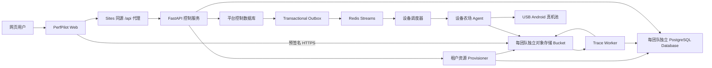

# PerfPilot 生产化一站式 Android 性能平台设计

- 日期：2026-07-23
- 状态：设计已确认，等待书面规格复核
- 代码仓库：`wurui27/trace`
- 首个真实验收应用：未优化版 RKGallery

## 1. 目标

PerfPilot 把 Android 性能测试、Perfetto Trace 采集、指标分析和优化建议连成一条自动化流水线。开发者提交 APK 后，平台调度真机执行测试，保存原始证据，生成可追溯的结论，并在网页端给出问题位置和优化建议。

首轮交付按以下顺序完成：

1. 云端控制台、中心化真机 Agent 和 Trace Worker。
2. 使用同一协议和状态机的本地独立版。
3. 跳过真机、直接上传 Trace 的分析模式。

每一阶段都必须完成测试、提交代码并快进推送到 GitHub `main`。前三阶段产生可私有部署的产品；公开发布、开放注册和商业化需要单独审批。

## 2. 成功标准

第一阶段必须用 RKGallery APK 和真实 Android 设备完成一次端到端任务：

- 冷启动取得 5 个有效样本，最多尝试 10 次。
- 连续滑动执行 5 次，每次 30 秒。
- 内存循环在同一应用进程中完成 10 轮进入和退出。
- 网页显示任务实时状态、真实指标、证据、问题等级和优化建议。
- 任一子场景失败时保留其他场景的有效结果，并把父任务标记为部分完成。
- 在原始证据保留期内，结果可由原始输入、场景特定采集产物、manifest、工具版本和规则版本复现；证据过期后只保证 provenance 可审计，不保证能够重新执行分析。

平台还必须通过跨团队访问拒绝、重复请求去重、Agent 掉线恢复和无效 Trace 拒绝测试。

## 3. 范围

### 3.1 本设计包含

- 现有 PerfPilot 网页与真实后端 API 的连接。
- 开发期管理员账户初始化。
- 团队级数据隔离和资源创建。
- APK 直传、任务编排、设备租约和多 Agent 注册。
- 冷启动、连续滑动和内存循环执行。
- Perfetto Trace、日志和 manifest 上传。
- 复用现有 SQL 和报告模型，并新增版本化证据与建议规则层。
- 本地独立运行模式。
- Trace 直接上传模式。
- 审计、数据保留、错误恢复和阶段验收。

### 3.2 本设计不包含

- 公开注册、邮箱验证、找回密码、付费和套餐。
- 第三方设备云。
- 自动修改客户源代码或自动提交修复。
- 通用 UI 自动探索或可视化场景录制器。
- 把大文件流量经由业务 API 中转。
- 用大语言模型替代性能证据、指标计算或问题判定。
- 首轮交付中的公开生产发布。

滑动和内存测试依赖可复现的场景配方。RKGallery 在第一阶段随系统提供经过验证的配方。其他应用可以复用已保存的配方或提交符合契约的 JSON 配方；没有配方时，平台不伪造滑动和内存结果。

## 4. 已确认的关键决策

| 主题 | 决策 |
| --- | --- |
| 产品形态 | 网页控制台加中心化自建设备农场 |
| Web 托管 | 保留现有 Sites/Vinext 前端，只承担交互和展示 |
| 业务 API | 独立 FastAPI 服务 |
| 浏览器 API 拓扑 | 浏览器只访问 Sites 同源 `/api`，由 Web Worker 反向代理到 FastAPI |
| 租户边界 | 一个团队或公司是一个租户 |
| 数据隔离 | 每个团队独立 PostgreSQL database、独立数据库凭据和独立对象存储 bucket |
| 全局数据 | 控制数据库保存账户、资源映射、设备和不含客户证据的任务编排状态 |
| 队列 | 控制数据库 outbox 保存可靠事件，Redis Streams 负责投递 |
| 真机执行 | 中心化 Agent 管理 USB Android 真机 |
| Trace 分析 | 独立 Worker，复用现有 Python、SQL 和报告模型 |
| 开发账户 | 开发环境初始化管理员 `ray_wu`，密码只从环境密钥注入 |
| 首个验收 APK | 未优化版 RKGallery |
| 第一阶段场景 | 冷启动、连续滑动、内存循环全部执行 |
| 后续模式 | 第二阶段本地独立版，第三阶段 Trace 上传版 |

每个团队使用独立 PostgreSQL database，而不是共享表或共享 schema。第一阶段允许这些 database 位于同一 PostgreSQL cluster；服务边界支持以后把某个团队迁移到独立 cluster，而不改变 API。

## 5. 总体架构



架构分为三个平面：

- 控制平面：Web、FastAPI、控制数据库、Provisioner 和调度器。
- 执行平面：Agent 与 Android 真机，只执行已签名的任务快照。
- 分析平面：Trace Worker，只读取不可变产物并写入结构化结果。

API 是唯一外部业务入口。Web、Agent 和 Worker 都不能自行选择租户数据库或 bucket。调度器和 Worker 只能通过受控路由组件，按控制数据库中的任务映射访问资源。

### 5.1 网络和部署拓扑

浏览器只请求当前 Sites 域名下的 `/api/v1/...`。Sites Worker 把这些小型 JSON 请求反向代理到 `PERFPILOT_API_ORIGIN`，因此登录 cookie 对浏览器始终同源。大文件仍由浏览器直传对象存储，不经过该代理。

本文 API 表列出 FastAPI 的内部路径 `/v1/...`。Sites Worker 只去掉浏览器路径中的 `/api` 前缀，再把 `/v1/...` 原样转发。

代理必须：

- 只转发 `/api/v1/` 允许的方法和请求头。
- 添加由 Sites secret 生成的代理身份签名。签名覆盖时间戳、方法、路径和请求体 SHA-256；API 拒绝超过 60 秒、重复 request ID 或签名错误的请求。
- 覆盖客户端伪造的转发头和代理身份头。
- 保留 `Set-Cookie`，但删除后端返回的 `Domain` 属性，使 cookie 成为 Web host-only cookie。
- 为每个请求传递或生成 `request_id`。

浏览器业务 API 要求有效代理签名，不开启通配 CORS。对象存储 bucket 的 CORS 只允许已登记的 Sites origin、`PUT` 和 `HEAD`，以及签名中列出的 checksum 和 content-type 头。Agent 使用独立 API origin 和服务令牌，不依赖浏览器 CORS。

第一阶段私有验收部署使用一个受控 Linux 主机运行 API、调度器、Worker、PostgreSQL、Redis 和 S3 兼容对象存储。只有 HTTPS API 和预签名对象数据入口暴露在公网；数据库、Redis 和对象存储管理端口位于私网。当前 Mac 上的 Agent 只建立出站 TLS 连接，不开放入站端口。所有服务以 OCI 容器交付，后续可拆分到独立主机而不改变契约。

## 6. 服务边界

### 6.1 Web

现有 Next.js/Vinext 应用继续部署在 Sites。它负责：

- 管理员登录和会话刷新。
- APK 或 Trace 直传。
- 创建任务和显示父子任务进度。
- 每 2 秒轮询一次运行中的任务；进入终态后停止轮询。
- 展示指标、问题、证据、建议和原始产物链接。

生产构建不能回退到演示数据。API 不可用时，页面明确显示服务错误。所有业务请求都使用同源 `/api`；浏览器不直接调用 FastAPI origin。

### 6.2 FastAPI 控制服务

控制服务负责：

- 身份认证、会话、团队成员和角色。
- 团队资源创建和租户数据库路由。
- 上传授权、文件校验和任务创建。
- 父子任务状态聚合。
- Agent 注册、设备目录、租约和心跳。
- 报告查询、删除和审计。

控制服务不执行 ADB，不运行 `trace_processor`，也不中转 APK 或 Trace 内容。

### 6.3 Provisioner

Provisioner 用可恢复的 saga 为新团队创建：

1. 一个 PostgreSQL database。
2. 一组仅能访问该 database 的凭据。
3. 一个独立的 S3 兼容 bucket。
4. 一条写入控制数据库的资源映射。

`tenant_resources` 依次进入 `requested`、`provisioning` 和 `active`。任一步失败时，Provisioner 执行补偿删除；补偿未完成时进入 `cleanup_pending` 并持续重试，不能把团队标为可用。相同团队创建请求使用幂等 key，不能并发创建两套资源。

每个资源记录还保存数据库迁移版本、凭据版本和 opaque secret reference。凭据只存于密钥管理器。迁移失败只阻断该团队，不能阻断其他团队。凭据轮换先创建新版本，连接池切换成功后再撤销旧版本。

团队迁移使用 `active → migrating → active`。迁移期间暂停该团队写入，复制并校验数据后原子切换资源版本；`TenantRouter` 关闭旧连接池，再恢复写入。旧数据库在验证窗口内只读保留，验证通过后按审计流程删除。

### 6.4 调度器

调度器从 Redis Streams 收到任务 ID，再从控制数据库读取权威状态。它在团队之间轮询，在同一团队内按创建时间 FIFO，避免一个团队占满设备。第一阶段不实现计费或付费优先级。

device 模式的设备租约属于父任务。三个场景子任务在同一租约和同一设备上依次执行；一个子任务失败不阻止后续子任务。该设备在父任务清理完成前不能穿插另一个团队的任务。不同父任务可以在不同设备上并发。

每个团队必须有可调整的保护额度。默认最多同时运行 2 个 device 父任务，最多排队 20 个父任务；超过额度时，创建 API 返回稳定错误码。额度是可用性保护，不是商业套餐。

兼容条件至少包括：

- 设备在线且未隔离。
- 设备没有有效租约。
- Android API level 和 ABI 满足 APK。
- 设备温度、电量和可用存储通过测试前检查。
- 设备标签满足任务指定的设备约束。

### 6.5 Agent

Agent 运行在中心化设备农场主机上。当前 Mac 作为首个农场节点。Agent 负责：

- 枚举 ADB 设备并上报能力和健康状态。
- 领取带租约令牌的任务快照。
- 下载 APK、验证 SHA-256、安装应用并执行场景。
- 调用 Trace 采集工具。
- 上传场景契约要求的 Trace 或 meminfo bundle、manifest、结构化日志和摘要。
- 上报检查点、心跳和最终执行结果。

Agent 不连接租户数据库，不计算最终结论，也不能修改任务快照。

任务快照使用 Ed25519 JWS 签名，并包含 `kid`、`analysis_id`、`scenario_job_id`、`lease_id`、`agent_id`、设备标识、输入产物、场景哈希、签发时间、到期时间和 `audience=perfpilot-agent`。Agent 内置当前及下一把公钥，根据 `kid` 验签。服务端可撤销租约；快照过期后只能重新领取。

每个 `lease_id/scenario_job_id/execution_id` 使用独立临时 workspace；`execution_id` 是冷启动/滑动的 `attempt_id` 或内存场景的 `bundle_id`。采集工具必须接受显式 output root 和 run ID；Agent 不得通过 glob 或“最新目录”寻找结果。这样，多台设备同时测试同一 package 时不会写入同一路径。

### 6.6 Trace Worker

Worker 从队列领取分析任务，下载不可变产物，固定工具版本后运行分析。它负责：

- 校验文件哈希和 manifest。
- 按启动、滑动或内存产物选择独立分析适配器。
- 根据 Trace capability 运行固定版本的 `trace_processor` 和适用 SQL。
- 把 legacy `ReportRecord` 和现有 SQL 输出适配为平台 `AnalysisBundle` 与 `Finding`。
- 通过新增的版本化证据规则层生成问题、证据和建议。
- 保存结构化结果、报告版本和分析来源。

相同输入哈希、SQL bundle、工具版本和规则版本必须产生等价结果。重新分析创建新报告版本，不覆盖旧报告。

队列 envelope 只包含 `schema_version`、`event_id`、`event_type`、`subject_type` 和 `subject_id`，不包含 DSN、bucket 名或密钥。Worker 使用 `worker_claim` 调用受控 `TenantRouter`；路由器从控制数据库派生团队，按 opaque secret reference 取得最小权限连接。Worker 不能为请求指定另一个团队。

## 7. 代码组织

现有网页目录保持不动，避免在第一阶段重写前端构建链。仓库新增以下边界：

```text
platform-web/
├── app/                     # 现有 Web
├── services/
│   ├── api/                 # FastAPI、Provisioner、调度器
│   └── trace-worker/        # Worker 和分析适配器
├── agents/
│   └── device-agent/        # ADB Agent
├── contracts/
│   └── v1/                  # JSON Schema 与示例载荷
├── tracekit/                # 纳入版本控制的现有采集与分析工具
├── infra/                   # Compose、迁移和部署配置
└── docs/
```

现存 `/Users/ray/Desktop/trace/tools` 是 `tracekit/` 的迁移来源，不是部署时的外部路径依赖。迁移必须把 Python 代码改为可安装 package，把 SQL、capture 脚本和模板改为 package resource，并删除对 `<project>/tools` 的硬编码。

旧命令通过兼容 launcher 保留。Worker 不解析 CLI 标准输出，而是调用稳定 Python API，或读取显式 `--output-json` 产生的 `AnalysisBundle v1`。启动、滑动和内存适配器都必须通过 JSON Schema 契约测试。

## 8. 租户、身份和权限

### 8.1 控制数据库

控制数据库只保存以下全局实体：

- `users`
- `teams`
- `memberships`
- `tenant_resources`
- `agents`
- `devices`
- `global_jobs`
- `scenario_jobs`
- `agent_leases`
- `sample_validation_claims`
- `worker_claims`
- `outbox_events`
- `inbox_events`
- `idempotency_keys`
- `sessions`
- `tenant_quotas`
- `audit_events`

控制数据库是编排状态、设备租约、Worker claim 和事件投递的权威来源。`global_jobs` 和 `scenario_jobs` 只保存 opaque 任务 ID、团队 ID、场景类型、状态、时间、ABI/minSdk 等非内容调度约束和 opaque 资源 ID，不保存性能指标、客户文件名、package、对象键、DSN 或分析证据。

### 8.2 团队数据库

每个团队数据库保存：

- 应用和版本。
- 场景配方及其版本。
- 面向团队展示的任务元数据。
- 场景尝试和样本质量。
- 产物元数据。
- 指标、问题、证据和建议。
- 报告版本。

编排状态与团队结果不做分布式事务。任务先在控制数据库进入内部 `creating`，再幂等创建团队记录；两边都成功后才对用户显示 `created`。Worker 先以唯一 `report_id` 幂等写入团队数据库，再用同一 ID 完成控制数据库中的 claim。后台 reconciler 修复中断的 saga。

`TenantRouter` 的连接池按团队资源版本分键，受每团队和全局上限约束；空闲池自动关闭。凭据版本切换时立即停止复用旧池。连接耗尽或目标团队数据库不可用时，只对该团队返回 `503 tenant_store_unavailable`。

用户业务请求按以下顺序路由：

1. 验证用户会话。
2. 从 URL 的 `/teams/{team_id}` 取得用户选择的团队。
3. 从控制数据库验证团队成员关系和角色。
4. 由服务端读取 `tenant_resources`。
5. 从受控连接池取得该团队数据库连接。
6. 在请求结束时释放连接。

客户端传入的 database、schema、bucket 或连接字符串一律忽略并拒绝。

### 8.3 路由和授权矩阵

| 调用者 | 团队来源 | 授权条件 | 资源能力 |
| --- | --- | --- | --- |
| Web 用户 | `/teams/{team_id}`；任务接口再由 task ID 反查并比对 | 有效 session、membership 和 RBAC | 当前团队业务 API |
| `platform_admin` | 管理端目标 ID | 平台管理员角色 | 团队资源生命周期和全局设备健康；默认不能读客户报告 |
| Agent | 服务端 task ID 和有效 lease | Agent token、设备归属和 lease token | 一个任务的下载、上传和事件 |
| Worker | 服务端 task ID 和有效 worker claim | Worker service identity 和 claim token | 一个任务的对象和目标团队写入 |
| 调度器 | 控制数据库中的 scenario job | 内部 service identity | 设备目录和租约 |
| Provisioner | 控制数据库中的 team ID | 内部 service identity 和资源 lifecycle | 该团队的创建、迁移和删除 |

`GET /v1/me` 返回用户可访问的团队列表。切换团队只改变 URL，不改变服务端授权。任务接口永远先由 task ID 反查团队，再验证 URL 中的团队 ID，防止改路径越权。

### 8.4 角色

第一阶段支持四个角色：

- `platform_admin`：创建团队、管理 Agent 和查看全局健康状态。
- `team_owner`：管理本团队成员、任务和删除请求。
- `team_member`：创建任务并查看本团队结果。
- `team_viewer`：只读本团队任务和报告。

第一阶段不实现邮件邀请或自助注册。`platform_admin` 使用一次性管理命令创建平台用户；`team_owner` 只能把已有平台用户加入团队并设置角色，成员 API 不创建账户，也不发送邀请邮件。

### 8.5 开发管理员和会话

开发环境首次启动时创建管理员 `ray_wu`。密码只通过 `PERFPILOT_BOOTSTRAP_ADMIN_PASSWORD` 注入，并使用 Argon2id 哈希后写入控制数据库。代码、示例配置、日志和 Git 历史均不得保存明文密码。

`APP_ENV=production` 时，服务必须拒绝以下启动条件：

- 使用开发期弱密码。
- 用户名与密码相同。
- 密码少于 12 个字符。
- 未配置会话签名密钥。

生产环境禁止自动创建开发管理员。生产管理员只能通过一次性管理命令和强密码创建。

会话保存在控制数据库。登录成功或角色变化时轮换 session ID；30 分钟无活动或 8 小时绝对期限到期；注销立即服务端撤销。浏览器使用 host-only、`HttpOnly`、`Secure`、`SameSite=Lax` 和 `Path=/` cookie。

未登录浏览器先调用 `GET /v1/auth/csrf`。该接口创建 10 分钟有效的匿名 pre-auth session cookie，并返回与其绑定的同步 CSRF token。登录必须携带该 token；登录成功后撤销匿名 session，轮换为正式 session ID，并在登录响应中返回绑定正式 session 的新 CSRF token。匿名 token 随匿名 session 立即失效。其余所有改变状态的 Web 请求也必须携带 `X-CSRF-Token`，代理和 API 同时校验 `Origin`。登录按账户和来源地址限速：15 分钟内连续失败 5 次后暂停 15 分钟，并写入不含密码的审计事件。

Agent 注册码只能使用一次。注册后令牌有明确 scope、到期时间和版本；控制台支持轮换和立即撤销。服务端只保存令牌哈希。

## 9. 对象存储

每个团队拥有一个开启 versioning 的独立 bucket。服务端生成不可推导的 bucket 名称。业务 API 只接受产物 ID；客户端可能在短期预签名 URL 中看到 opaque bucket 名，但不能据此枚举或选择 bucket。

推荐对象键结构：

```text
analyses/<analysis_id>/inputs/apk/<sha256>.apk
analyses/<analysis_id>/scenarios/<scenario_job_id>/attempts/<attempt_id>/trace.pb
analyses/<analysis_id>/scenarios/<scenario_job_id>/attempts/<attempt_id>/manifest.json
analyses/<analysis_id>/scenarios/<scenario_job_id>/attempts/<attempt_id>/agent.log
analyses/<analysis_id>/reports/<report_version>/report.json
```

场景契约定义不同的必需 slot：

| 场景单元 | 必需产物 | 可选产物 |
| --- | --- | --- |
| 一个冷启动 attempt | `trace.pb`、`config.txtpb`、slot `capture_manifest` 对应的 `manifest.json`、`info.txt`、`agent.log` | 独立诊断 Trace |
| 一个滑动 run | `trace.pb`、`config.txtpb`、`scroll_manifest.json`、`scroll_summary.json`、`agent.log` | Perfetto 原始日志、UI 失败截图 |
| 一次内存循环 | `metadata.json`、`summary.json`、`memory_cycles.csv`、逐轮 raw meminfo、`agent.log` | UI 失败截图和 diagnostics |

每个 slot 的 MIME、最大字节数、允许数量和是否必需都写入 `contracts/v1/artifact-manifest.schema.json`。内存循环不伪造 `trace.pb`。

每次上传使用随机 `upload_id` 和从未复用的对象键。上传方先计算字节数和 Base64 编码的 SHA-256，再申请 URL。预签名 `PUT` 把 content type、checksum header 和对象键纳入签名；对象存储必须在 `HEAD/GetObjectAttributes` 中返回可信的 `ChecksumSHA256`、字节数和 `version_id`。

客户端 finalize 时只提交 `upload_id`、checksum 和字节数。API 以创建 slot 时保存的预期 MIME、字节数和 SHA-256 为权威，再根据服务端保存的唯一对象键执行 `HEAD/GetObjectAttributes`，取得对象存储返回的可信 MIME、checksum、字节数和 version ID。客户端随 finalize 重复提交的值只做一致性检查；任一来源不匹配都拒绝 finalize。校验通过后，API 用数据库 CAS 把该 version ID 标为不可变产物。后续对同一键的上传只会创建新版本，不能改变已记录版本。重试创建新的 `attempt_id`，重新分析创建新的 `report_version`。

浏览器在创建上传 slot 前计算 SHA-256 和字节数；Agent 在请求 artifact URL 前完成同样计算。浏览器 URL 有效 15 分钟。API 不读取大文件内容。第一阶段对象存储必须支持 SigV4 checksum 和 versioning，集成测试把这两项作为基础设施门禁。

用户下载原始产物时，调用团队内 artifact download API。API 校验 membership 和角色后返回 5 分钟有效、绑定具体 version ID 的预签名 `GET`，并设置 `Content-Disposition: attachment` 和 `X-Content-Type-Options: nosniff`。

Agent 预签名 URL 的有效期取 5 分钟、lease 剩余时间和快照剩余时间中的最小值，并只覆盖一个任务的一组明确对象。撤销 lease 会立即阻止申请新 URL、提交事件和 finalize；已经签发的 URL 最迟在上述短期 TTL 后失效，其上传版本不会被任务接纳。

每个冷启动 attempt 或滑动 run 完成后，Agent 提交不可变 `sample_attempt_manifest`，列出必需 slot、`upload_id`、SHA-256 和字节数。API 逐项解析并记录对象 version ID 后 finalize 该样本，但场景子任务保持 `running`。样本随后通过 outbox 进入轻量服务端有效性验证。

冷启动或滑动达到 5 个服务端有效样本、用完 10 次尝试或遇到确定性错误后，Agent 提交 `scenario_execution_manifest`。内存场景在完成 10 轮、环境重试耗尽或遇到确定性错误后提交场景级 manifest。manifest 列出 sample/bundle ID、Agent 本地诊断、总尝试数和 `stop_reason`。

API 忽略 Agent 声称的有效性，从控制数据库读取权威 verdict。存在可分析产物时，API 把场景子任务推进到 `analyzing` 并发布完整分析事件，Worker 生成成功或部分失败报告；没有任何可分析产物的确定性错误直接把子任务标为 `failed`。缺少契约要求的产物时不能伪装成成功分析。

## 10. 任务模型和状态机

一次 device 模式分析由一个父任务和三个子任务组成：

- `cold_start`
- `scroll`
- `memory_cycle`

父任务负责上传、设备租约和聚合。三个子任务独立记录结果，并在父任务 lease 内依次采集；各自产物 finalize 后可以独立并行分析，分析不依赖设备 lease。

### 10.1 父任务

```text
created → uploading → queued → scheduled → running → analyzing
                                                     ├→ completed
                                                     └→ partially_completed
任一非终态 ──用户取消──→ canceled
上传/创建确定性错误或子任务终态聚合 ──→ failed
```

`created` 和 `uploading` 只属于父任务。上传 finalize 后，系统创建三个子任务，父任务按以下优先级派生：

1. 全部子任务终态：按 10.6 节聚合父终态。
2. 任一子任务仍是 `queued`、`scheduled` 或 `running`，且已有子任务写入 `started_at` 或进入终态：父任务为 `running`。
3. 没有子任务启动，至少一个为 `scheduled`：父任务为 `scheduled`。
4. 全部子任务为 `queued`：父任务为 `queued`。
5. 没有子任务等待或采集，至少一个为 `analyzing`：父任务为 `analyzing`。

因此，第一个场景完成、第二个场景已调度但尚未开始的必经空档仍显示 `running`，不会落入未定义状态。

内部创建 saga 可以使用不对用户显示的 `creating`。只有控制数据库和团队数据库都创建成功后才进入 `created`。

### 10.2 场景子任务

```text
queued → scheduled → running → analyzing → completed
任一非终态 ─────────→ failed | canceled
```

- 调度器确认父任务租约有效并选中当前场景后，把 `queued` 改为 `scheduled`。
- Agent 用有效租约确认执行后，把 `scheduled` 改为 `running`。
- API 验证并 finalize `scenario_execution_manifest` 后，把 `running` 改为 `analyzing`。
- Worker 用有效 `worker_claim` 保存报告后，把 `analyzing` 改为 `completed`。
- 确定性执行错误或耗尽规定重试且没有可分析产物时进入 `failed`；有可分析产物时先生成部分报告，再由 Worker 标为 `failed`。
- 控制服务处理用户取消时进入 `canceled`。

### 10.3 样本 attempt

冷启动的每次 attempt 和滑动的每个 run 使用独立状态：

```text
uploading → finalized → validating → valid | invalid | validation_error
```

finalize 一个样本不会推进场景子任务。Trace Worker 中独立的 sample-validator consumer 领取 `sample_validation_claim`，使用与完整分析相同的 Trace 健康和样本有效性契约。Agent 可以在前一个样本验证期间继续下一次采集，但最多创建 10 个样本。只有服务端确认 5 个有效样本，或已经尝试 10 次后，Agent 才提交场景级 `scenario_execution_manifest`。

Agent 提交的场景级 manifest 只引用 sample attempt ID 和本地诊断，不声明权威 valid/invalid。控制服务从数据库读取服务端 verdict，构造最终样本清单并计算 `can_complete`。样本验证暂时错误重试 3 次；耗尽后进入 `validation_error`，场景子任务以系统错误失败，不能把基础设施错误算作无效性能样本。

内存循环是一个整体场景 bundle，不使用多样本 attempt 状态。

用完 10 次仍不足 5 个有效样本时，完整 Worker 仍生成一份保留有效样本和失败原因的部分报告，然后把场景子任务标为 `failed`。若完整 Worker 与轻量 validator 对同一不可变样本给出不同有效性，任务以 `validator_disagreement` 失败并触发系统告警，不能静默补算或改变样本。

### 10.4 设备租约和 Worker claim

设备租约状态独立于任务，并绑定一个父任务：

```text
active → released | expired | revoked
```

Worker claim 也使用独立状态：

```text
active → completed | expired | revoked
```

`sample_validation_claim` 使用相同状态，但只允许更新一个 sample attempt 的 verdict。

Agent transition 必须校验任务版本、`lease_id` 和租约令牌。Worker transition 必须校验任务版本、`claim_id` 和 claim 令牌，不校验设备租约。这样，设备租约到期后，Worker 仍可分析已经 finalize 的不可变产物。

最后一个 device 场景的 `scenario_execution_manifest` 被控制服务接受，且控制服务确认不再等待设备执行后，Agent 立即执行父任务级设备清理；这包括没有可分析产物的确定性失败。活动 lease 清理成功后改为 `released`，已经撤销的 lease 保持 `revoked`，设备即可领取另一个父任务；已经入队的 Worker 分析继续运行，不等待父报告进入终态。清理失败时将设备置为 `quarantined`，不能领取新任务。

### 10.5 Transition 权限

| Transition | 唯一执行者 | 必需条件 |
| --- | --- | --- |
| 父任务 `created → uploading` | 控制服务 | 用户有创建权限，upload session 已创建 |
| Trace 父任务 `uploading → analyzing` | 控制服务 | 输入 finalize 成功，并在同一 transaction 写 analysis outbox |
| Trace 父任务 `analyzing → completed/failed` | Worker | 报告幂等写入成功，worker claim 有效 |
| 子任务 `queued → scheduled` | 调度器 | 父任务租约有效，且该设备没有另一个运行中的子任务 |
| 子任务 `scheduled → running` | Agent | 任务版本和 lease 都有效 |
| 子任务 `running → analyzing` | 控制服务 | `scenario_execution_manifest` 完整且对象校验通过 |
| 子任务 `analyzing → completed` | Worker | 报告幂等写入成功，worker claim 有效 |
| 非终态 `→ failed` | 当前阶段的服务 | 稳定错误码和重试次数已保存 |
| 非终态 `→ canceled` | 控制服务 | 取消请求 CAS 成功并撤销 lease/claim |

所有 transition 使用乐观版本号和数据库 CAS。终态不可回退；重新执行会创建新任务或新报告版本。

### 10.6 device 父任务终态聚合

只有 device 父任务的全部子任务进入终态后，父任务才进入终态：

| 子任务结果 | 父任务结果 |
| --- | --- |
| 全部 `completed` | `completed` |
| 至少一个 `completed`，其余为 `failed` 或 `canceled` | `partially_completed` |
| 没有 `completed`，至少一个 `failed` | `failed` |
| 全部 `canceled` | `canceled` |

取消请求先写入 `cancel_requested_at`，再撤销父任务设备 lease 和各非终态子任务的 sample/Worker claim，并把这些子任务标为 `canceled`。这些操作使用同一控制数据库 transaction。已经 `completed` 的结果保留。持有旧 lease 或 claim 的 Agent 与 Worker 不能再附加结果。运行中的 Agent 在下一次心跳停止测试并清理设备。

若用户在上传 finalize 和子任务创建前取消，控制服务直接把父任务标为 `canceled` 并清理未 finalize 的上传。上传校验发生确定性错误时，控制服务可以直接把父任务标为 `failed`。

trace-upload 已进入 `analyzing` 后取消时，控制服务撤销父任务的 worker claim 并把父任务标为 `canceled`；旧 Worker 结果不能再附加。

## 11. API 和协议契约

所有 Web、Agent 和 Worker 载荷都由 `contracts/v1/` 中的 JSON Schema 定义。契约包含 `schema_version`，服务只接受明确支持的主版本。

标识和枚举统一如下：

- `analysis_id`：父分析任务。
- `scenario_job_id`：device 模式的一个场景子任务。
- `scenario_type`：场景枚举。
- `attempt_id`：一个冷启动样本或一个滑动 run。
- `bundle_id`：一次完整内存循环执行。
- `execution_id`：仅用于公共目录和日志关联，值为该场景的 `attempt_id` 或 `bundle_id`。
- `analysis_mode`：`device | trace_upload`。
- `startup_mode`：Perfetto 启动语义，取值 `cold | warm | hot`。
- `capture_variant`：采集方式，取值 `standard | first | manual`，不能代替 `startup_mode`。

device 的 `scenario_type=cold_start` 固定映射为 `startup_mode=cold` 和 `capture_variant=standard`。trace-upload 的 `scenario_type=startup` 必须显式提交 `startup_mode`，可以另交 `capture_variant`；`capture_variant=first` 只允许配 `startup_mode=cold`，`capture_variant=manual` 也不能让平台推断启动类型。SQL 中 `android_startups.startup_type` 必须与 `startup_mode` 精确匹配。兼容 CLI 的旧 `--mode=first` 只在适配器边界映射为 `startup_mode=cold`、`capture_variant=first`；旧 `--mode=manual` 进入平台时必须另有显式 `startup_mode`。平台契约不再使用含义模糊的顶层 `mode`。

### 11.1 Web API

| 方法 | 路径 | 作用 |
| --- | --- | --- |
| `GET` | `/v1/auth/csrf` | 获取与会话绑定的 CSRF token |
| `POST` | `/v1/auth/login` | 用户登录 |
| `POST` | `/v1/auth/logout` | 注销当前会话 |
| `GET` | `/v1/me` | 当前用户和可访问团队 |
| `POST` | `/v1/admin/teams` | 创建团队并 provision 资源 |
| `GET/POST` | `/v1/teams/{team_id}/members` | 列出成员或添加已有平台用户 |
| `PATCH/DELETE` | `/v1/teams/{team_id}/members/{member_id}` | 修改角色或移除团队成员 |
| `POST` | `/v1/admin/agents/registration-codes` | 签发一次性 Agent 注册码 |
| `GET` | `/v1/admin/agents` | 列出 Agent、令牌版本和健康状态 |
| `POST` | `/v1/admin/agents/{agent_id}/rotate-token` | 轮换 Agent token |
| `POST` | `/v1/admin/agents/{agent_id}/revoke` | 撤销 Agent 身份和 token |
| `GET` | `/v1/admin/devices` | 列出设备、能力、lease 和隔离状态 |
| `POST` | `/v1/admin/devices/{device_id}/unquarantine` | 记录检查结果并解除设备隔离 |
| `POST` | `/v1/teams/{team_id}/analyses` | 幂等创建 device 或 trace-upload 任务 |
| `POST` | `/v1/teams/{team_id}/analyses/{analysis_id}/uploads` | 为允许的可选文件创建上传 slot |
| `POST` | `/v1/teams/{team_id}/analyses/{analysis_id}/finalize-upload` | 校验全部上传并开始任务 |
| `GET` | `/v1/teams/{team_id}/analyses/{analysis_id}` | 查询父子任务和进度 |
| `POST` | `/v1/teams/{team_id}/analyses/{analysis_id}/cancel` | 请求取消 |
| `GET` | `/v1/teams/{team_id}/analyses/{analysis_id}/report` | 获取结构化报告 |
| `POST` | `/v1/teams/{team_id}/analyses/{analysis_id}/artifacts/{artifact_id}/download` | 获取短期下载 URL |
| `DELETE` | `/v1/teams/{team_id}/analyses/{analysis_id}` | 幂等请求删除；非终态先取消并返回 `202` |

创建任务的请求体包含 `analysis_mode`：

- `device`：必需 APK slot，固定创建 `cold_start`、`scroll` 和 `memory_cycle` 三个子任务，并引用版本化场景配方。
- `trace_upload`：`scenario_type` 只接受 `startup` 或 `scroll`。startup 必需 Trace、package 和 `startup_mode`，可以另交 `capture_variant`；scroll 必需 Trace、package、测量窗口、目标 display 和刷新模式。可以增加 capture manifest、APK、mapping、源码、Native symbols 和日志 slot。`memory_cycle` 返回稳定的 `unsupported_trace_scenario`，该模式不创建设备子任务。

现有 Web Trace 表单必须增加 package 和场景类型字段。若上传 manifest 能可信提供这些值，Web 可以自动填充，但 finalize 仍由服务端验证 Trace 内目标进程。

`POST .../analyses` 必须携带 `Idempotency-Key`。同一团队、同一 key 和相同请求体返回原任务；相同 key 配不同请求体返回 `409`。并发请求依靠控制数据库唯一约束，只能创建一条记录。

DELETE 同样幂等。终态任务写 tombstone 并启动异步清理；非终态任务记录 `delete_requested_at`、先执行取消并返回 `202`，进入终态后自动继续清理。重复 DELETE 返回同一删除状态。

创建或增加上传 slot 时，Web 必须先提交 MIME、字节数和 SHA-256。API 校验上限后，为每个 slot 返回 `upload_id`、唯一对象键、必须发送的签名头和 15 分钟预签名 URL。浏览器直传完成后用相同 `upload_id`、checksum 和字节数 finalize；API 按第 9 节的服务端预期值和对象存储元数据复核，并保存 version ID。

### 11.2 Agent API

| 方法 | 路径 | 作用 |
| --- | --- | --- |
| `POST` | `/v1/agent/register` | 使用一次性注册码创建 Agent 身份 |
| `POST` | `/v1/agent/heartbeat` | 上报 Agent 和设备状态 |
| `POST` | `/v1/agent/tasks/next` | 长轮询领取任务和租约 |
| `GET` | `/v1/agent/tasks/{scenario_job_id}` | 读取权威样本 verdict、计数和 `can_complete` |
| `POST` | `/v1/agent/tasks/{scenario_job_id}/inputs` | 获取任务限定、短期下载 URL |
| `POST` | `/v1/agent/tasks/{scenario_job_id}/events` | 上报状态和检查点 |
| `POST` | `/v1/agent/tasks/{scenario_job_id}/artifacts` | 获取单任务上传授权 |
| `POST` | `/v1/agent/tasks/{scenario_job_id}/samples` | 提交并 finalize 一个 `sample_attempt_manifest` |
| `POST` | `/v1/agent/tasks/{scenario_job_id}/complete` | 提交并 finalize `scenario_execution_manifest` |

注册请求使用一次性注册码；heartbeat 和 tasks/next 使用 Agent token。领取任务之后的 task GET、inputs、events、artifacts、samples 和 complete 还必须携带 `lease_id` 与租约令牌。

tasks/next 返回签名任务快照和 lease，不直接暴露 bucket。inputs 返回绑定具体对象 version ID 的短期 GET。Agent 在调用 artifacts 前计算每个产物的字节数和 SHA-256，API 用这些值签发 URL。samples 只接受快照声明的样本 slot，返回 sample ID 和初始验证状态，且不会推进场景子任务。task GET 返回每个 sample 的权威 verdict、`valid_count`、`attempt_count`、`can_capture_more`、`can_complete` 和失败原因。complete 只接受已经 finalize 的样本 ID 和场景级产物。

### 11.3 通用错误结构

所有 API 错误返回：

```json
{
  "schema_version": "1.0",
  "error": {
    "code": "stable_machine_code",
    "message": "面向用户的简短说明",
    "retryable": false,
    "request_id": "opaque-id"
  }
}
```

客户端只根据 `code` 和 `retryable` 决定行为，不解析 `message`。

### 11.4 可靠事件投递

任何会产生异步工作的控制数据库 transaction，都在同一 transaction 写入 `outbox_events`。独立 dispatcher 按 `event_type` 把 envelope 路由到 schedule、sample-validation 或 analysis 三条独立 Redis Stream，执行 `XADD` 后记录 `published_at`。未知 event type 进入 dead-letter，不能广播给所有 consumer。

调度器、sample-validator 和完整 Worker 使用各自的 consumer group：

1. 在同一个控制数据库 transaction 中按 `(consumer_name, event_id)` 插入或读取 `inbox_events`，并用任务版本创建或接管 claim。
2. 只有 inbox 已是 `processed` 或任务状态已经越过该事件，才能直接 `XACK`。
3. inbox 为 `received` 且另一个有效 claim 仍存活时，不 ACK；消息留在 pending。
4. claim 过期时，新 consumer 用 CAS 接管，再继续工作。
5. 工作完成后，在同一个 transaction 写状态 transition、把 inbox 改为 `processed` 并完成 claim；commit 后才 `XACK`。

`sample_validation_requested` 事件由 sample-validator 创建 `sample_validation_claim`；`analysis_requested` 事件由完整 Worker 创建 `worker_claim`。claim token 只由对应 consumer 持有。

reconciler 每 30 秒扫描未发布 outbox、超时 pending 消息、卡在 `validating` 的 sample attempt，以及卡在 `queued` 或 `analyzing` 的任务，并安全地重新发布。Redis 中断不会丢任务，重复投递也不会重复安装、采集或生成同一报告。工作逻辑的暂时错误最多重试 3 次；耗尽后写稳定失败状态和 dead-letter 记录。

## 12. 完整任务数据流

1. 用户登录并选择团队。
2. Web 先计算输入文件字节数和 SHA-256，再使用幂等 key、`analysis_mode` 和文件 manifest 创建父任务及所需上传 slot。
3. 父任务进入 `uploading`，浏览器把文件直传团队 bucket。
4. Web 提交 `upload_id`、checksum 和字节数；API 通过对象存储可信元数据解析 version ID 并 finalize 上传。
5. device 模式在隔离进程中解析 APK，固化 package、version、ABI、最低 API level 和场景配方快照。
6. 控制服务创建三个子任务，并在同一 transaction 写入调度 outbox。
7. 调度器为父任务选择兼容设备并建立设备 affinity；三个子任务在该设备上依次执行。
8. Agent 领取签名快照和租约，下载指定 APK version，复核 SHA-256 并安装。
9. Agent 按场景采集，把每次尝试写入独立目录和独立 manifest。
10. 冷启动和滑动每产生一个样本，Agent 就上传产物并提交 `sample_attempt_manifest`；API finalize 样本并通过 outbox 请求轻量验证，场景子任务保持 `running`。
11. 冷启动和滑动在收到 5 个服务端有效样本、用完 10 次尝试或遇到确定性错误后停止；内存在完成 10 轮、环境重试耗尽或遇到确定性错误后停止。Agent 随后提交 `scenario_execution_manifest`。
12. API 校验场景级 manifest；存在可分析产物时，把子任务推进到 `analyzing`，并在同一 transaction 写入完整分析 outbox；没有可分析产物的确定性错误直接把子任务标为 `failed`。
13. Worker 领取 claim，校验产物，在隔离工作副本中运行对应适配器，把报告幂等写入团队数据库和 bucket。
14. Worker 用 `report_id` 完成 claim；device 模式更新场景子任务并聚合父任务，trace-upload 模式直接更新父任务。
15. trace-upload 模式在第 4 步由控制服务执行 `uploading → analyzing` 并在同一 transaction 写入 `analysis_requested` outbox；Worker consumer 收到事件后创建 claim，跳过第 5 至第 12 步的设备流程。
16. Web 每 2 秒刷新，终态后显示完整报告并停止轮询。

API 从不读取大文件内容到应用内存，也不把大文件转发给 Agent 或 Worker。

第一阶段同一父任务固定同一设备、系统 build、display mode 和 APK。设备故障后可以把尚未执行的子任务迁到新设备，但报告必须按设备分组，禁止对不同设备的子场景做联合根因推断。RKGallery 验收任务不得发生设备迁移。

## 13. 场景执行

### 13.1 APK 和设备预检

第一阶段只接受单个 `.apk`，不接受 `.apks`、`.xapk` 或 split APK 集合。APK metadata 解析器在受限容器中使用固定版本的 `apkanalyzer` 或 `aapt2`，读取 package、versionName、versionCode、launch activity、minSdk、targetSdk、ABI 和 Native library。解析失败或需要缺失 split 时，任务在调度前以稳定错误码失败。

服务端和 Agent 都验证 package、component、整数范围和场景 action allowlist。任何值都不能直接插入 shell、ADB shell 字符串或 Perfetto textproto。现有 Bash 中包含字符串拼接的调用必须重构或包在严格校验后的兼容层内。

设备预检记录 API level、ABI、build fingerprint、display mode、温度、thermal 状态、电量、可用存储、root/profileable 能力和 Perfetto 数据源。任务快照只请求该设备实际支持的 capability；缺失可选能力时明确降级，缺失场景必需能力时不执行。

### 13.2 场景配方

场景配方是版本化 JSON。任务创建后保存配方快照和 SHA-256。配方可以包含：

- package 和 launch activity。
- `launch`、`tap_text`、`wait_text`、`tap_ratio` 和 `keyevent`。
- 滚动方向、准备条件、稳定条件和结束条件。
- 内存循环的 `enter_actions`、`operation_actions` 和 `exit_actions`。

Agent 在每个导航动作后验证 UI。目标页面不匹配时，该尝试标记为 `navigation_failed`，不能进入指标平均值。

RKGallery 的版本化 fixture 是第一阶段交付物。收到 APK 和目标设备后，实施必须提交与 APK SHA-256 绑定的 fixture 和媒体数据集 manifest。fixture 明确：

- Android 版本感知的媒体权限授权。
- 首次启动、onboarding 和弹窗处理。
- 固定媒体数据集的文件数、总字节数、逐文件 SHA-256 和 dataset fingerprint。
- locale、orientation、display mode 和动画设置。
- 滑动目标页、准备动作和分段内容运动检查。
- 内存 `enter_actions`、`operation_actions`、`exit_actions` 及每步 postcondition。
- 编译、应用数据和 page-cache policy。

setup 和 fixture 校验全部在测量窗口外执行。任一步失败时不得开始采样。真实 APK 到位前不能编造 package、控件或 Activity；fixture 的提交和真机验证是第一阶段 RKGallery 验收的前置门禁。

RKGallery 验收固定使用平台策略 `aot_speed` 和显式 warm-cache。`aot_speed` 必须映射为 Android `compiler_filter=speed`，由 Agent 执行并验证等价于 `cmd package compile -f -m speed <package>` 的参数化调用，不能把字符串 `aot_speed` 原样传给 Android。Agent 在每个冷启动 attempt 前清理并重放同一应用状态、授权和数据集 setup，执行一次声明的非测量 warm-up，随后 force-stop 再采样；现有采集脚本的隐式预检启动必须关闭。三个场景按 `cold_start → scroll → memory_cycle` 执行；每个场景开始前恢复自己的 fixture 状态，不能无声明继承前一场景生成的数据库、缩略图缓存或任务状态。

Agent 必须在采样前应用并验证 `aot_speed`；设备无法执行或验证声明的编译策略时，RKGallery 验收不能开始。

同一场景的有效样本必须具有相同 APK SHA-256、versionCode、设备 serial、build fingerprint、配方哈希、场景哈希、dataset fingerprint、display mode、编译策略、应用数据策略和 cache policy。报告保留每轮值，并输出中位数、坏方向 P90、最小值、最大值、CV 和有效样本数，不能只输出平均值。

### 13.3 环境门禁

第一阶段默认门限与现有分析器一致：电池温度不高于 42°C、SoC 温度不高于 65°C、Android thermal status 不高于 `LIGHT(1)`。RKGallery fixture 可以收紧门限，不能放宽。

每个冷启动 attempt 和滑动 run 都记录开始及结束温度与 thermal status。任一值超限时，该样本因环境无效，不参与 KPI；Agent 等待 3 次、每次间隔 10 秒的连续读数恢复后再重试。内存循环记录开始、每轮和结束环境；运行中超限时整个 bundle 无效，冷却后最多重新执行一次完整 bundle。

传感器不可用必须记录为 `unavailable`，不能视为门禁通过。通用任务可以继续但降低环境相关 finding 的置信度；RKGallery 真实验收至少需要一个可靠设备或电池温度源和 Android thermal status，否则验收不通过。

### 13.4 冷启动

Agent 调用纳入版本控制的 `tracekit/capture/trace_app.sh`。适配器设置：

- `ANDROID_SERIAL`
- `TRACE_ACTIVITY`
- `TRACE_AUTOFILL_EXCEL=0`

一次尝试至少保存 `trace.pb`、`config.txtpb`、`manifest.json`、`info.txt` 和 `agent.log`。以下情况判为无效样本：

- Trace 为空或无法解析。
- 设备温度超过配置上限。
- 场景步骤未完成。
- manifest 的 `valid_capture` 为 false。

capture manifest 的 `valid_capture` 只表示采集脚本完成且本地文件非空；对象 finalize 和 `sample_attempt_manifest` 才表示上传完整。Worker 必须另行计算 `valid_measurement`。冷启动有效样本必须满足：

- 存在 package 匹配，且 `startup_type` 与 `startup_mode` 完全相同的 `android_startups` 行。
- startup UPID 能解析到唯一目标进程。
- 目标进程与 Agent 在尝试期间记录的 observed PID 一致。
- TTID 有效，且 Trace 覆盖完整启动窗口。

缺少官方启动行、目标启动不唯一或 PID 不一致时，样本不能进入 KPI 聚合。TTFD 未上报时显示“应用未报告/不可测”，不得填 0 或判为通过。

第一阶段的 `cold_start` 明确定义为 process-cold：执行 `force-stop` 后启动，保留应用数据和 ART 编译产物。首次安装或清数据启动是另一种场景，不混入该指标。

Agent 新增本地 `CaptureValidator`，尽早淘汰明显无效的产物；只有服务端 validator 的结果计入 5 个目标样本。完整 Worker 最后再次验证。现有脚本退出码和 `valid_capture` 都不是测量有效性的权威。

Agent 最多执行 10 次，取得 5 个有效样本后停止。达不到 5 个时，子任务失败，但保留有效样本和失败原因。

### 13.5 连续滑动

Agent 使用场景配方导航到目标页面，再调用现有滑动执行器。目标是取得 5 次有效运行，每次 30 秒；最多尝试 10 次。每次运行分别保存 `trace.pb`、`config.txtpb`、`scroll_manifest.json`、`scroll_summary.json` 和 `agent.log`。

滑动 manifest 至少包含 `window_start_ns`、`window_end_ns`、开始和结束 PID、前台 component、目标 display 和刷新模式、手势数、内容运动确认、温度、thermal 状态、Trace 哈希、config 哈希和场景哈希。

样本有效性由 Trace 数据源健康、完整 30 秒窗口、目标进程身份、场景自动化证据和手势执行证明决定，不设置最低产帧数门槛。健康 Trace 中的零帧、极低产帧、进程崩溃或 ANR 是真实性能或稳定性结果，不能因结果差而重试掉。

Agent 的新滑动适配器至少每 5 秒检查前台 component、PID 和分段内容运动，不能只比较起止截图，因为往返滚动可能回到原位置。任意 PID 切换、自动化失联或错误页面使运行无效；有明确 crash/ANR 证据的进程终止除外。所有帧、Slice、线程状态、RenderThread 和 SurfaceFlinger 证据都必须与该窗口重叠，不能使用录制前后的数据。

每次运行分别计算：

- `deadline_miss_rate = count(overrun > 0) / count(all_frames)`。
- `p95_positive_overrun = P95(max(overrun, 0))`，分母是全部帧。
- `p95_late_frame_overrun = P95(overrun where overrun > 0)`，仅统计迟到帧。
- `motion_fps = 目标 App 在已确认持续运动分段中的产帧数 / 这些分段的秒数`。

静态或无法确认运动的窗口不计算 `motion_fps`。页面必须把两个 P95 分别显示为“全部帧 P95 正超时”和“迟到帧 P95 超时”，不能复用含义不明的 `P95O`。

报告至少包含：

- 有效运行数。
- `motion_fps` 中位数。
- deadline miss rate 和冻结帧数。
- 两种 P95 overrun 和最大 overrun。
- 最长主线程 Slice 及其证据。

测量开始前导航失败或页面未稳定、窗口证据不足，或窗口内既没有分段运动证据也没有 crash/ANR 证据时，该运行无效。由真实性能问题造成的极低产帧或运动停滞仍是有效结果。10 次尝试后不足 5 次有效运行时，`scroll` 子任务失败。

### 13.6 内存循环

Agent 首次冷启动后保持同一进程，记录基准，再执行 10 轮进入、操作和退出。每轮退出后等待固定冷却时间并调用 `dumpsys meminfo -d`。一次 bundle 至少保存 `metadata.json`、`summary.json`、`memory_cycles.csv`、baseline 与逐轮 raw meminfo，以及 `agent.log`。

内存场景只有在一个 baseline 加 10 个 after-exit 样本完整、PID 始终一致、每个页面检查点正确且必需 meminfo 字段可解析时才有效。Agent 必须为每轮 action 增加显式 postcondition，不能只在首次启动后检查 Activity。PID 变化、目标 Activity 不匹配或任一必需步骤失败时，整个内存场景无效。

报告保存 Java Heap、Native Heap、Graphics、TOTAL PSS、View、ViewRootImpl、Activity 数量及其相对基准变化。第一阶段可以确认“内存增长”或“退出后未回落”现象；没有 heap 引用链、LeakCanary 或等价对象持有证据时，不得标记“已确认内存泄漏”，最高只能标记 `suspected`。

## 14. 分析和结论可信度

### 14.1 产物适配器

Worker 按产物类型执行独立适配器：

- 冷启动：逐 attempt 分析 Trace，再聚合 5 个有效样本。
- 滑动：逐 run 分析 Trace 和测量窗口，再聚合 5 个有效运行。
- 内存循环：校验 `summary.json`、CSV 和原始 meminfo，不要求内存场景必须生成 Trace。
- Trace 上传：根据上传的场景类型选择对应 Trace 适配器。

`tracekit` 新增稳定机器接口：

```text
analyze_startup_attempt(...) -> AnalysisBundleV1
analyze_scroll_run(...)      -> AnalysisBundleV1
analyze_memory_cycle(...)    -> AnalysisBundleV1
```

Worker 直接 import 这些接口，不解析终端文本。兼容 CLI 增加显式结构化输出：

```text
python3 -m tracekit.cli analyze \
  --input <work-copy> \
  --adapter <startup|scroll|memory-cycle> \
  --contract-version 1 \
  --output-json <path>
```

查询根据 Trace capability 执行。heapprofd、Binder、GPU、网络和功耗等可选数据源缺失时，对应指标返回 `insufficient_data` 或 `unavailable`，不得解释为 0 或正常。heapprofd 等扰动型诊断 Trace 与 KPI Trace 分开保存，不能混入 KPI 聚合。

现有 `ReportRecord` 是迁移输入，不是最终平台契约。第一阶段新增 `AnalysisBundle`、`Finding`、`Evidence`、`EvidenceRule` 和 `Confidence` 模型，为四态 finding、规范化 SQL 证据、场景窗口和来源版本提供固定字段。内存适配器新增 `build_memory_cycle_records`；滑动适配器不能依赖现有 `build_scroll_records` 未覆盖的根因字段。

capture manifest 是不可变证据。现有 CLI 即使会更新本地 manifest，也只能在临时工作副本中修改。Worker 把 `valid_measurement`、reported startup type 和分析字段写入独立 `analysis_manifest`，不能覆盖或重新上传 capture manifest。

### 14.2 Trace 健康和 capability

Worker 在运行性能规则前先保存 `trace_health` 和 `trace_capabilities`：

- 解析是否成功及 Trace 起止边界。
- 目标 package、进程、UPID、PID 和线程是否可解析。
- 场景测量窗口覆盖。
- 必需表、数据源和可选传感器是否存在。
- buffer 或 ftrace 数据丢失。
- `traced_buf_patches_failed`、未完成 Slice 和边界截断数量。
- FrameTimeline、刷新模式和目标 display 覆盖。

必需数据缺失时，对应指标为 `insufficient_data`。影响必需证据的数据丢失时，Worker 禁止产生 `confirmed` 根因。可选传感器不可用必须明确标为 `unavailable`。

### 14.3 报告来源和复现身份

每份报告保存全部适用来源。输入对象、Worker、分析工具、SQL、`AnalysisBundle` 和规则版本是必填来源；capture manifest、APK、设备和 Agent 等模式特定来源在适用时保存。模式特定字段不适用或上游未提供时，报告 schema 仍保存 `not_applicable` 或 `not_provided` 及原因，不能伪造值。

- 输入对象 ID、version ID 和 SHA-256。
- capture manifest 和 `scenario_hash`。
- APK SHA-256、versionCode、数据集身份、设备、系统 build、display mode、编译策略、应用数据策略和 cache policy。
- Agent 和分析适配器版本。
- Worker 容器镜像 digest。
- `trace_processor` 可执行文件版本和 SHA-256。
- SQL bundle 哈希。
- 查询参数和场景配方快照。
- `AnalysisBundle` schema 版本和哈希；若使用 legacy `ReportRecord` 适配器，另保存其适配器版本。
- 建议规则集版本。

Worker 镜像内固定 Python lockfile、`trace_processor` 二进制及 checksum，运行时禁止下载 `latest`。相同复现身份必须产生等价结构化结果：指标、finding、evidence 和建议一致；`report_id`、生成时间和临时路径等易变 provenance 不参与等价比较。重新分析创建新报告版本，不覆盖旧报告。

### 14.4 问题状态

finding 状态只有四种：

- `confirmed`：该 finding 的必需证据和排除条件全部满足。
- `suspected`：证据指向问题，但缺少确认所需的一项数据。
- `insufficient_data`：Trace 可读取，但不足以判断。
- `invalid_capture`：采集本身无效，不能形成性能结论。

报告区分异常症状和根因。指标越过阈值可以确认“启动慢”“帧超预算”或“内存未回落”等症状；根因只有在规则的必需证据和排除条件全部满足时才能 `confirmed`。根因确认至少要求：

1. 锁定具体启动、慢帧或场景窗口。
2. 区分墙钟时间与实际 CPU 时间。
3. 验证线程状态。
4. 沿 Binder、锁、I/O、RenderThread 或 SurfaceFlinger 等等待链找到依赖。
5. 排除热降频、系统竞争和采集丢失。
6. 在多个有效样本中出现一致签名。

单个最差帧、最长 inclusive Slice 或名称启发式结果最高只能是 `suspected`。

Worker 持久化规则使用的规范化 SQL 行、参数、单位、时间区间、线程和对象引用。报告链接这些 evidence ID，而不是依赖 Worker 内存中的原始查询对象。

### 14.5 规则和定位边界

规则目录使用不可变 `rule_id`，不解析 Markdown 序号。每条规则声明适用场景、必需证据、排除条件、阈值来源、finding 类型、置信度和复测方法。帧预算优先使用 FrameTimeline deadline 和实际 display mode；固定 16.6 ms 只能作为 60 Hz 展示值。

优化建议必须链接到具体指标、SQL 结果、时间区间、线程或 Slice。只上传 APK 和 Trace 时，第一阶段定位到场景、帧、时间区间、线程、Slice 或系统服务。只有存在业务 Trace、mapping 或 Native symbols 时才承诺方法级定位；第一阶段不承诺源码行级定位。

缺少 capture manifest 时，Worker 仍从 Trace 内验证目标 package。Trace 本身能直接证明的事实可以 `confirmed`；依赖场景上下文的 finding 分别降为 `suspected` 或 `insufficient_data`。缺少场景绝对窗口时，禁止确认滑动根因。

第一阶段不允许大语言模型自行改变 finding 状态、严重级别、指标或证据。自然语言只能解释版本化规则已经形成的结论。

## 15. 租约、重试和恢复

### 15.1 心跳和租约

- Agent 每 10 秒发送一次心跳。
- 30 秒未收到心跳时，Agent 进入 `offline`。
- 控制服务在同一 CAS transaction 中撤销该 Agent 的父任务 lease，把可重试的当前场景重新排队，并将相关设备置为 `quarantined`。
- 管理员完成设备检查后才能解除隔离。
- 过期租约的事件、上传授权和完成请求全部拒绝。

设备在任一时刻只能拥有一个有效租约。

### 15.2 重试

- 网络和对象存储暂时错误最多重试 3 次，使用指数退避。
- ADB 安装失败、不兼容 APK、找不到控件和配方错误属于确定性错误，不在同一设备无限重试。
- 冷启动和滑动样本重试各受 10 次总尝试限制；thermal 无效的内存 bundle 最多完整重试 1 次。
- Worker 对暂时错误重试 3 次；解析错误直接形成稳定错误码。

### 15.3 检查点

Agent 上报 APK 下载、安装、场景尝试和产物 finalize 检查点。同一 Agent、同一设备和有效租约内重启时，可以从最后一个服务端确认的检查点继续。

租约过期后，原设备状态不再可信。新租约必须重新安装并重新采集；已经 finalize 的不可变产物仍可供诊断，但不与新尝试混合。Worker 可从已 finalize 的产物继续分析，无需重新操作设备。

## 16. 安全、审计和数据保留

### 16.1 安全边界

- 所有外部流量使用 TLS。
- 密钥只存放在环境变量或密钥管理器。
- Agent 和 Worker 从不取得租户数据库主凭据。
- 每个团队数据库使用独立最小权限账号。
- 每个团队 bucket 使用独立访问策略。
- 上传文件校验类型、大小、哈希和归属。
- APK 只在隔离的设备农场执行，不在 API 或 Worker 主机运行。
- 用户输入不能拼接为 shell 命令；package、component、数值和 action 必须先通过严格 schema，再以参数数组调用工具。

现有采集 Bash 中包含 ADB shell 字符串和 textproto 插值，因此“外层使用参数数组”不足以满足该要求。第一阶段必须重构这些入口，或在兼容层内实施完整 allowlist 和转义测试。

### 16.2 设备与 Worker 隔离

Agent 使用专用 OS 账户和每任务临时目录，不能读取 API、数据库或其他团队密钥。Android 设备位于隔离网络，不能访问平台私网；互联网默认关闭，只有场景明确声明并由管理员允许时才开放受控出口。

每个父任务开始前，Agent 卸载同 package 的旧版本、安装目标 APK，并建立干净应用数据。父任务内只保留目标 APK 和声明的编译策略；每个场景或 attempt 都必须按版本化 fixture 恢复应用数据、权限、数据集和 cache 状态。process-cold 只在恢复完成的该状态上执行 `force-stop`，测量前不清除应用数据。最后一个设备场景的执行产物 finalize 后，Agent 按第 10.4 节立即执行以下清理：

- force-stop、清除数据并卸载 APK。
- 删除设备端 Trace、截图、下载和临时文件。
- 清理 logcat 和 Agent workspace。
- 撤销任务网络和账户配置。

任一步清理失败时，设备进入 `quarantined`，不能领取下一个团队的任务。

APK metadata 解析、Trace 解析、符号处理和压缩包解包都在非 root 受限容器中运行。容器设置 CPU、内存、磁盘、文件数、解压后总大小和执行时间上限；拒绝绝对路径、`..`、符号链接逃逸和解压炸弹。Worker 默认无互联网出口，只能访问控制服务、目标对象存储和经 `TenantRouter` 授权的数据库。任务结束后删除临时目录。

### 16.3 数据保留

- APK、Trace、映射文件、源码和符号文件默认保留 30 天。
- 结构化指标、问题、建议和报告保留到团队主动删除。
- 每个原始对象保存 `expires_at`，清理任务删除后写入审计事件。
- 保留清理跳过非终态任务和仍被运行中 Worker claim 引用的对象。
- 只有终态任务可以删除。对运行中任务的删除请求先执行取消：device 模式等全部子任务终态后继续；trace-upload 模式等父任务终态且 worker claim 已撤销或完成后继续。
- 删除先写 tombstone 并阻止新下载 URL，再由幂等清理任务删除团队数据库数据和全部对象 version；控制数据库只保留不含客户内容的审计记录。
- 原始证据过期后，结构化报告保留 provenance 和“原始证据已过期”标记，不能生成失效链接。

### 16.4 审计

以下操作必须记录操作者、团队、时间、请求 ID、目标和结果：

- 管理员登录和失败登录。
- 团队资源创建、迁移和删除。
- 成员及角色变更。
- Agent 注册、令牌轮换和设备解除隔离。
- 任务创建、取消、领取和删除。
- 预签名 URL 创建、产物 finalize 和下载。

审计日志不得包含密码、会话 cookie、Agent 令牌或预签名 URL。

### 16.5 公开发布前运维门禁

私有验收可以使用单主机容器拓扑。公开发布前还必须完成：

- staging 与 production 的账户、网络、bucket、数据库和密钥完全分离。
- 控制数据库和每个团队数据库的自动备份及实际恢复演练。
- Redis、PostgreSQL 和对象存储只允许私网服务身份访问。
- health、readiness、指标、告警和日志脱敏。
- OCI image digest 固定、依赖漏洞扫描和密钥轮换演练。

## 17. 第二阶段：本地独立版

本地版保留 Web API、JSON Schema、任务状态和报告格式，只替换基础设施适配器：

| 云端实现 | 本地实现 |
| --- | --- |
| PostgreSQL 控制库和团队库 | 一个本地 SQLite workspace |
| S3 兼容 bucket | workspace 内的不可变文件目录 |
| Redis Streams | 进程内队列；SQLite 保存权威状态和 outbox |
| 中心化 Agent | 本机 ADB 执行器 |
| 多团队路由 | 一个本地 workspace 对应一个租户 |

`perfpilot local up` 一条命令启动本地 API、Worker、Agent 和 Web，并只绑定 `127.0.0.1`。本地版使用同一 RKGallery 验收场景。关闭进程再启动后，未完成任务从 SQLite 恢复。

## 18. 第三阶段：Trace 上传版

Trace 模式要求：

- 启动 Trace：必需 `trace.pb`、package 和 `startup_mode`；采集方式需要保留时另交 `capture_variant`。
- 滑动 Trace：必需 `trace.pb`、package、`window_start_ns`、`window_end_ns`、目标 display 和刷新模式。
- 可选：capture manifest、APK、mapping、源码、Native symbols 和补充日志。

内存循环当前产物不是 Trace。第三阶段不把任意 Trace 伪装成内存循环；内存结果仍来自设备模式或本地模式产生的完整 memory-cycle bundle。

流程为：

```text
created → uploading → analyzing → completed
                              ↘ failed | canceled
```

该模式不创建子设备任务，不进入设备队列，也不联系 Agent。Worker 使用同一分析、可信度和报告协议，从 Trace 内再次验证目标 package。缺少 capture manifest 时，只允许 Trace 自身直接证明的 finding 保持 `confirmed`；依赖设备、场景或测量窗口的 finding 分别降为 `suspected` 或 `insufficient_data`。

## 19. 测试策略

### 19.1 单元测试

覆盖：

- 父任务、场景子任务、设备 lease 和 Worker claim 的独立状态机。
- 只有全部子任务终态后才执行的父任务聚合表。
- 租约创建、续租、过期、撤销和旧令牌拒绝。
- 并发幂等 key、相同 key 请求体冲突和唯一约束。
- outbox、inbox、重复事件和 reconciler。
- sample-validator claim、verdict、`can_complete` 和 10 次上限。
- 团队数据库及 bucket 路由。
- session 轮换、角色、同源代理、Origin 和 CSRF。
- 文件类型、大小、checksum、version ID 和场景 artifact manifest 校验。
- package、component、数值和 action allowlist。
- 启动、滑动、内存适配器及其样本聚合。
- thermal 门禁、冷却恢复和三种滑动指标公式。
- 报告可信度规则。

### 19.2 契约测试

Web、API、Agent 和 Worker 对 `contracts/v1/` 的固定 JSON Schema 运行生产者和消费者测试。契约至少覆盖任务、签名快照、场景配方、artifact manifest、`AnalysisBundle`、`Finding` 和通用错误。破坏兼容性的修改必须增加主版本。

### 19.3 集成测试

Docker Compose 启动 PostgreSQL、Redis、开启 versioning/checksum 的 MinIO、API 和 Web proxy。测试使用 fake ADB 和 fake trace processor 验证完整流水线、对象 finalize、数据库路由和任务恢复。

集成测试必须创建两个团队，并证明：

- 团队 A 不能读取团队 B 的任务、报告或对象。
- 用户、Agent 和 Worker 三种身份都不能跨团队。
- 客户端伪造 team、database、bucket、对象键或 task ID 无效。
- 两个 fake Agent 可以并发领取不同设备任务。
- Web 登录 cookie 经同源 `/api` 工作，直接跨域浏览器调用被拒绝。
- bucket CORS 只允许登记的 Web origin 和签名头。
- finalize 后覆盖同一对象键不会改变已记录 version。
- Redis 停机后 outbox 能恢复派发。
- consumer 在 inbox/claim 和状态 transition 的任一边界退出后，pending 消息仍能接管。
- sample-validator 重启后 `validating` attempt 能恢复，Agent 能读到权威 verdict。

### 19.4 故障注入

至少覆盖：

- 并发重复创建任务和重复消息投递。
- Agent 在运行中退出。
- 设备掉线。
- lease 到期与旧 Agent complete 竞态。
- 取消与 Agent 或 Worker complete 竞态。
- APK 不兼容或安装失败。
- 空 Trace 和损坏 Trace。
- Trace 数据丢失、缺少 capability 和窗口截断。
- 设备过热。
- 导航控件不存在。
- Worker 在写入报告前退出。
- Worker 写入报告后、完成 claim 前退出。
- 预签名 URL 重放、覆盖和跨租户直接对象访问。
- 运行中删除与保留清理竞态。
- 压缩炸弹、路径穿越和解析超时。

### 19.5 真实设备验收

当前 Mac 运行真实 Agent，连接至少一台 Android 真机，执行未优化版 RKGallery：

| 场景 | 验收条件 |
| --- | --- |
| 冷启动 | 最多 10 次取得 5 个有效 process-cold 样本，原始 Trace 和启动指标可下载 |
| 连续滑动 | 最多 10 次取得 5 次有效运行，每次 30 秒，帧指标和证据可见 |
| 内存循环 | 同一 PID 完成 10 轮，基准和逐轮变化可见 |
| 报告 | 指标、问题状态、证据、建议和来源版本完整 |
| Web | 从上传到终态无模拟数据，刷新后状态不丢失 |
| 设备卫生 | 任务结束后 APK、应用数据、Trace、截图和日志清理完成 |

三个场景必须使用同一设备身份、APK、RKGallery fixture、dataset fingerprint、`aot_speed` 策略和 display mode。验收日志必须证明每个场景恢复了声明的应用状态，并且所有有效样本通过逐次 thermal 门禁。真实应用的性能好坏不是流水线验收门槛；数据真实性、样本完整性和结论可追溯性才是门槛。

## 20. 阶段交付和发布门禁

### 20.1 第一阶段

交付：

- 管理员登录。
- 团队数据库和 bucket provision。
- Sites 同源 API 代理、session 和 CSRF。
- APK 直传。
- 任务 API、outbox、Redis Streams、调度器和设备租约。
- 真机 Agent。
- 启动、滑动和内存分析 Worker 适配器。
- Web 实时状态和报告。
- RKGallery 真实端到端验收。

### 20.2 第二阶段

交付本地 SQLite、文件存储、进程内队列、本机 ADB 和一键启动。

### 20.3 第三阶段

交付 Trace 直传、补充产物上传、无设备分析和统一报告。

### 20.4 每阶段门禁

每一阶段推送前必须满足：

- 工作树没有意外修改。
- 单元、契约、集成和当前阶段验收测试通过。
- 现有 Web 测试、SSR 路由测试、lint 和生产构建通过。
- 故障注入测试通过。
- 不使用 force push。
- 快进推送到 GitHub `main` 后核对远端 SHA。
- 涉及 Web 的阶段保存并部署新的私有 Sites 版本。

公开发布不随代码推送自动发生。公开访问、域名、生产凭据和运行基础设施必须经过单独发布审批。

## 21. 明确假设

- 用户在真实设备验收前提供可安装的 RKGallery APK。
- 当前 Mac 可以连接 Android 真机，并安装 Android platform-tools。
- 私有云端验收前，用户提供可运行 OCI 容器、具有公网 HTTPS 入口的 Linux 主机或等价运行环境。
- RKGallery 的 package、启动 Activity、滑动页面和内存循环步骤能固化为场景配方。
- 对象存储提供 S3 兼容预签名上传和服务端对象元数据。
- 云端组件能以 OCI 容器运行；具体云厂商不改变本设计的接口。
- 第一阶段只有开发管理员入口，但数据模型从开始就支持多个团队和成员。
- 性能结论以版本化工具和规则为准；自然语言只能解释证据，不能篡改证据。

这些假设若在实施前不成立，实施计划必须先增加相应的环境准备任务，不能降低样本质量或租户隔离标准。
