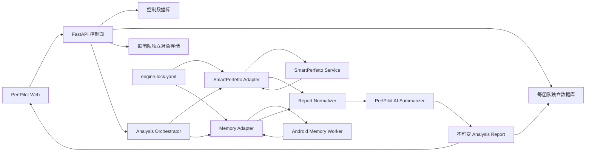

# PerfPilot 外部分析内核接入设计

- 日期：2026-07-28
- 状态：待用户书面复核
- 主分析内核：SmartPerfetto
- 内存补证内核：Android-App-Memory-Analysis
- 产品边界：保留现有 PerfPilot 界面、账户、租户数据库、对象存储、任务和报告体验

## 1. 决策摘要

PerfPilot 不再开发另一套 Trace 分析内核。SmartPerfetto 负责主要 Trace 分析，Android-App-Memory-Analysis 负责内存专项证据，PerfPilot 负责租户隔离、任务编排、结果规范化和最终建议。

两个内核独立部署。PerfPilot 通过版本化 Adapter 调用它们，不复制其源码，也不解析终端文案。升级时，系统拉取指定 tag 或 commit，构建独立镜像，运行兼容测试，再灰度切换镜像 digest。兼容升级不改 PerfPilot 的网页和公共 API。

首版只实现上传分析：用户上传一份 Perfetto Trace，可附加内存证据、APK、源码、mapping 和 Native symbols。首版不实现 APK 自动安装、ADB、真机调度或用户自带 AI Key。

## 2. 目标

首版必须完成以下流程：

1. 用户在现有“上传 Trace 分析”入口提交 Trace 和可选附件。
2. PerfPilot 校验并保存不可变输入。
3. SmartPerfetto 分析 Trace，并通过 SSE 返回进度和终态报告。
4. 用户上传内存材料时，Android-App-Memory-Analysis 生成版本化证据上下文。
5. PerfPilot 保存两个内核的原始结构化结果，再规范化为平台报告。
6. PerfPilot AI 提取重点、合并重复项、说明用户影响，并生成优化建议和复测标准。
7. 现有总览、问题详情、证据链和建议页面展示真实数据。

首版成功标准：

- 生产页面不回退到演示数据。
- 每个指标、问题和建议能追溯到内核结果和 artifact ID。
- 报告记录输入哈希、内核 commit、镜像 digest、契约版本、模型和生成时间。
- 用户或团队之间无法读取彼此的输入、内核运行记录和报告。
- 内存补证失败时保留 SmartPerfetto 主报告。
- SmartPerfetto 失败时不生成 PerfPilot 最终结论。
- 兼容的内核升级只修改 engine lock 和镜像，不改网页代码。

## 3. 非目标

本轮不实现：

- APK 自动安装、真机租约、ADB 采集和设备农场。
- SmartPerfetto 页面嵌入或 iframe。
- 把 SmartPerfetto 或 Android 内存仓库复制进 PerfPilot。
- 用户配置模型或自带 API Key。
- 自动修改、提交或发布客户代码。
- 直接跟随 upstream `latest`。
- 把原始 Trace、HPROF、日志、对象键或本地绝对路径发送给 PerfPilot AI。

## 4. 上游版本与许可证边界

首个兼容基线固定为：

| 内核 | 源仓库 | 首个基线 | 接口边界 | 许可证 |
| --- | --- | --- | --- | --- |
| SmartPerfetto | `Gracker/SmartPerfetto` | tag `v1.0.38`，commit `1508f99788bfcf18cc861e4bf4f8b472e84240c3` | workspace HTTP API、SSE、结构化报告 | AGPL-3.0-or-later |
| Android-App-Memory-Analysis | `Gracker/Android-App-Memory-Analysis` | commit `d5514972ced78c3faa7fc17589c1ea9231645056` | `android-memory-ai-context` schema `1.2` | Apache-2.0 |

SmartPerfetto 作为独立网络服务运行。PerfPilot 不修改或静态链接其代码。若项目修改 SmartPerfetto 并向网络用户提供服务，发布流程必须满足 AGPL 对应源码义务，或在上线前取得合适的商业许可。最终许可证判断由法务确认。

Android 内存仓库可作为独立 Worker 使用。首版镜像不分发仓库中的本机 `adb` 或 `hprof-conv` 二进制；后续引入这些能力前必须完成 SBOM 和第三方许可证核验。

## 5. 总体架构



控制面继续负责身份认证、租户路由、上传授权、任务状态和报告查询。两个内核不连接控制数据库或租户数据库，也不能选择 bucket、对象键或团队。它们只处理一次 claim 对应的临时输入。

## 6. 组件边界

### 6.1 PerfPilot Web

网页保留现有页面层级和视觉设计。首版只增加：

- “内存证据包”可选上传项。
- 可选问题描述。
- SmartPerfetto、Android Memory 和 PerfPilot AI 三段进度。
- 报告中的来源标签、内核版本和部分失败提示。

用户没有上传内存材料时，网页不显示内存步骤失败，而是标记为“未请求”。现有“真机自动测试”入口继续保留为不可用状态，不进入首版后端流程。

APK、源码、mapping 和 Native symbols 字段继续保留。首版只有 Adapter 明确声明并通过安全校验的附件才参与分析；其余附件在界面中标记为“已保存，暂未参与本次分析”，避免虚假提升可信度。

### 6.2 Analysis Orchestrator

Orchestrator 读取权威任务和 artifact 记录，选择 Adapter，保存执行状态，并触发最终总结。它不读取大文件内容。Worker claim API 负责生成短期、版本绑定的下载授权。

Trace 上传采用直接父任务：`analysis_mode=trace_upload` 不创建设备场景任务、租约或 Agent 请求。任务从上传完成直接进入分析阶段。

### 6.3 Engine Adapter

Adapter 使用统一内部协议：

```text
submit(inputs, config) -> EngineRunRef
stream(run_ref, cursor) -> EngineEvent[]
fetch_result(run_ref) -> EngineResult
cancel(run_ref) -> EngineTerminalState
```

每个 Adapter 声明：

- `engine_id` 和 `adapter_version`。
- 支持的 analysis profile。
- 必需和可选 artifact 类型。
- 接受的上游契约版本。
- 超时、重试和资源要求。
- 稳定错误码映射。

Adapter 只读取结构化 API 或 JSON。它不得解析日志措辞、CLI 进度文本、HTML 或 Excel。

### 6.4 SmartPerfetto Adapter

SmartPerfetto 是必需的主引擎。Adapter 使用 workspace 路径：

```text
POST /api/workspaces/{workspaceId}/traces/upload
POST /api/workspaces/{workspaceId}/agent/analyze
GET  /api/workspaces/{workspaceId}/agent/runs/{runId}/stream
GET  /api/workspaces/{workspaceId}/agent/{sessionId}/status
GET  /api/workspaces/{workspaceId}/agent/{sessionId}/report
POST /api/workspaces/{workspaceId}/agent/{sessionId}/cancel
```

Adapter 保存 `trace_id`、`session_id`、`run_id` 和 SSE cursor。连接中断时，它使用 `Last-Event-ID` 续传。它把 `awaiting_user`、`quota_exceeded`、`partial`、`cancelled` 和 `failed` 映射为平台稳定状态。

首版启用 `auto`、`startup` 和 `scroll` 三种 profile。`auto` 先执行 Smart scene preview，只接收可映射到 startup 或 scroll 的已识别场景；没有受支持场景时返回 `unsupported_trace_profile`。内存专项不依赖 SmartPerfetto 的场景推断，由 Memory Adapter 补充。

SmartPerfetto 生产实例必须开启企业模式和 workspace 授权。PerfPilot 不开放 Provider Manager、外部 URL 上传、CLI capture、RAG 写入、案例自学习、MCP、代码执行或跨 workspace 共享。

一个 PerfPilot 团队固定映射到一个 SmartPerfetto workspace。控制面创建并保存这条 opaque 映射；浏览器、用户请求和 Adapter 都不能指定或覆盖 workspace。删除团队时，保留策略先处理进行中的 run 和报告，再删除对应 workspace 数据。

### 6.5 Memory Adapter

Memory Adapter 只在用户上传内存证据包时运行。它在独立 Worker 中调用：

```bash
python3 tools/ai_context.py \
  --dump-dir /work/input \
  --question "为什么退出页面后内存没有回落？" \
  --format json
```

Worker 捕获 stdout，并要求：

- `context_type=android-memory-ai-context`。
- `schema_version=1.2`。
- `generator.name=android-memory-ai`。
- JSON 通过本地兼容校验。

退出码 `0` 表示上下文已生成。退出码 `2` 表示证据不足；系统保存上下文并映射为 `insufficient_data`，不把它当成 Worker 故障。退出码 `1`、超时、无效 JSON 或 schema 不兼容映射为稳定失败码。

首版不使用 `--include-local-paths`，不开放显式目录外 artifact override，也不调用 `live`、`panorama` 或 `diff` 采集命令。

### 6.6 Report Normalizer

Normalizer 先保存上游原始结构化结果，再生成平台 `AnalysisBundle`。它负责：

- 保留 SmartPerfetto finding、evidence、claim verification 和 identity resolution。
- 把 Memory context 的 coverage、conflict、artifact、limitation 和 next evidence 映射到平台证据。
- 统一 severity、finding status、metric state 和稳定错误码。
- 为每条结论保留来源引擎和原始 ID。
- 把缺失值映射为 `unavailable` 或 `insufficient_data`，不写成 `0`。

设备模式继续使用现有 `AnalysisBundle v1` 和 `AnalysisReport v1`。Trace 上传沿用 Phase 3 的直接父任务和同一报告契约：startup、scroll 或两者均可形成报告条目，但不创建设备场景任务。非 startup/scroll 的 SmartPerfetto 发现保存在原始 engine result 中，首版不把它提升为公共问题卡片。

Memory context 只有在 package 和 phase metadata 与本次分析一致时，才生成补充 `memory_cycle` 报告条目。证据不足时，Normalizer 只写入 limitation 和 next-evidence 指令，不生成已确认问题。无法关联场景的内存证据保存在原始 result 中，不改变 Trace 指标或 finding 状态。

### 6.7 PerfPilot AI Summarizer

SmartPerfetto 负责主分析；PerfPilot AI 不重新查询 Trace。它只读取：

- SmartPerfetto 的终态结构化报告。
- Memory context 的脱敏投影。
- 平台已验证的 artifact、设备和应用元数据。

AI 输出必须通过严格 JSON Schema，包含：

- `executive_summary`。
- `top_findings`，每项引用既有 finding 或 evidence ID。
- `recommendations`，每项包含优先级、修改方向、预期效果和证据 ID。
- `retest_plan`，包含相同场景、指标、目标和失败条件。
- `limitations` 和缺失证据。

AI 不能创建新的测量值、证据 ID 或内核状态。模型输出无效时，系统最多重试一次；再次失败后保留内核报告，并把任务标记为部分完成。

### 6.8 平台级 AI 配置

管理员配置一个平台级 AI provider。密钥只存在密钥管理器中，租户数据库、浏览器和日志都不保存它。SmartPerfetto 和 PerfPilot AI 通过只读 secret mount 或内部 secret broker 取得运行时配置。

每次模型调用记录 tenant、analysis、provider、model、prompt template version、token usage、latency 和结果状态。审计记录不保存提示词正文或客户证据。

## 7. 输入与公共 API

现有 `/v1/teams/{team_id}/analyses` 增加 Trace 上传分支：

```json
{
  "schema_version": "1.0",
  "analysis_mode": "trace_upload",
  "analysis_profile": "auto",
  "question": "为什么页面滑动时出现周期性卡顿？",
  "inputs": [
    {"kind": "trace", "mime": "application/octet-stream", "size": 1048576, "sha256_b64": "AAAAAAAAAAAAAAAAAAAAAAAAAAAAAAAAAAAAAAAAAAA="},
    {"kind": "memory_evidence_archive", "mime": "application/zip", "size": 524288, "sha256_b64": "AQEBAQEBAQEBAQEBAQEBAQEBAQEBAQEBAQEBAQEBAQE="}
  ]
}
```

约束如下：

- `analysis_profile` 只允许 `auto`、`startup` 或 `scroll`。
- 每次请求必须包含一份 Trace。
- 内存证据包最多一份。
- APK、mapping、source archive、Native symbols 和日志保持可选。
- 服务端生成对象键；文件名只用于展示。
- `Idempotency-Key` 与规范化请求哈希共同决定幂等结果。

默认资源上限：

| 资源 | 默认上限 |
| --- | --- |
| Trace | 2 GiB |
| 内存证据压缩包 | 2 GiB |
| 解压后总大小 | 4 GiB |
| 文件数 | 2,048 |
| 单文件压缩比 | 100:1 |
| SmartPerfetto 墙钟时间 | 30 分钟 |
| Memory Worker 墙钟时间 | 10 分钟 |
| PerfPilot AI 墙钟时间 | 2 分钟 |

管理员可调低这些值。提高上限需要容量测试。

## 8. 持久化模型

新增私有 `engine_executions`，不把引擎运行字段塞入公共报告：

```text
id
analysis_id
engine_id
adapter_version
engine_commit_sha
engine_image_digest
input_manifest_hash
config_hash
external_workspace_id
external_session_id
external_run_id
state
last_event_cursor
stable_error_code
started_at
completed_at
raw_result_artifact_id
normalized_report_version_id
```

外部 ID 是 opaque 值，只能在对应团队和分析任务中使用。API 不向浏览器返回 SmartPerfetto 内部 workspace、路径或 provider 配置。

`report_versions` 继续保存不可覆盖的规范化 bundle。PerfPilot AI 总结作为同一报告版本的受校验 section 保存；重跑总结时创建新报告版本，不覆盖旧报告。

## 9. 状态与失败语义

Trace 上传父任务使用：

```text
creating -> created -> uploading -> analyzing -> completed
                                      |          -> partially_completed
                                      -> failed
                         cancel_requested -> canceled
```

终态规则：

| SmartPerfetto | Memory | PerfPilot AI | 父任务 | 行为 |
| --- | --- | --- | --- | --- |
| 成功 | 未请求或成功 | 成功 | `completed` | 展示完整报告 |
| 成功 | 已请求但失败 | 成功 | `partially_completed` | 展示主报告和缺失提示，可单独重试 Memory |
| 失败 | 任意 | 不运行 | `failed` | 不生成最终结论；保留已完成补证和错误 |
| 成功 | 成功或未请求 | 失败 | `partially_completed` | 展示内核报告，可单独重跑总结 |
| 取消 | 任意 | 不运行或取消 | `canceled` | 停止外部 run，保留审计和已完成产物 |

系统把 SmartPerfetto `quota_exceeded` 映射为稳定的可重试容量错误。SSE 暂时断开不改变任务终态。Orchestrator 先重连并重放事件，再查询 status；只有上游明确终态或超过恢复期限时才失败。

## 10. 安全与隔离

两个内核运行在独立容器或独立 Worker 池中，满足：

- 非 root 用户。
- 只读根文件系统。
- 删除 Linux capabilities，并启用 `no-new-privileges`。
- 每个 claim 使用独立可写 workspace。
- CPU、内存、PID、临时磁盘和墙钟限制。
- 默认禁网；SmartPerfetto 仅允许访问配置的 AI provider 和内部 API。
- Worker 不挂载控制数据库、租户数据库或对象存储密钥。
- 输入通过短期、版本绑定的下载授权取得。
- 输出通过私有 claim API 回传。

内存压缩包解压时拒绝绝对路径、`..`、符号链接、硬链接、设备文件、重复覆盖和超限条目。原始 HPROF 和 Trace 采用高敏感数据的保留、访问和删除策略。

## 11. 内核版本锁与升级

仓库新增 `infra/engines/engine-lock.yaml`：

```yaml
engines:
  smartperfetto:
    source: https://github.com/Gracker/SmartPerfetto.git
    ref: v1.0.38
    commit: 1508f99788bfcf18cc861e4bf4f8b472e84240c3
    image_digest: null
    api_contract: workspace-agent-v1
  android_memory:
    source: https://github.com/Gracker/Android-App-Memory-Analysis.git
    commit: d5514972ced78c3faa7fc17589c1ea9231645056
    image_digest: null
    output_contract: android-memory-ai-context-1.2
```

`image_digest: null` 只允许出现在尚未构建的变更中。镜像构建完成后，发布流程把它替换为签名的 SHA-256 digest；生产配置拒绝 `null`、tag-only 镜像和未登记 digest。

升级流程固定为：

1. 选择 upstream tag 或 commit。
2. 在隔离构建环境中拉取源码。
3. 生成镜像、SBOM、许可证清单和签名。
4. 运行旧 fixture 契约测试。
5. 运行真实样本差异测试并生成人工可读 diff。
6. 以 5% 任务灰度新 digest。
7. 指标稳定后全量切换；异常时恢复旧 digest。

Adapter 接口不兼容时，升级进入独立适配任务。旧镜像继续处理生产请求，直到新 Adapter 通过门禁。

## 12. 测试策略

测试分五层：

1. 契约测试：固定 SmartPerfetto HTTP/SSE fixture 和 Memory context fixture。
2. Adapter 测试：覆盖提交、事件重放、取消、超时、错误映射和规范化。
3. 容器集成测试：用固定 Trace 和内存样本运行真实内核。
4. 租户安全测试：验证跨团队读取、猜测 ID 和重放授权均返回 404 或拒绝。
5. 网页端到端测试：覆盖上传、进度、部分失败、报告、单步重试和无演示数据回退。

每次内核升级必须通过以下门禁：

- 旧的成功 fixture 仍能生成可校验报告。
- 旧的失败 fixture 仍返回稳定错误码。
- 同一输入和配置的确定性字段保持一致，或差异得到批准。
- 新版本不会泄露路径、对象键、凭据或跨租户内容。
- 资源峰值未超过配置预算。
- 回滚到旧 digest 后，进行中的新任务停止领取，旧版本能继续处理新任务。

## 13. 实施顺序

当前 Task 7 先完成并冻结设备模式的任务、状态机和报告契约。随后暂停设备 Agent 路线，把原计划中的 Trace-upload 工作提前。

新的实施顺序：

1. Engine Adapter、EngineExecution 和 engine lock 基础。
2. SmartPerfetto workspace API、SSE、取消和报告接入。
3. Android Memory context 接入和安全解压。
4. Report Normalizer 与 PerfPilot AI 总结。
5. Trace-upload API、真实前端数据和进度页面。
6. 容器隔离、升级门禁和端到端验收。
7. 以上流程稳定后，再恢复 APK、ADB 和真机 Agent 计划。

每个实施任务独立测试、独立提交，并快进推送到 GitHub `main`。

## 14. 验收场景

首版至少通过四个真实场景：

1. 只上传启动 Trace：SmartPerfetto 完成，报告显示启动问题、证据和最终建议。
2. 上传滚动 Trace 和内存证据：两个内核完成，PerfPilot 合并结果并保留来源。
3. SmartPerfetto 完成、Memory Worker 超时：父任务部分完成，主报告可读，Memory 可单独重试。
4. SmartPerfetto 返回失败：父任务失败，PerfPilot 不生成最终结论，也不把 Memory 补证伪装成主报告。

四个场景都必须验证租户隔离、输入哈希、内核版本、报告版本和审计记录。
