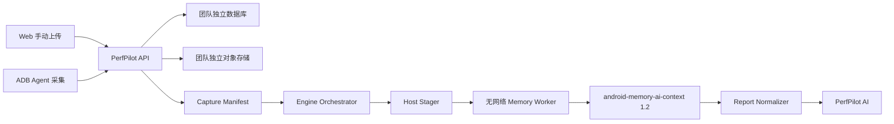

# PerfPilot Android Memory Adapter 设计

- 日期：2026-07-29
- 状态：已获用户确认
- 上游仓库：`Gracker/Android-App-Memory-Analysis`
- 固定 commit：`d5514972ced78c3faa7fc17589c1ea9231645056`
- 基础输出契约：`android-memory-ai-context-1.2`

## 1. 决策摘要

PerfPilot 通过隔离 Worker 接入 Android-App-Memory-Analysis。平台不复制上游源码，也不在分析任务中拉取代码。构建流程按 `engine-lock.yaml` 拉取固定 commit，执行兼容测试，再生成带 digest 的 Worker 镜像。

输入采用“多 Artifact + 服务端生成的 Capture Manifest”。ZIP 不是内核要求，也不是首版协议。每份 meminfo、smaps、HPROF、日志、截图或 Trace 独立上传、校验和保存。Manifest 只描述同一次采集中的 Artifact 关系。

一次 Android Memory 执行只分析一个采集阶段。`before`、`after` 和 `cooldown` 分别生成独立 context，后续由 Report Normalizer 和 PerfPilot AI 比较。该约束避免上游在一个目录中发现多份 meminfo 或 smaps 后无法安全配对。

第一阶段只调用稳定的 `ai-context` 入口。HPROF、Panorama 和阶段 Diff 属于后续深度子任务；它们按证据与问题自动触发，不阻塞基础 context。

本文取代《PerfPilot 外部分析内核接入设计》中以下 Android Memory 内容：单 ZIP 输入、一次目录扫描多个阶段，以及未带 `--strict` 的命令示例。SmartPerfetto 和 PerfPilot AI 的既有边界保持不变。

## 2. 目标

第一阶段必须完成以下能力：

1. 接受同一团队和分析任务下的多份内存证据 Artifact。
2. 为手动上传和 ADB Agent 采集生成同一格式的 Capture Manifest。
3. 把一个采集阶段还原为只包含普通文件的隔离目录。
4. 校验每份输入的租户归属、状态、大小和 SHA-256。
5. 在无网络、非 root 的 Worker 中执行固定版本 `ai-context`。
6. 校验并保存 `android-memory-ai-context` schema `1.2`。
7. 把退出码 `0`、`1` 和 `2` 映射为稳定平台状态。
8. 支持超时、取消、有限重试和进程重启恢复。
9. 保持每团队独立数据库和对象存储边界。
10. 为后续深度分析和 PerfPilot AI 保留可追溯输入与结果。

成功标准：

- 单次快照可独立生成基础 context。
- 多阶段分析不会把不同阶段的 meminfo、smaps 或 HPROF 放进同一上游扫描目录。
- 证据不足时保存 context，并返回 `insufficient_data`，不报告系统故障。
- 每个结果可追溯到 Manifest、Artifact hash、上游 commit、镜像 digest 和 Adapter 版本。
- Worker 无法访问数据库、对象存储长期凭据、其他租户目录或外部网络。
- A 团队不能在 Manifest 中引用 B 团队的 Artifact。

## 3. 非目标

第一阶段不实现：

- 在每个任务中执行 `git clone`、`git pull` 或安装依赖。
- 接受 ZIP、tar 或任意目录归档作为标准输入。
- 调用 Android Memory 的 `live` 命令控制 ADB。
- 执行完整 HPROF、Panorama 或 Diff 深度分析。
- 把原始 HPROF、Trace、日志正文或截图像素发送给 PerfPilot AI。
- 允许用户指定可执行文件、命令行参数、环境变量或服务器路径。
- 根据文件名猜测多份同类证据的阶段关系。
- 自动修改、提交或发布客户 Android 代码。

ADB Agent 的采集动作属于独立功能包。该 Agent 上线后使用本文的 Artifact 和 Manifest 契约，不改变 Memory Adapter。

## 4. 已验证的上游契约

固定 commit 提供以下入口：

```bash
python3 tools/ai_context.py \
  --dump-dir /work/input \
  --question "退出页面后内存没有下降" \
  --format json \
  --strict \
  --output /work/output/context.json
```

`tools/ai_context.py` 是薄包装，实际入口是 `android_memory_ai.cli.main`。Worker 必须传 `--strict`，才能得到确定的退出语义：

| 退出码 | 上游语义 | 平台状态 |
| --- | --- | --- |
| `0` | context 已生成，证据覆盖不为 `insufficient` | `completed` |
| `2` | context 已生成，但必需证据不完整 | `insufficient_data` |
| `1` | 目录、输入、输出或运行时错误 | `failed` |

基础结果必须满足：

```text
context_type = android-memory-ai-context
schema_version = 1.2
generator.name = android-memory-ai
generator.version = 1.2.0
analysis_contract.privacy.local_paths_included = false
```

上游按内容递归识别目录中的证据。它支持 meminfo、smaps、showmap、HPROF、gfxinfo、系统 meminfo、pressure、zram、DMA-BUF、exit info、Perfetto Trace、native heap profile、设备上下文、阶段元数据、Android 日志、QA 截图、旧 context 和旧分析报告。

上游默认最多索引 2,048 个普通文件。它不跟随符号链接。多份同阶段 meminfo 或 smaps 可能使账本进入 `ambiguous`；PerfPilot 因此对每个采集阶段单独运行内核。

`ai-context` 建立证据清单、覆盖度、冲突、部分 meminfo/smaps 账本、日志信号、限制和下一步采集建议。它不等同于完整 HPROF、Panorama 或 Diff 分析。

## 5. 总体架构



API 负责身份、租户路由、上传授权和 Manifest 生成。Host Stager 使用短期下载 claim 取得 Artifact，并在启动 Worker 前校验输入。Memory Worker 只读本地文件，不能连接数据库或对象存储。Orchestrator 保存执行状态和原始结果。

## 6. 输入模型

### 6.1 Artifact 存储分类

平台保留现有 Artifact 表和不可变上传流程。公共上传 allowlist 增加 `memory_evidence` 和 `screenshot`，并复用现有分类。平台另增一个仅供内部写入的 Manifest 分类：

| `artifact_kind` | 用途 |
| --- | --- |
| `memory_evidence` | meminfo、smaps、showmap、HPROF、gfxinfo、系统内存证据和其他内存文件 |
| `screenshot` | PNG、JPEG 或 WebP QA 截图 |
| `log` | logcat、LeakCanary、bugreport 和其他 Android 日志 |
| `trace` | Perfetto Trace 或受支持的 profile |
| `capture_manifest` | ADB 工具产生、供上游识别的原始采集清单 |
| `memory_capture_manifest` | PerfPilot 服务端生成的阶段与 Artifact 关系清单 |

`artifact_kind` 控制存储策略，不替代内容校验。Manifest 的 `role` 提供分析提示；上游仍按内容确认文件类型。

`memory_capture_manifest` 不进入公共上传 allowlist。客户端仍可上传上游格式的 `capture_manifest` 作为证据。生成的 context 和后续深度结果使用现有引擎结果 Artifact 流程，不开放为输入上传类型。

### 6.2 Capture Manifest

Manifest schema `1.0` 表示一个采集阶段：

```json
{
  "schema_version": "1.0",
  "analysis_id": "018f0000-0000-7000-8000-000000000001",
  "capture_id": "018f0000-0000-7000-8000-000000000002",
  "phase": "before",
  "source": "adb_agent",
  "captured_at": "2026-07-29T08:00:00Z",
  "subject": {
    "package": "com.example.app",
    "pid": 1234,
    "android_release": "17",
    "android_sdk": 37
  },
  "artifacts": [
    {
      "artifact_id": "018f0000-0000-7000-8000-000000000010",
      "role": "meminfo"
    },
    {
      "artifact_id": "018f0000-0000-7000-8000-000000000011",
      "role": "smaps"
    }
  ]
}
```

字段约束：

- `analysis_id`、`capture_id` 和 `artifact_id` 是 UUID。
- `phase` 只允许 `single`、`before`、`after` 或 `cooldown`。
- `source` 只允许 `manual_upload` 或 `adb_agent`。
- `captured_at` 可选；已知时使用 UTC RFC 3339。ADB Agent 提供采集时间，手动上传缺少原始时间时保持为空，不用上传时间代替。
- `subject` 只保存受限的应用、进程和 Android 版本字段。
- `artifacts` 不得为空，同一 `artifact_id` 不得重复。
- Manifest 不保存团队 ID、bucket、对象键、下载 URL、本地路径或原始文件名。

`role` 允许：

```text
auto
meminfo
smaps
showmap
hprof
gfxinfo
proc_meminfo
pressure_memory
zram
dmabuf
exit_info
analysis_report
comparison_report
perfetto_trace
native_heap_profile
phase_metadata
device_context
previous_ai_context
previous_analysis_report
android_log
qa_screenshot
```

一个 Manifest 最多包含一份 `meminfo`、`smaps`、`showmap`、`hprof`、`gfxinfo`、`proc_meminfo`、`pressure_memory`、`zram`、`dmabuf`、`exit_info`、`perfetto_trace`、`native_heap_profile`、`phase_metadata` 或 `device_context`。日志、截图和历史材料可以重复。未分类的手动文件使用 `auto`。

问题文本不进入 Manifest。Orchestrator 通过 `SubmitConfig.question` 传递问题，使同一份不可变证据可以用新问题重新分析。

### 6.3 Manifest 信任边界

客户端不能直接写入权威 Manifest Artifact。手动上传 API 接收 Artifact ID、阶段和可选 role；ADB Agent 接收采集 claim 后提交同类元数据。服务端执行以下步骤：

1. 从认证上下文取得团队和分析任务。
2. 在该团队数据库中加载 Artifact。
3. 要求 Artifact 已完成上传、未删除、未过期，并归属于允许的 Analysis 或 SampleAttempt。
4. 拒绝跨团队、跨分析和重复引用。
5. 规范化字段顺序和时间格式。
6. 生成 Manifest JSON、hash 和不可变 Artifact。

浏览器和 Agent 提交的 `analysis_id`、对象地址、文件大小或 hash 都不覆盖服务端权威记录。

### 6.4 手动与自动分析

- 自动化测试复用现有 `memory_cycle` 场景。每次采集绑定相应 `SampleAttempt`。
- 手动证据使用新的 `analysis_mode=memory_upload`。用户先选择已有 ApplicationVersion，输入 Artifact 再直接归属于 Analysis；首版不创建脱离应用版本的孤立任务。
- 单次快照使用 `phase=single`。
- 内存增长场景默认生成 `before`、`after` 和 `cooldown` 三个 Manifest。

若证据识别出的 package 与所选应用冲突，系统保留原始 context 和冲突信息，但不把该 context 规范化为所选应用的已确认 finding。

控制数据库与团队数据库中的 `analysis_mode` 约束、公共 API 枚举和测试必须同时增加 `memory_upload`。迁移保持旧记录不变。

## 7. 多阶段执行

Orchestrator 为每个 Manifest 创建一个 Android Memory `engine_execution`。它不把多个 Manifest 合成一个上游目录。

```text
before Manifest   -> execution A -> before context
after Manifest    -> execution B -> after context
cooldown Manifest -> execution C -> cooldown context
```

三个执行共享 Analysis ID，但使用不同 `input_manifest_hash` 和结果 Artifact。Report Normalizer 按 `capture_id` 和 `phase` 组合结果。后续 PerfPilot AI 可以比较阶段；Memory Adapter 本身不推断泄漏。

任一阶段返回 `insufficient_data` 时，系统保留其他阶段结果。父任务可进入 `partially_completed`，但不得把缺失阶段当作零值。

## 8. Adapter 与 Worker

### 8.1 Adapter 描述

`AndroidMemoryAdapter` 实现现有 `EngineAdapter` 协议，并声明：

```text
engine_id: android_memory
resource_profile: isolated_worker
profiles: auto
required_inputs: memory_capture_manifest
optional_inputs: memory_evidence, log, screenshot, trace
accepted_contracts: android-memory-ai-context-1.2
default_timeout_seconds: 900
```

`external_run_id` 保存 Worker run 的 opaque ID。它不能包含主机 PID、目录、容器名称或队列地址。Adapter 只读取结构化 Worker 状态和 JSON 结果，不解析 stderr 措辞。

### 8.2 Host Stager

Host Stager 运行在有对象存储访问能力的受控进程中：

1. 解析权威 Manifest。
2. 为每个 Artifact 申请短期、版本绑定的下载 claim。
3. 流式下载到新建的执行目录。
4. 在写入过程中限制单文件和总字节数。
5. 比较服务端记录的大小与 SHA-256。
6. 根据 role 和 Artifact ID 生成安全相对路径。
7. 以只读 mount 启动 Worker。

Stager 不使用原始文件名。示例路径为 `meminfo/meminfo-<artifact-id>.txt` 或 `logs/android-log-<artifact-id>.txt`。`auto` 文件使用 `unclassified/<artifact-id>.bin`。

`memory_capture_manifest` 属于控制面元数据，不写入 `/work/input`。Stager 只把它引用的证据放入上游目录。原始 `capture_manifest` 若作为证据上传，才以其上游格式进入 `/work/input`。这样可以防止 PerfPilot Manifest 被上游误判为 Android Memory 的采集清单。

下载授权、bucket 和对象键不进入事件、异常、数据库结果或 Worker 环境。

### 8.3 Worker 隔离

生产 Worker 必须满足：

- 非 root 用户。
- 只读根文件系统和只读源码。
- 删除 Linux capabilities，并启用 `no-new-privileges`。
- 禁止外部网络。
- `/work/input` 只读，`/work/output` 和 `/tmp` 为本次执行的临时目录。
- 固定入口和参数 allowlist；不调用 shell。
- 不注入数据库、对象存储、AI provider 或租户密钥。
- 施加 CPU、内存、PID、临时磁盘和墙钟限制。
- 完成、失败或取消后清理执行目录。

默认限制：

| 资源 | 上限 |
| --- | --- |
| Artifact 数量 | 2,048 |
| 单文件大小 | 5 GiB，且不得超过上传层记录 |
| 单次总输入 | 8 GiB |
| 基础分析墙钟时间 | 15 分钟 |
| 输出 JSON | 32 MiB |

管理员可以调低限制。提高限制需要容量测试和磁盘配额评审。

### 8.4 命令构造

Adapter 以参数数组调用 Python，不拼接 shell 字符串：

```text
python3
tools/ai_context.py
--dump-dir
/work/input
--question
<SubmitConfig.question or empty string>
--format
json
--strict
--output
/work/output/context.json
```

Worker 不传 `--include-local-paths`、`--hash-large-files` 或目录外 override。后续若要启用这些选项，必须修改 Adapter 版本和安全测试。

## 9. 输出校验与隐私

Worker 先校验文件存在、为普通文件、大小不超过 32 MiB，并能解析为单个 JSON object。Adapter 再校验固定根字段、类型、契约版本和隐私标志。

保存结果前，平台执行防泄漏检查：

- 拒绝 `analysis_contract.privacy.local_paths_included=true`。
- 拒绝对象键、签名 URL、数据库连接串和已知执行目录前缀。
- 拒绝绝对 POSIX 路径、Windows drive 路径和 `file://` URI 出现在路径字段。
- 日志只记录执行 ID、稳定错误码、字节计数和耗时。

平台保存完整的脱敏 context 作为原始引擎结果。供 PerfPilot AI 使用的投影只包含 coverage、conflict、accounting ledger、QA signal、limitation、next evidence、知识条目 ID 和 Artifact ID。它不包含原始文件正文或像素。

## 10. 状态、重试与恢复

外部执行状态保持现有公共集合：

```text
pending
  -> running/downloading
  -> running/verifying
  -> running/analyzing
  -> completed | insufficient_data | failed | canceled
```

`downloading`、`verifying` 和 `analyzing` 是稳定事件代码，不扩展数据库状态枚举。

稳定失败码：

```text
missing_input
manifest_invalid
download_failed
integrity_mismatch
input_limit_exceeded
worker_unavailable
engine_timeout
engine_failed
invalid_output
incompatible_contract
privacy_violation
```

重试规则：

- 短期下载凭证过期时重新签发一次。
- 临时网络错误或 Worker 容量不足使用有界退避，最多三个 execution attempt。
- `integrity_mismatch`、`manifest_invalid`、`input_limit_exceeded`、`invalid_output`、`incompatible_contract` 和 `privacy_violation` 不重试。
- 基础 Worker 超时允许一次新 attempt；第二次超时终止执行。
- `insufficient_data` 是成功保存的终态，不重试。
- 取消操作幂等。取消已完成执行不删除结果。

每个 attempt 使用新工作目录。结果 Artifact ID 由 execution ID 确定生成，沿用现有 sink-before-terminal 和比较交换写入规则。服务重启后，Orchestrator 重新 claim 非终态 execution；它不得把旧进程状态当作完成证据。

## 11. 深度分析扩展

第二阶段引入三个独立子任务，不改变基础 context 契约：

| 子任务 | 自动触发条件 | 结果用途 |
| --- | --- | --- |
| HPROF | 有效 HPROF，且问题涉及 Java 泄漏或堆增长 | Java 堆对象、引用和泄漏候选 |
| Panorama | 有可用 meminfo、smaps、gfxinfo 组合 | 多内存域联合分析 |
| Diff | 至少两个兼容阶段完成 | before、after、cooldown 差异 |

每个子任务使用独立 execution、资源 profile、超时和输出契约。Orchestrator 只从 allowlist 选择任务，用户不能直接指定脚本。深度任务失败时保留基础 context，并把父任务标为部分完成。

PerfPilot AI 在所有已请求子任务进入终态后运行。它引用既有 Artifact、finding 和 evidence ID，不创建新的测量值。

## 12. 上游升级

`infra/engines/engine-lock.yaml` 是生产版本权威来源：

```yaml
android_memory:
  source: https://github.com/Gracker/Android-App-Memory-Analysis.git
  ref: null
  commit: d5514972ced78c3faa7fc17589c1ea9231645056
  image_digest: <release digest>
  output_contract: android-memory-ai-context-1.2
```

升级流程：

1. 拉取候选 tag 或 commit 到构建环境。
2. 核对许可证、依赖和 SBOM。
3. 构建候选 Worker 镜像。
4. 运行上游测试、Adapter 契约测试、真实样例回归和隐私测试。
5. 运行多租户、取消、超时和恢复测试。
6. 固定镜像 digest 和 commit。
7. 灰度运行，再更新生产 lock。

任务只使用创建 execution 时冻结的 commit 和 digest。更新期间已经运行的任务不切换版本。回滚只需要恢复上一份 lock 和镜像 digest。

本地开发可以指定源码 checkout，但启动时必须验证 checkout HEAD 等于 execution 锁定的 commit。生产环境不挂载可变 Git 工作区。

## 13. 测试与验收

### 13.1 单元测试

- Manifest schema、枚举、重复 Artifact 和 role 数量限制。
- 服务端重新绑定团队、Analysis、SampleAttempt 和 Artifact。
- 安全文件名与参数数组构造。
- 输入大小、总量、文件数和输出大小限制。
- 退出码 `0`、`1`、`2` 映射。
- schema、generator 和隐私字段校验。
- 稳定错误码、重试决策和取消幂等。

### 13.2 集成测试

- 使用真实对象存储接口下载多 Artifact，并校验 hash。
- 使用固定 commit Android Memory checkout 运行最小 meminfo 样例。
- 运行证据不足样例，确认保存 context 并进入 `insufficient_data`。
- 模拟超时、进程退出、取消和服务重启。
- 验证 sink-before-terminal 和确定性结果 Artifact ID。
- 使用真实 PostgreSQL 验证迁移、CAS 和租户路由。
- A 团队引用 B 团队 Artifact 时返回稳定的不可用错误，且响应和日志不泄漏 B 团队信息。

### 13.3 安全测试

- 文件名路径穿越、绝对路径、NUL、控制字符和 Unicode 混淆。
- 符号链接、FIFO、设备文件和硬链接拒绝。
- 超大文件、超量文件、截断下载和 hash 不一致。
- 问题文本包含 shell 元字符时不改变命令结构。
- 输出包含服务器路径、签名 URL、对象键或连接串时拒绝保存。
- Worker 无网络、无长期凭据、无跨执行目录访问。

### 13.4 回归测试

- 完整 API 测试通过。
- Ruff 通过 API 源码和测试目录。
- 现有 SmartPerfetto Adapter 测试保持通过。
- 现有 `device` 和 `trace_upload` 分析流程不变。
- PostgreSQL 强制集成测试通过。

## 14. 实施包与提交边界

实现按以下顺序提交，每个包通过对应测试后独立提交并推送：

1. Manifest、Artifact 类型、`memory_upload` 模式和输入契约。
2. Host Stager 与隔离 Worker Runner。
3. Android Memory Adapter 和真实固定版本契约测试。
4. 执行编排、重试、取消与恢复。
5. HPROF、Panorama 和 Diff 深度子任务。
6. Report Normalizer 与 PerfPilot AI 接入。

每个提交必须包含失败测试、实现、回归结果和稳定错误码。不得用后续提交修补前一包本应满足的验收条件。

## 15. 已确认决定

- 输入使用多 Artifact + Manifest，不强制 ZIP。
- 单次快照直接分析；增长场景使用 `before`、`after` 和 `cooldown`。
- 每个阶段单独运行 Android Memory。
- 第一阶段默认执行基础 `ai-context`。
- 深度 HPROF、Panorama 和 Diff 按需自动触发。
- Android Memory 与 PerfPilot 解耦，通过 commit 和镜像 digest 升级。
- PerfPilot AI 负责跨阶段和跨内核总结，不替代上游测量。
