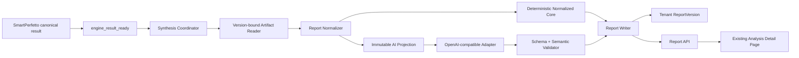

# PerfPilot AI 二次分析与 Trace 报告设计

- 日期：2026-08-03
- 状态：已于 2026-08-03 获用户确认
- 首个 AI 协议：OpenAI-compatible Chat Completions + strict JSON Schema
- 依赖设计：
  - `2026-07-28-perfpilot-external-analysis-engines-design.md`
  - `2026-07-30-perfpilot-canonical-engine-results-design.md`

## 1. 决策摘要

PerfPilot 使用异步分层流水线生成最终 Trace 报告：SmartPerfetto 先产出不可变
`canonical-engine-result`；Report Normalizer 再生成可验证的核心报告草稿和脱敏 AI
投影；PerfPilot AI 只总结这份投影；Report Writer 最后保存不可变
`AnalysisReport 1.1`。

首个 Provider Adapter 使用 OpenAI-compatible `/chat/completions` 协议。平台管理员
配置 HTTPS base URL、模型和密钥引用。浏览器、租户数据库和控制数据库都不保存
密钥。更换兼容供应商不改变报告 API 或网页代码。

SmartPerfetto 始终拥有测量事实。AI 只能总结、排序、解释影响、给出优化方向和复测
方案。AI 不能查询 Trace，不能创建指标、测量值、finding、evidence 或内核状态。

## 2. 本轮范围

本轮交付一条可上线的 SmartPerfetto 到最终报告链路：

1. SmartPerfetto 的 `completed` 或 `insufficient_data` 结果发布 `engine_result_ready`。
2. 独立 Report Worker 读取指定租户、指定版本的 canonical artifact。
3. Normalizer 生成确定性核心报告和 AI 投影。
4. OpenAI-compatible Adapter 请求严格结构化总结。
5. Validator 校验结构、引用、数值和隐私边界。
6. Report Writer 保存不可变报告版本。
7. 报告 API 和现有分析详情页展示真实结果。
8. AI 失败时保留核心报告，并允许单独重试总结。

Android Memory 的 canonical result 继续保持可接入边界。本轮不把 Memory Web 上传和
编排加入 Trace 流水线；后续阶段可把已校验的 Memory projection 加入同一 Normalizer，
无需修改 Provider Adapter 或网页顶层结构。

## 3. 非目标

本轮不实现：

- 把原始 Trace、HPROF、日志、源码或对象存储坐标发送给 AI。
- 让 AI 直接调用 SmartPerfetto、Perfetto SQL、数据库、文件系统或工具。
- 用户自带 API Key 或按租户选择模型。
- 自动修改、提交或发布客户代码。
- 解析模型的自由文本或 Markdown 作为报告。
- 重做现有视觉设计或把静态总览页改造成跨分析聚合页。
- 完成 Android Memory 的自动 Trace 关联和最终合并报告。

## 4. 方案选择

设计比较了三种方式：

1. **异步分层流水线（采用）**：Normalizer 与 AI 分开，分别校验并持久化。该方案
   支持租约恢复、独立重试、审计和部分完成。
2. **AI 直接读取 canonical result（拒绝）**：代码较少，但会扩大数据暴露面，让
   Provider 绑定上游结构，并削弱引用校验。
3. **读取报告时同步调用 AI（拒绝）**：无需 Worker，但会增加页面延迟、重复计费和
   不确定失败，无法提供稳定报告版本。

## 5. 总体架构



控制数据库只保存任务、租约和不含客户正文的调用审计。Canonical result、AI
projection 和最终报告都保存在选定租户的数据库或对象存储中。Worker 不能自行选择
team、bucket、object key 或版本。

## 6. 组件边界

### 6.1 Synthesis Coordinator

`EngineExecution` 完成 canonical result 的终态 CAS 后，发布一次
`engine_result_ready`。Coordinator 验证以下事实后创建 synthesis generation：

- 父任务属于同一 team 和 analysis。
- 分析模式为 `trace_upload`。
- 引擎为 `smartperfetto`，执行状态为 `completed` 或 `insufficient_data`。
- `raw_result_artifact_id` 已绑定且 `normalized_report_version_id` 为空。
- 该 execution 是父任务当前权威的最新 attempt，不是被替代的旧结果。
- synthesis 固定使用 execution 捕获的 `tenant_resource_version`。
- 事件中的 execution version 与权威记录一致。

Coordinator 不读取 artifact 内容。它创建 `SynthesisExecution`，写入
`analysis_synthesis_requested` outbox event，并让父任务保持 `analyzing`。

### 6.2 Version-bound Artifact Reader

Reader 通过 team 和固定 `tenant_resource_version` 加载 tenant Artifact 记录，并使用精确
`VersionId` 读取对象。它验证对象状态、MIME、长度、SHA-256、S3 VersionId 和
canonical envelope 身份。Reader 不接受 URL、bucket、key 或版本作为消息参数。

读取失败按稳定错误分类。数据库、路由和对象存储暂时故障可重试；身份、校验和或
canonical schema 不匹配视为完整性失败。

### 6.3 Report Normalizer

Normalizer 是确定性纯转换。输入相同、Normalizer 版本相同，输出字节必须相同。
它完成以下工作：

- 重新校验 `canonical-engine-result 1.0` 和 `workspace-agent-v1` 固定点。
- 只从 SmartPerfetto `resultContract.version=1.0.0`、claim verification、identity
  resolution、findings 和明确支持的 summary 字段提升事实。
- 为 metric、finding、evidence 和 limitation 生成稳定 UUIDv5。
- 统一 scenario、severity、finding status、confidence 和缺失值语义。
- 把无法验证的值标记为 `insufficient_data` 或 `unavailable`，绝不写成 `0`。
- 保留 source ID、canonical artifact ID、引擎 commit、镜像 digest 和契约版本。
- 生成内部 `normalized-trace-report 1.0` 与更小的 `ai-projection 1.0`。

Normalizer 不解析终端文案，不把假设提升为测量事实，也不根据单个阈值宣布根因。
只有结构化来源字段可进入公共报告。旧版或未知 `resultContract` 保留在 canonical
artifact 中，但不会成为公共 finding。

### 6.4 AI Projection Builder

Projection Builder 从已验证核心报告生成最多 256 KiB 的规范 JSON。它保留：

- authoritative analysis profile 和用户问题；
- scenario、metric、finding、evidence 和 limitation 的公共 ID；
- 已验证的状态、严重程度、置信度、阈值和必要证据摘要；
- 不含存储位置的应用、设备和引擎 provenance。

它排除：

- Trace、HPROF、日志、源码和附件正文；
- SmartPerfetto conversation、query history、analysis notes 和 echoed question；
- 外部 workspace、session、run、report ID；
- bucket、object key、VersionId、URL、本地路径、凭据和内部异常正文；
- 未验证假设和不受支持的任意上游字段。

平台单独注入规范化后的用户问题，最大 2,000 个字符。Prompt 把该问题标记为不可信
数据；它不能改变系统指令或输出契约。

Projection 作为 tenant-private、不可变 `ai_projection` Artifact 保存。报告 provenance
记录 artifact ID 和 SHA-256。控制数据库只保存 projection hash。
同一 canonical result 和 Normalizer 版本复用同一 projection Artifact；generation 不改变
projection 身份。

### 6.5 OpenAI-compatible Provider Adapter

首个 Adapter 定义 `chat-completions-json-schema-v1`：

- base URL 指向 API 根路径，例如 `https://provider.example/v1/`；Adapter 在保留根路径的
  前提下追加 `chat/completions`；
- 使用 `Authorization: Bearer <secret>`；
- 请求设置 `stream=false`、`temperature=0` 和 strict `response_format.json_schema`；
- 不声明 tools、function calling、file、web search 或 remote MCP；
- 只接受 `choices[0].message.content` 中的单个 JSON 文档；
- 拒绝 redirect、tool call、refusal、截断响应、多 choice 和额外正文；
- 响应正文上限为 128 KiB；
- 整个 synthesis generation 的墙钟上限为 120 秒。

Adapter 接口与 provider 无关：它接收投影、Prompt 模板和每次 attempt 的请求 ID，返回候选 JSON、
非敏感 usage 和 latency。它不返回或记录请求头、密钥、完整请求和原始无效响应。

### 6.6 Synthesis Validator

Validator 分两步处理模型输出：

1. JSON Schema 验证字段、枚举、长度、数量和 `additionalProperties: false`。
2. 语义验证确认所有 finding、evidence、metric、scenario 和 limitation 引用来自投影。

语义验证还执行以下规则：

- AI 不能创建或修改 metric、measurement、threshold、status、severity 或 confidence。
- `insufficient_data` 和 `invalid_capture` finding 不能获得优化建议。
- 输出中的数值必须出现在投影的测量值或阈值白名单中。
- 每条 recommendation 必须引用至少一个可建议 finding 和一个已有 evidence。
- 每个 retest item 必须引用已有 scenario 和 metric，或明确选择“补采证据”。
- 所有字符串再次通过 URL、凭据、对象存储 URI、绝对路径和遍历标记扫描。
- 输出 ID、来源状态和 provider 文案不能覆盖平台生成的 provenance。

服务端生成 recommendation 等公共 ID。模型不生成数据库 ID。

通过全部验证的模型输出作为 tenant-private、不可变 `ai_synthesis_result` Artifact 保存。
平台不保存无效候选。Worker 用 control CAS 绑定候选 artifact、checksum 和唯一
`report_generated_at`；崩溃恢复后直接使用已绑定候选，不再次调用 Provider。

### 6.7 Report Writer

Report Writer 把核心报告和 synthesis section 组合成 `AnalysisReport 1.1`，计算规范 JSON
SHA-256，并在 tenant transaction 中写入下一条 analysis-level `ReportVersion`。随后它
通过 control CAS 绑定 `EngineExecution.normalized_report_version_id`，完成
`SynthesisExecution`，并更新父任务。

并发 Writer 依靠 generation 唯一约束、报告版本唯一约束、checksum 比对和 control
CAS 收敛。发现不同字节争用同一版本时，Writer 报告完整性错误，绝不覆盖现有报告。
所有恢复 Writer 使用 `SynthesisExecution.report_generated_at`，不会因本机时钟生成不同
报告字节。

### 6.8 Report API 与 Web

`GET /v1/teams/{team_id}/analyses/{analysis_id}/report` 对 `trace_upload` 读取最新有效的
analysis-level `ReportVersion`。Device 模式继续从 scenario bundle 组装，不改变现有
行为。

`POST /v1/teams/{team_id}/analyses/{analysis_id}/synthesis-runs` 使用
`Idempotency-Key` 创建下一代 AI 总结。该接口要求团队写权限、有效核心报告和终态父
任务。它不重新运行 SmartPerfetto，也不重新上传 Trace。

手动重跑期间继续提供上一份有效报告。成功写入新版本后，如果父任务唯一的部分完成
原因是 AI 失败，专用 remediation CAS 可以把 `partially_completed` 提升为
`completed`；如果仍有其他部分完成原因，父状态保持不变。已经 `completed` 的父任务
在重跑期间和重跑后都保持 `completed`。普通状态转换接口不能执行该提升。

Analysis 响应新增四个阶段：`input_validation`、`smartperfetto`、`perfpilot_ai` 和
`report`。阶段状态只允许 `pending`、`running`、`completed`、`failed`、`canceled` 和
`not_requested`。

## 7. 数据契约

### 7.1 Normalized Trace Report 1.0

Normalizer 使用内部 schema
`contracts/v1/reports/normalized-trace-report.schema.json` 表示确定性核心报告草稿。它
包含最终 scenario reports、核心状态、公共 provenance 和稳定 limitations，但不包含
`synthesis`、Provider 信息、generated time 或报告版本。只有 Report Writer 能把该草稿
包装成公共 `AnalysisReport 1.1`。

### 7.2 AI Projection 1.0

Projection 使用独立 schema `contracts/v1/ai/analysis-projection.schema.json`。顶层结构为：

```json
{
  "schema_version": "1.0",
  "analysis_id": "00000000-0000-0000-0000-000000000000",
  "analysis_profile": "auto",
  "question": null,
  "source": {
    "engine_id": "smartperfetto",
    "adapter_version": "1.0.0",
    "source_contract": "workspace-agent-v1",
    "canonical_artifact_id": "00000000-0000-0000-0000-000000000000"
  },
  "scenarios": [],
  "limitations": []
}
```

每个 scenario 只包含公共 metric、finding、evidence 和 limitation 投影。数组按稳定 ID
排序。Projection 不包含 generated time、调用 attempt 或其他非确定性字段。

### 7.3 AI Synthesis 1.0

模型必须返回：

```json
{
  "schema_version": "1.0",
  "executive_summary": "...",
  "top_findings": [
    {
      "finding_id": "00000000-0000-0000-0000-000000000000",
      "evidence_ids": ["00000000-0000-0000-0000-000000000000"],
      "user_impact": "..."
    }
  ],
  "recommendations": [
    {
      "priority": "p0",
      "title": "...",
      "action": "...",
      "expected_effect": "...",
      "finding_ids": ["00000000-0000-0000-0000-000000000000"],
      "evidence_ids": ["00000000-0000-0000-0000-000000000000"]
    }
  ],
  "retest_plan": [
    {
      "mode": "verify_metric",
      "scenario_type": "startup",
      "metric_ids": ["00000000-0000-0000-0000-000000000000"],
      "limitation_ids": [],
      "steps": "...",
      "success_condition": "meet_existing_threshold",
      "failure_condition": "threshold_missed"
    }
  ],
  "limitations": []
}
```

数量和文本上限：

| 字段 | 上限 |
| --- | ---: |
| `executive_summary` | 2,000 字符 |
| `top_findings` | 5 项 |
| `recommendations` | 10 项 |
| `retest_plan` | 5 项 |
| `limitations` | 20 项 |
| 单个说明字段 | 2,000 字符 |

空 finding 或证据不足的报告允许空 `top_findings` 和 `recommendations`。此时
`retest_plan` 只能要求补采已有 limitation 指定的证据。

`retest_plan.mode=verify_metric` 要求非空 `metric_ids`、空 `limitation_ids`，并使用
`meet_existing_threshold` 或 `improve_from_baseline`。`mode=collect_evidence` 要求空
`metric_ids`、非空 `limitation_ids`，并使用 `evidence_collected` 和
`evidence_missing`。每个 limitation 项包含已有 `limitation_id` 和解释，不能创建新的
limitation。

### 7.4 AnalysisReport 1.1

现有 v1 contract 同时接受 `schema_version=1.0` 和 `1.1`。旧设备和旧 Trace 报告继续
使用 1.0；新的 Trace 报告使用 1.1，并必须包含 `synthesis`。1.0 报告禁止携带
`synthesis`，防止同一版本出现两种解释。

Trace 的 `scenario_reports` 支持按 `startup`、`scroll`、`memory_cycle` 排序的 1 至 3
项，禁止重复。当前 Normalizer 只生成 SmartPerfetto 支持的 `startup` 和 `scroll`；
Memory 合并阶段才能生成 `memory_cycle`。

`synthesis.state=completed` 时必须包含已验证输出及以下 provenance：

- provider 协议和非敏感 provider 名称；
- model；
- prompt template version；
- prompt template SHA-256；
- Normalizer version；
- Report Worker image digest；
- projection artifact ID 和 SHA-256；
- generated time 和 token usage；
- synthesis generation。

`synthesis.state=failed` 时，输出字段为空，并包含稳定 failure code。报告仍保留核心
scenario reports。该报告的父状态为 `partially_completed`。

`AnalysisReport 1.1` 调整部分完成条件：部分完成可以来自一个 scenario 失败，也可以
来自 synthesis 失败。所有 scenario 完成但 synthesis 失败时，报告仍合法。

父任务只有在核心状态完整、synthesis 完成且没有其他部分失败时才进入 `completed`。
只要存在有效核心报告，核心 `insufficient_data` 或 synthesis 失败都会得到
`partially_completed`，而不是丢弃报告。

## 8. 持久化模型

### 8.1 Tenant `report_versions`

扩展现有表：

```text
report JSONB nullable
report_sha256_b64 varchar(44) nullable
ai_projection_artifact_id UUID nullable FK artifacts.id
ai_synthesis_artifact_id UUID nullable FK artifacts.id
```

`source_artifact_id` 保存 canonical result Artifact。数据库约束允许三类既有或新增记录：

- scenario-level：`scenario_result_id`、`bundle` 和 `bundle_sha256_b64` 非空；
- analysis-level：`scenario_result_id` 为空，`report` 和 `report_sha256_b64` 非空。
- metadata-only：`bundle`、`report` 及其 checksum 均为空，用于兼容既有失败或历史记录。

`bundle` 与 `report` 永远互斥。新 Trace Writer 只创建 analysis-level 内容记录；迁移不
猜测或改写已有 metadata-only 行。`ai_projection_artifact_id` 只用于 AnalysisReport 1.1；
`ai_synthesis_artifact_id` 在 synthesis 成功时必填，失败时为空。

Analysis-level 版本继续使用现有 `(analysis_id, report_version)` 唯一索引。报告必须先在
应用层通过 schema、checksum 和隐私校验，再写数据库。

### 8.2 Control `synthesis_executions`

新增控制面记录：

```text
id
team_id
analysis_id
source_execution_id
tenant_resource_version
generation
state
version
request_fingerprint
normalizer_version
report_worker_image_digest
projection_sha256_b64
projection_artifact_id nullable
provider_protocol
provider_name
model
prompt_template_version
prompt_template_sha256_b64
attempt_count
prompt_tokens nullable
completion_tokens nullable
total_tokens nullable
latency_ms nullable
stable_error_code nullable
candidate_artifact_id nullable
candidate_sha256_b64 nullable
report_generated_at nullable
report_version_id nullable
started_at nullable
completed_at nullable
```

它不保存 endpoint、credential reference、提示词、projection 正文、模型原始输出或
外部错误正文。`(analysis_id, source_execution_id, generation)` 唯一。
`state` 只允许 `queued`、`running`、`succeeded`、`failed` 和 `canceled`。

### 8.3 Control `ai_invocations`

每次外部模型调用单独写一条审计记录：

```text
id
synthesis_execution_id
team_id
analysis_id
attempt_number
request_fingerprint
provider_protocol
provider_name
model
prompt_template_version
state
prompt_tokens nullable
completion_tokens nullable
total_tokens nullable
latency_ms nullable
stable_error_code nullable
started_at
completed_at nullable
```

`(synthesis_execution_id, attempt_number)` 唯一。记录只保存非敏感元数据，不保存
endpoint、credential reference、请求正文、投影正文、响应正文或外部错误正文。

## 9. 幂等、并发与恢复

自动 synthesis 使用 generation 1。手动重跑在 control transaction 中分配下一代。
同一个 `Idempotency-Key` 和规范请求哈希返回同一 generation；不同请求返回
`idempotency_conflict`。

请求指纹覆盖：

```text
canonical result checksum
tenant resource version
authoritative question checksum
normalizer version
projection contract version
report contract version
prompt template version
prompt template checksum
report worker image digest
provider protocol
provider name
model
non-secret inference configuration hash
generation
```

凭据和 credential rotation 不进入指纹。Worker claim 使用租约、heartbeat 和版本 CAS。
租约过期后，另一 Worker 从权威 `SynthesisExecution` 恢复。

OpenAI-compatible 服务未必支持通用幂等头。Adapter 发送每次 attempt 固定的请求 ID；支持该头的服务
可以去重。若 Provider 忽略它，Worker 在“Provider 已响应、平台尚未持久化”期间崩溃，
恢复调用可能产生一次额外计费。平台保证报告不重复，但不能对任意第三方 Provider
承诺 exactly-once 计费。

## 10. 状态与失败语义

```text
queued -> analyzing.smartperfetto
       -> analyzing.normalizing
       -> analyzing.perfpilot_ai
       -> completed
       -> partially_completed
       -> failed
```

数据库父状态继续使用现有 `analyzing`；点号后的阶段来自 stage projection，不新增父
状态枚举。

| 失败点 | 自动行为 | 最终父状态 | 报告 |
| --- | --- | --- | --- |
| SmartPerfetto 失败 | 不运行 Normalizer 或 AI | `failed` | 无公共结论 |
| SmartPerfetto `insufficient_data` | 生成受限核心报告并运行 AI | `partially_completed` | 仅证据与补采计划 |
| canonical 读取暂时失败 | 按租约和 deadline 重试 | 保持 `analyzing` | 无 |
| canonical 身份或 checksum 失败 | 停止 | `failed` | 无 |
| Normalizer 契约不支持或无法形成可信核心报告 | 停止 | `failed` | 无 |
| AI timeout、429 或 5xx | 自动重试一次 | 成功或 `partially_completed` | 核心报告保留 |
| AI JSON、引用、数值或隐私校验失败 | 用通用校验码重试一次 | 成功或 `partially_completed` | 核心报告保留 |
| AI 配置或认证错误 | 不重试 | `partially_completed` | 核心报告保留 |
| 报告写入暂时失败 | 在 recovery deadline 内恢复 | 保持 `analyzing` | 直到提交成功 |
| 报告完整性争用 | 停止并告警 | `failed` | 旧版本不变 |
| 用户取消 | 停止领取和后续写入 | `canceled` | 保留已提交版本 |

AI 自动尝试最多两次。第二次请求只包含稳定校验错误码，不包含第一次原始输出。所有
日志使用稳定错误码，不记录 Provider 错误正文。

## 11. 安全与配置

新增环境设置：

```text
PERFPILOT_AI_ENABLED
PERFPILOT_AI_BASE_URL
PERFPILOT_AI_PROVIDER_NAME
PERFPILOT_AI_MODEL
PERFPILOT_AI_CREDENTIAL_REFERENCE
PERFPILOT_AI_CONNECT_TIMEOUT_SECONDS
PERFPILOT_AI_READ_TIMEOUT_SECONDS
PERFPILOT_AI_WRITE_TIMEOUT_SECONDS
PERFPILOT_AI_POOL_TIMEOUT_SECONDS
PERFPILOT_AI_MAX_PROJECTION_BYTES
PERFPILOT_AI_MAX_RESPONSE_BYTES
```

生产配置必须满足：

- base URL 使用 HTTPS，且不含 user info、query 或 fragment；
- host 不是 loopback、localhost 或 link-local；
- credential reference 不是开发默认值；
- 密钥通过现有 secret store 或 owner-only read-only mount 读取；
- HTTP client 校验证书、不跟随 redirect，并限制连接池、超时和正文大小；
- Worker 只允许访问配置的 Provider host、内部 API 和租户授权的 artifact；
- API 和 Web 永远不返回 endpoint、credential reference 或密钥。

生产 Report Worker 在 AI 配置无效时拒绝启动。开发和测试环境可以显式关闭 AI，或
使用本地 fake Provider。

## 12. 网页行为

现有分析详情页保持视觉语言和页面层级。它增加：

- 四段进度：文件校验、SmartPerfetto、PerfPilot AI、报告完成；
- 完成后的执行摘要；
- 最多五条重点问题；
- 按 P0、P1、P2 排序的优化建议；
- 复测计划；
- 限制、缺失证据和可折叠 provenance；
- AI 失败时的部分完成提示和“重新生成 AI 建议”操作。

页面从 Analysis API 和 Report API 读取数据。它不导入 `performance-data`，不把
SmartPerfetto 文案当作最终报告，也不在请求失败时回退到演示内容。

报告中的 finding 和 evidence 使用页内稳定 anchor。当前静态 `/problems` 页面不接入
本轮报告；跨分析聚合将在独立阶段完成。

## 13. 测试策略

### 13.1 Contract 与单元测试

- Projection、AI output 和 AnalysisReport 1.1 的有效、无效 fixture。
- 旧 AnalysisReport 1.0 fixture 保持有效。
- Normalizer 对同一输入生成 byte-stable core report 和 projection。
- 未知字段、未知 contract、非有限数值、超限集合和缺失事实安全失败。
- AI 引用不存在 ID、创建测量值、建议无证据 finding 时拒绝。
- URL、签名、对象 URI、凭据、POSIX/Windows 路径和 traversal 全部拒绝。
- Provider 响应过大、redirect、tool call、refusal、截断和多 choice 分类稳定。
- 第二次尝试不携带第一次无效输出。

### 13.2 PostgreSQL、S3 与 Worker 集成测试

- tenant migration upgrade、downgrade preflight 和 ORM 约束一致。
- report 与 bundle 互斥；checksum 漂移不可读取。
- 跨 team 猜测 analysis、artifact、report 或 generation 返回 404 或拒绝。
- exact VersionId、checksum 和 tenant resource version 均被验证。
- 重复事件、并发 finalizer 和租约过期只产生一个 generation 和一个报告版本。
- Provider 成功、暂时失败、永久失败和无效输出产生正确父状态。
- 手动重跑创建下一版本，不覆盖旧报告。

### 13.3 Web 与端到端测试

- Web 展示运行中、完整、部分完成、失败和取消状态。
- 完整报告展示摘要、重点、建议、复测、限制和 provenance。
- AI 失败不显示伪造建议，并允许单独重试。
- 页面无静态数据回退，不暴露内部字段。
- E2E 使用本地 fake SmartPerfetto 和 fake OpenAI-compatible Provider，验证上传到报告的
  完整链路。
- 真实 Provider 只用于私有上线 smoke test；CI 不访问外部模型，也不使用真实密钥。

## 14. 发布顺序

1. 增加契约、Pydantic 模型和安全校验器。
2. 增加 tenant/control migration 与 repository。
3. 实现 canonical reader、Normalizer 和 projection artifact。
4. 实现 OpenAI-compatible Adapter 与 fake Provider。
5. 实现 Synthesis Coordinator、Worker、租约恢复和父状态终结。
6. 接入 Report API、重跑 API 和 Web 报告展示。
7. 运行完整后端、Web、迁移、S3 和 E2E 测试。
8. 配置真实镜像 digest、生产 Provider secret 和私有 smoke test 后再上线。

每个步骤使用独立提交并推送到 GitHub。实现分支通过 Pull Request 合并到 `main`。

## 15. 验收标准

本轮完成时必须满足：

1. 成功的 SmartPerfetto Trace 任务自动生成可校验的 AnalysisReport 1.1。
2. 每个 AI 重点和建议引用已有 finding、evidence 或 metric。
3. AI 无法读取原始文件、存储坐标、内部 ID、凭据或 SmartPerfetto 会话历史。
4. AI 失败后核心报告仍可读，父任务为 `partially_completed`。
5. 用户可单独重跑 AI，并获得新的不可变报告版本。
6. 重复事件、并发 Worker 和进程崩溃不覆盖或重复发布报告。
7. 每个报告保留输入 checksum、内核版本、Normalizer、Prompt、provider、model 和生成
   时间 provenance。
8. 报告页面只展示当前 team 的真实数据，不回退到演示数据。
9. 生产环境缺少安全 AI 配置时，Report Worker 拒绝启动。
10. 完整测试套件和私有真实 Trace smoke test 通过后才允许部署。
