# PerfPilot 本地三轮 AI 最终报告设计

- 日期：2026-08-04
- 状态：用户已确认
- 适用范围：本地网页版本
- 依赖设计：`2026-08-03-perfpilot-ai-synthesis-design.md`

## 1. 问题与证据

SmartPerfetto 已完成本次 Trace 分析。运行记录显示 53 轮分析、94 个推理回合、52 次工具调用、5 个问题和 12 条证据。它还生成了约 11,681 字的 HTML 报告。

PerfPilot 网页没有展示该报告，原因有两个：

1. 本地 API 只在内存中保存分析、SmartPerfetto 会话和报告。API 重启后，网页使用的分析编号失效。
2. 本地 `perfpilot_ai` 阶段调用确定性转换函数，没有调用独立 AI。`synthesis-runs` 接口也只返回 `queued`，没有启动任务。

因此，当前界面把“结构化整理”标记成“PerfPilot AI 已完成”，但没有执行用户要求的三轮 AI 复核。

## 2. 目标

本轮实现以下结果：

1. SmartPerfetto 完成后，PerfPilot 连续执行证据提取、独立审查和最终建议三轮 AI。
2. 每轮只读取脱敏、受限的结构化投影，不读取原始 Trace、文件路径、凭据或存储坐标。
3. 最终报告包含执行摘要、重点问题、证据、优化建议、预期收益、风险、复测计划和限制。
4. 分析状态、SmartPerfetto 会话、三轮输出和最终报告落盘。API 重启后自动恢复。
5. 网页显示 SmartPerfetto 的实际分析轮次，以及 PerfPilot 三轮 AI 的真实状态。
6. 通过本地恢复接口导入已经完成的 SmartPerfetto 会话，不重新分析同一 Trace。

## 3. 非目标

本轮不实现：

- 生产 PostgreSQL、Redis 或对象存储部署；
- Android Memory 与 Trace 的合并报告；
- 自动修改用户源码；
- 多模型投票；
- 允许 AI 创建新指标、测量值或证据；
- 把 SmartPerfetto 的内部会话正文完整发送给第二阶段 AI。

## 4. 方案选择

本设计比较三种方案：

1. **只展示 SmartPerfetto HTML 报告**：恢复快，但缺少 PerfPilot 的独立提取、复核和最终排序。
2. **三轮有界 AI 流水线（采用）**：复用现有 AI 投影和最终报告契约，增加提取、审查、定稿三个独立步骤。该方案提供真实复核、严格引用和清晰的失败状态。
3. **两个模型交叉投票**：独立性更强，但增加配置、成本和故障面，不适合当前本地版本。

采用方案 2。SmartPerfetto 仍拥有 Trace 测量事实；PerfPilot 只解释、审查、排序和制定复测计划。

## 5. 总体架构

```mermaid
flowchart LR
    T["Trace"] --> SP["SmartPerfetto 多轮分析"]
    SP --> SR["脱敏结构化报告"]
    SR --> N["Normalizer + AI Projection"]
    N --> R1["第 1 轮：证据提取"]
    R1 --> R2["第 2 轮：归因审查"]
    R2 --> R3["第 3 轮：最终建议"]
    R3 --> V["Schema + 引用校验"]
    V --> P["持久化 AnalysisReport"]
    P --> WEB["分析详情页"]
```



本地 API 通过 SmartPerfetto 的 HTTP 契约接入内核，不导入或修改 SmartPerfetto 源码。SmartPerfetto 后续升级只需保持已审查的上传、状态和报告接口。

## 6. 三轮 AI 契约

### 6.1 第 1 轮：证据提取

输入为 `ai-projection 1.0`。模型必须输出：

- 最多五个候选重点问题；
- 每个问题引用已有 `finding_id` 和至少一个 `evidence_id`；
- 用户影响；
- 建议保留或降级该问题的理由；
- 投影中明确存在的限制。

该轮不能修改 severity、confidence、metric、threshold 或 measurement。

### 6.2 第 2 轮：归因审查

输入为同一投影和第 1 轮的已校验输出。模型逐项检查：

- 结论是否由引用证据支持；
- 相关性是否被误写成因果关系；
- App、系统和测试环境责任是否混淆；
- 建议是否超出证据范围；
- 问题是否重复或优先级失真。

输出只允许 `approved`、`revised` 或 `rejected`。修改后的条目仍必须引用投影中的 ID。

### 6.3 第 3 轮：最终建议

输入为投影、提取结果和审查结果。模型输出既有 `synthesis-output 1.0`：

- 执行摘要；
- 最多五个重点问题；
- 按 P0 至 P3 排序的优化建议；
- 每条建议的动作、预期效果和证据引用；
- 复测步骤、成功条件和失败条件；
- 限制与缺失证据。

现有语义校验器继续阻止模型创建 ID、数值和事实。

## 7. AI Provider

本地流水线复用现有 OpenAI-compatible Provider Adapter。新增 `LocalReportSynthesizer` 接口，编排三个不同的不可变提示词。每轮使用 `temperature=0`、严格 JSON Schema、固定最大响应字节数和超时。

本地配置使用独立环境变量：

```text
PERFPILOT_LOCAL_AI_BASE_URL
PERFPILOT_LOCAL_AI_MODEL
PERFPILOT_LOCAL_AI_TOKEN
PERFPILOT_LOCAL_AI_PROVIDER_NAME
```

当前开发机可以在启动进程时把既有 SmartPerfetto DeepSeek 凭据映射到这些变量。代码不读取 SmartPerfetto 的 `.env`，也不保存或返回密钥。生产环境继续使用现有 secret store 和 Worker 配置。

## 8. 本地持久化与恢复

每个分析使用独立目录：

```text
.perfpilot/local-runtime/analyses/<analysis-id>/state.json
.perfpilot/local-runtime/analyses/<analysis-id>/smartperfetto-report.json
.perfpilot/local-runtime/analyses/<analysis-id>/round-1.json
.perfpilot/local-runtime/analyses/<analysis-id>/round-2.json
.perfpilot/local-runtime/analyses/<analysis-id>/round-3.json
.perfpilot/local-runtime/analyses/<analysis-id>/report.json
```

写入流程使用临时文件、`fsync` 和原子替换。状态文件保存分析输入摘要、阶段、SmartPerfetto `session_id`、`run_id`、非敏感 Provider 元数据、轮次状态和最终报告位置。它不保存密钥、请求头、原始模型错误或外部 URL。

API 启动时加载所有状态文件：

- 完成任务直接提供已保存报告；
- SmartPerfetto 正在运行的任务恢复轮询；
- SmartPerfetto 已完成但 AI 未完成的任务从缺失轮次继续；
- 已持久化某轮输出的任务不会重复调用该轮 Provider；
- 损坏或契约不合法的状态进入明确失败状态，不伪装成完成。

## 9. 已有报告恢复

本地 API 增加 CSRF 保护的恢复接口。请求提供已完成的 SmartPerfetto `session_id`、`run_id` 和 Trace 摘要。服务端完成以下验证：

1. SmartPerfetto 状态为 `completed`；
2. 报告通过既有脱敏契约；
3. 会话与本地 workspace 匹配；
4. 同一 `session_id` 只导入一次。

恢复成功后，服务创建稳定的本地分析记录，从 PerfPilot 第 1 轮继续，不重新上传或重新分析 Trace。本轮实现后会导入当前会话 `agent-1785835764755-xvfs1ut4`，让用户从 PerfPilot 分析详情页查看最终报告。

## 10. API 与网页行为

Analysis 响应保留四个顶层阶段，并增加 `ai_rounds`：

```json
[
  {"round": 1, "role": "extract", "state": "completed"},
  {"round": 2, "role": "review", "state": "running"},
  {"round": 3, "role": "finalize", "state": "pending"}
]
```

网页在 `PerfPilot AI` 阶段下显示：

- 第 1 轮：证据提取；
- 第 2 轮：归因审查；
- 第 3 轮：最终建议。

最终报告页增加“分析过程”摘要，显示 SmartPerfetto 实际轮次、证据复核结果、PerfPilot 完成轮数、Provider 和模型。页面只显示非敏感元数据。

报告生成前，页面持续轮询。某轮失败时，页面保留 SmartPerfetto 核心报告，标记 `partially_completed`，并提供“从失败轮次重试”。重试使用新的 generation，但不重新运行 SmartPerfetto。

## 11. 失败语义

| 失败点 | 状态 | 用户可见结果 |
| --- | --- | --- |
| SmartPerfetto 失败 | `failed` | 无最终报告，显示稳定错误码 |
| 第 1 轮失败 | `partially_completed` | 显示 SmartPerfetto 核心报告，可重试 AI |
| 第 2 轮失败 | `partially_completed` | 显示核心报告和提取结果摘要，可重试 |
| 第 3 轮失败 | `partially_completed` | 显示已审查问题，不显示伪造的最终建议 |
| 状态文件损坏 | `failed` | 显示“本地分析状态损坏”，保留原文件供排查 |
| API 重启 | 恢复原状态 | 不产生新的 SmartPerfetto 或 AI 计费 |

每轮 Provider 暂时故障最多自动重试一次。第二次调用只携带稳定错误码，不携带第一次的原始无效输出。

## 12. 测试策略

### 12.1 单元与契约测试

- 三轮有效和无效 JSON fixture；
- 不存在的 finding、evidence 和 metric 引用必须失败；
- 第 2 轮不能批准缺少证据的问题；
- 第 3 轮不能恢复已拒绝的问题；
- 每轮正文、集合、深度和响应字节数受限；
- 密钥、URL、绝对路径和对象存储坐标不能进入输出。

### 12.2 本地运行时集成测试

- SmartPerfetto 完成后按顺序执行三轮；
- 任一轮失败产生部分报告；
- API 在每个阶段重启后从正确位置恢复；
- 已完成轮次不会重复调用 Provider；
- 恢复接口导入一次，同一会话重复请求返回同一分析；
- `synthesis-runs` 真正启动缺失轮次，而不是只返回 `queued`。

### 12.3 网页测试

- 页面显示三个真实轮次和当前状态；
- 完成后展示摘要、问题、证据、建议、复测和限制；
- 报告读取失败不回退到演示数据；
- API 重启后原分析 URL 仍能打开；
- 浏览器端到端测试使用真实本地恢复记录验证最终报告。

## 13. 验收标准

1. 当前 SmartPerfetto 完成报告可以从 PerfPilot 分析详情页打开。
2. 新 Trace 自动执行 SmartPerfetto 和三轮 PerfPilot AI。
3. 网页显示 SmartPerfetto 实际轮次和三轮 PerfPilot AI 状态。
4. 最终问题和建议全部引用已有证据。
5. API 重启后，分析 URL、轮次状态和报告保持有效。
6. AI 失败时保留核心报告，并且界面不宣称 AI 已完成。
7. “重新生成 AI 建议”从失败轮次继续，不重新运行 SmartPerfetto。
8. 密钥、内部路径和原始上游正文不出现在 API、日志或报告中。
9. 完整后端、前端、构建和浏览器回归测试通过。
