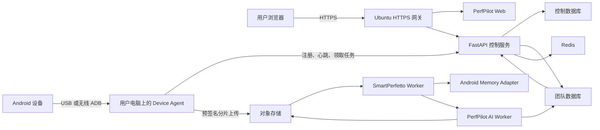

# PerfPilot 局域网部署与跨平台 Device Agent 设计

- 日期：2026-08-05
- 状态：已确认，可进入实施
- 部署主机：`rivotek@10.166.0.125`
- 代码仓库：`wurui27/trace`

## 1. 目标

本设计把现有 PerfPilot 本地闭环部署到一台 Ubuntu 局域网主机，并新增 macOS、Windows、Linux 共用的 Device Agent。用户继续通过网页创建任务、查看进度和打开报告；Android 设备可以连接到局域网内任意一台安装了 Agent 的电脑。

首个版本必须完成以下闭环：

1. 用户在网页生成一次性 Agent 注册码。
2. 用户在 macOS、Windows 或 Linux 安装 Agent 并完成注册。
3. Agent 发现通过 USB 或无线 ADB 连接的 Android 设备。
4. 网页显示真实设备状态，并允许用户选择自己的设备。
5. Agent 领取任务、采集 Trace、上传证据并响应取消请求。
6. Ubuntu 上的 SmartPerfetto 和 PerfPilot AI 生成报告。
7. 主界面显示真实指标、问题和完整报告入口。

本设计是现有生产平台设计的单主机局域网交付切片，不替代公开云部署设计。现有本地模式继续用于开发和快速 Trace 上传测试。

## 2. 已知环境

2026-08-05 的只读检查确认了以下主机条件：

| 项目 | 当前值 | 设计决定 |
| --- | --- | --- |
| 系统 | Ubuntu 24.04.4 LTS, x86-64 | 支持 Docker Compose 部署 |
| CPU | Intel Core i7-10700，8 核 16 线程 | 足够运行单个重型分析任务 |
| 内存 | 15 GiB，另有 4 GiB swap | 重型分析并发固定为 1 |
| 系统盘 | 233 GiB，约 63 GiB 可用 | 不保存 Trace 和报告 |
| 数据盘 | `/data`，约 870 GiB 可用 | 保存数据库、对象、日志和本地备份 |
| 网络 | `10.166.0.125/24`，当前使用 DHCP | 上线前固定该地址 |
| SSH | 已启用，密钥登录已验证 | 仅用于部署和维护 |
| ADB | 已安装，当前无连接设备 | Ubuntu 也可作为一个 Agent 节点 |
| Docker / Node.js | 尚未安装 | 首次引导脚本安装固定版本 |
| systemd | `fwupd-refresh.service` 失败 | 与 PerfPilot 无关，不阻断部署 |
| 异机存储 | `/mnt/nfs` 已挂载 | 验证可写后保存第二份加密备份 |

Ubuntu 用户 `rivotek` 拥有 `sudo` 权限，但 `sudo` 需要交互式密码。安装脚本不得收集、记录或传输该密码；管理员在 Ubuntu 终端完成一次系统引导。

## 3. 范围

### 3.1 包含

- Ubuntu 单主机 Docker Compose 部署。
- 内网 HTTPS、服务自启动、健康检查和可回滚更新。
- PostgreSQL 控制数据库与每团队独立 database。
- Redis 和 S3 兼容对象存储。
- SmartPerfetto、Android App Memory Analysis 和 PerfPilot AI Worker。
- Agent 注册、撤销、心跳、设备目录、任务租约和取消协调。
- Python 共享 Agent 核心。
- macOS `launchd`、Windows Service 和 Linux `systemd` 安装包。
- USB ADB 和无线 ADB 设备发现。
- Trace 直接上传、校验、重试和报告发布。
- 主界面真实设备状态、活动任务和最终报告。
- 数据保留、显式清空、备份与恢复验收。

### 3.2 不包含

- 公网访问、ICP 备案和商业发布。
- 自动注册、邮件邀请、找回密码和付费。
- macOS Developer ID、Apple 公证或 Windows 商业代码签名。
- Agent 自动更新；首版通过新安装包升级。
- 多主机高可用数据库和多 Worker 横向扩容。
- 浏览器直接控制 USB 或 ADB。
- 把 ADB `5555` 端口暴露给局域网或公网。

## 4. 总体架构



浏览器只访问 HTTPS 网关。网关是局域网唯一业务入口；PostgreSQL、Redis、对象存储管理接口、SmartPerfetto 和 Worker 不监听局域网地址。

Agent 只建立出站 HTTPS 连接。Agent 无需入站端口、路由器端口映射或对外开放 ADB。一个 Agent 可以管理多台 Android 设备，一个 Android 设备同一时刻只能由一个有效租约执行任务。

## 5. Ubuntu 服务与文件布局

Docker Compose 管理以下服务：

- `gateway`：终止局域网 HTTPS，并把网页和 API 请求路由到内部服务。
- `web`：现有 Vinext/React 网页。
- `api`：FastAPI 控制服务。
- `postgres`：控制数据库和团队数据库。
- `redis`：会话限速、事件投递和短期协调状态。
- `object-store`：S3 兼容私有对象存储。
- `smartperfetto`：SmartPerfetto 服务。
- `trace-worker`：Trace 校验、规范化和报告流水线。
- `synthesis-worker`：PerfPilot AI 多轮提取、复核和最终建议。

平台文件使用以下布局：

```text
/opt/perfpilot/
├── platform/
│   ├── releases/<git-sha>/
│   └── current -> releases/<git-sha>
└── engines/
    ├── SmartPerfetto/
    │   ├── releases/<git-sha>/
    │   └── current -> releases/<git-sha>
    └── Android-App-Memory-Analysis/
        ├── releases/<git-sha>/
        └── current -> releases/<git-sha>

/data/perfpilot/
├── postgres/
├── redis/
├── objects/
├── reports/
├── logs/
└── backups/
```

平台和两个分析内核独立更新。更新命令拉取指定提交，在临时 release 目录中完成契约测试和健康检查，再切换 `current`。失败的更新保留当前 release。运行中的任务继续使用领取任务时记录的引擎版本。

## 6. Agent 架构

### 6.1 共享核心与系统适配层

Agent 使用一个 Python 共享核心，系统适配层只负责服务生命周期和安全存储：

| 系统 | 后台服务 | 凭据存储 | 内部安装包 |
| --- | --- | --- | --- |
| macOS | `launchd` | Keychain | `.pkg` |
| Windows | Windows Service | DPAPI/Credential Manager | `.msi` |
| Linux | `systemd` | root-owned `0600` 文件 | `.deb` |

三个平台共用注册、ADB、任务、上传、状态机和错误码。平台特定代码不得实现业务状态转换。

### 6.2 ADB 管理

Agent 按以下顺序定位 ADB：

1. 管理员显式配置的绝对路径。
2. Android SDK 的标准 `platform-tools` 路径。
3. 当前 `PATH` 中的 `adb`。
4. Agent 管理的固定版本 `platform-tools`。

安装器在缺少 ADB 时下载平台配置中锁定的 Google Platform Tools 版本，并验证发布清单中的 SHA-256。Agent 不在启动时追踪“最新版本”。

Agent 支持 `device`、`unauthorized`、`offline` 和 `booting` 状态。设备属性读取设置超时；单台异常设备不能阻断同一 Agent 上的其他设备。

## 7. 注册、身份和权限

团队管理员通过网页创建一次性注册码。注册码绑定 `team_id` 和创建者，十分钟后过期，成功使用后立即失效。服务端只保存注册码摘要。

管理员先从已信任的管理设备下载部署专用引导包。引导包包含通用 Agent 安装包、`perfpilot-agent-config.json`、局域网 CA 和文件 SHA-256 清单。安装器验证清单，导入 CA，并写入固定服务地址。Agent 必须先完成 TLS 验证，才能发送注册码。

Agent 首次启动时生成 Ed25519 密钥对，并提交注册码、公钥、平台、Agent 版本和主机显示名称。注册成功后，服务端返回 Agent ID、短期访问令牌、刷新凭据和服务端任务签名公钥。服务端只保存令牌摘要；Agent 把私钥和刷新凭据写入系统安全存储。注册响应不能建立 TLS 信任，也不能替换安装时固定的 CA。

每个 Agent 属于一个团队，并记录拥有者用户。团队管理员可以撤销、重命名和重新分配 Agent。撤销立即使令牌、刷新凭据和活动租约失效。

Agent 通过 TLS 上报原始 ADB serial。API 使用服务端密钥计算稳定摘要，并只保存摘要和脱敏尾号。网页不得返回完整 serial。相同设备转移到另一个 Agent 时，服务端通过摘要识别设备，并要求旧租约已经释放或过期。

## 8. 心跳与设备目录

Agent 每十秒发送一次心跳，并在 ADB 设备集合变化时立即发送完整设备快照。服务端三十秒未收到心跳即把 Agent 和所属设备标记为离线。

心跳包含：

- Agent ID、Agent 版本、操作系统和主机显示名称。
- 本地时钟偏差、可用磁盘和执行槽状态。
- 设备型号、Android 版本、API Level、连接方式和 ADB 状态。
- 电量、温度、可用存储和最后一次属性读取错误。
- 当前 execution ID 和任务租约版本。

主界面显示真实状态。没有设备时显示“尚未连接设备”，不得回退到 Pixel 8 或其他演示值。

## 9. 任务领取与取消

用户在网页选择在线设备并创建任务。API 验证用户、团队、Agent 和设备归属，再创建任务与排他设备租约。

Agent 使用最长二十秒的出站长轮询领取任务。任务快照使用服务端 Ed25519 JWS 签名，并包含 Agent ID、设备摘要、execution ID、输入产物、场景参数、到期时间和允许的上传槽。Agent 在执行前验证签名、受众、到期时间和设备摘要。

任务租约有效期为六十秒。Agent 每二十秒续约。租约丢失后，Agent 停止执行并拒绝上传新的最终状态。重复领取、心跳和完成请求使用 execution ID 与版本号保证幂等。

网页取消任务时，API 原子写入 `cancel_requested` 并撤销后续工作。Agent 在长轮询或续约响应中取得取消指令，终止该任务的进程组，保留诊断日志，删除未完成的临时产物并确认取消。正常网络下，取消指令应在五秒内到达 Agent。

## 10. Trace 上传与分析

Agent 不通过 FastAPI 中转 Trace。API 为当前 execution 创建限定对象键、大小、校验和和有效期的预签名分片上传。Agent 计算 SHA-256，上传分片，完成后提交 manifest。API 校验对象大小、摘要、execution 所有权和上传槽状态，再发布分析事件。

单个 Trace 默认限制为 512 MiB。上传失败保留已确认的分片；Agent 在租约有效期内继续上传。任务取消或租约丢失后，服务端拒绝提交新的完成 manifest，并由清理任务回收孤立分片。

SmartPerfetto 先生成可追溯的结构化结果。PerfPilot 再执行 AI 提取、复核和最终建议。AI 隐私投影失败或模型不可用时，平台仍发布 SmartPerfetto 核心报告，并明确标记 AI 未完成。

## 11. 数据隔离与保留

控制数据库保存账户、团队、Agent、设备摘要、租约和不含客户证据的调度状态。每个团队使用独立 PostgreSQL database 和独立对象存储前缀。服务端根据会话和任务映射选择资源；客户端不能传入 database、bucket、对象键或连接串。

普通重启必须保留数据。运维入口提供以下命令：

```text
./scripts/perfpilot-lan restart
./scripts/perfpilot-lan reset
./scripts/perfpilot-lan update
./scripts/perfpilot-lan status
./scripts/perfpilot-lan backup
```

`reset` 在交互确认后清空分析、Trace 和报告，但保留平台安装。测试自动化必须使用显式 `--yes` 和测试环境标识；生产配置拒绝非交互清空。

## 12. 网络与安全

上线前，网络管理员必须把 `10.166.0.125` 固定给 Ubuntu。局域网入口使用该固定 IP 和内部 CA 签发的 IP SAN 证书。首次引导通过 SSH 或现有受控共享目录把 CA 证书和指纹交给管理员；管理员核对指纹后，在管理设备安装 CA。已信任的管理员再从网页下载部署专用 Agent 引导包。普通浏览器用户首次访问前安装同一 CA。所有账户、Agent、Trace 和报告请求使用 HTTPS。

防火墙只允许受控内网访问 `443/tcp`。SSH `22/tcp` 只允许管理网段或指定管理设备。容器内部端口不映射到主机的非回环地址。

开发密码 `ray_wu` 不能用于该部署。管理员通过环境密钥和一次性命令创建强密码账户。AI Token、会话密钥、代理签名密钥、数据库凭据和 Agent 签名私钥存入权限为 `0600` 的部署 secret 文件或容器 secret；任何密钥都不得进入 Git、镜像层、日志或报告。

内部 macOS 和 Windows 安装包首版不承诺商业代码签名。安装说明必须明确系统警告和手动信任步骤。公开分发前必须增加 Apple Developer ID、公证和 Windows 代码签名。

## 13. 资源限制与可用性

Ubuntu 同时只运行一个 SmartPerfetto 或 Android Memory 重型任务。其余任务进入队列。Web、API、数据库和 Agent 心跳保留独立资源预算，重型 Worker 不能挤占控制服务。

系统在以下任一条件出现时停止接受新上传，并保留已有报告：

- `/data` 可用空间低于 50 GiB。
- PostgreSQL、对象存储或队列健康检查失败。
- 当前 Worker 缺少安全启动任务所需的内存。

服务重启后，reconciler 检查运行中租约、未完成上传和 Worker claim。它只恢复幂等步骤，并把无法安全恢复的任务标记为可重试中断。

## 14. 备份与恢复

每日备份控制数据库、团队数据库、报告、配置版本和对象索引。原始 Trace 按保留策略备份，避免无上限复制大文件。

第一份备份保存在 `/data/perfpilot/backups`。部署前验证 `/mnt/nfs` 的权限、容量和稳定性；验证通过后，将加密备份复制到 `/mnt/nfs/perfpilot-backups`。本地与 NFS 备份使用不同加密密钥引用。

备份成功不代表恢复成功。每次发布前，验收流程必须在临时 database 和临时对象前缀中恢复最新备份，并验证账户、任务、报告和对象摘要。

## 15. 失败语义

| 条件 | 系统行为 |
| --- | --- |
| Ubuntu 离线 | Agent 保留本地状态并退避重试，不领取新任务 |
| Agent 离线 | 三十秒后设备离线；租约到期后任务进入可重试中断 |
| Android 拔线 | Agent 终止采集，上传诊断日志，返回稳定设备断开错误 |
| ADB 未授权 | 网页显示授权提示，任务创建接口拒绝该设备 |
| Trace 上传中断 | 保留已确认分片并续传，不重复发布分析事件 |
| SmartPerfetto 失败 | 保留 Trace、manifest 和日志，允许重新分析 |
| AI 失败 | 发布 SmartPerfetto 核心报告，标记 AI 未完成 |
| 磁盘不足 | 拒绝新上传，已有报告继续可读 |
| 更新失败 | 保持或切回上一 release，不迁移到不兼容状态 |

## 16. 验收标准

首个局域网版本必须通过以下验收：

1. Ubuntu 重启后自动恢复全部服务，已有任务和报告仍然存在。
2. macOS、Windows、Linux 安装包都能安装、启动、停止、升级和卸载 Agent。
3. 三个平台的契约测试使用同一套 fake ADB 场景，并在对应原生系统运行。
4. 至少一台真实 Android 设备完成注册、发现、任务执行、取消和报告闭环。
5. 多设备、未授权、离线和拔线状态在主界面准确显示。
6. 正常网络下，网页取消在五秒内停止 Agent 的采集进程。
7. Trace 上传中断后恢复，服务端只生成一份规范化结果和一份当前报告。
8. SmartPerfetto 和 AI 均成功时，主界面显示真实指标、问题和完整报告。
9. AI 失败时，主界面仍显示 SmartPerfetto 核心报告和明确的 AI 状态。
10. 跨团队访问 Agent、设备、Trace、任务和报告均返回拒绝响应。
11. `/data` 空间阈值、Worker 单并发和服务资源隔离生效。
12. 最新备份能在临时环境恢复，并通过对象摘要校验。
13. 浏览器和 Agent 无明文密码、令牌、ADB serial 或文件系统路径泄漏。

## 17. 交付边界

本设计按以下提交边界实施，每个提交必须有对应测试：

1. Ubuntu 容器与运维入口。
2. Agent 契约、注册与凭据生命周期。
3. 心跳、设备目录和网页设备选择。
4. 任务签名、领取、租约和取消协调。
5. Trace 分片上传与分析事件。
6. 跨平台 Python Agent 核心。
7. macOS 后台服务与安装包。
8. Windows 后台服务与安装包。
9. Linux 后台服务与安装包。
10. 数据隔离、备份、恢复和完整局域网验收。

每个边界通过测试后独立提交。全部验收通过后再推送到 `main`，不使用强制推送。
