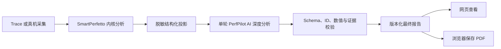

# PerfPilot 单轮 AI 与可下载报告设计

- 日期：2026-08-06
- 状态：用户已确认
- 适用范围：本地网页与 Ubuntu 局域网部署
- 替代设计：`2026-08-04-perfpilot-local-multiround-report-design.md` 中的本地三轮 AI 流程

## 1. 背景

当前本地流程在 SmartPerfetto 完成后连续调用三轮 PerfPilot AI：证据提取、归因复核和最终定稿。三轮设计降低了早期模型误判风险，却增加了耗时、费用和故障面。任一轮失败都会阻止 AI 建议进入最终报告。

现有报告页已经完整展示指标、问题、证据、建议和复测计划，也包含打印样式，但没有下载入口。用户需要一个 AI 轮次生成最终结论，并把同一份报告保存为 PDF。

## 2. 目标

本次改造实现以下结果：

1. SmartPerfetto 完成后，PerfPilot 只执行一个 AI 轮次；正常路径只发送一次 Provider 请求。
2. 单次调用同时完成证据核验、责任归因、问题排序、优化建议和复测计划。
3. 服务端继续校验输出 Schema、指标、问题 ID、证据 ID 和数值引用。
4. 最终报告仍在网页中展示，并可通过报告页保存为 PDF。
5. 旧三轮报告继续打开，不迁移或删除历史数据。
6. AI 失败时保留 SmartPerfetto 基础报告，用户可只重试 AI。

## 3. 非目标

本次不实现以下内容：

- 服务端 Chromium、WeasyPrint 或独立 PDF 渲染服务；
- Word、Markdown 或批量报告导出；
- 自动修改 Android 源码；
- 多模型投票；
- 重新运行已完成的 SmartPerfetto 分析；
- 生产 PostgreSQL、Redis 或分布式 Worker 改造。

## 4. 方案选择

### 4.1 单轮 AI 与浏览器原生 PDF（采用）

PerfPilot 发送一次受限结构化投影。AI 返回完整 `synthesis-output 1.0`，服务端校验后写入报告。报告页的“下载 PDF”按钮调用浏览器打印能力，现有打印 CSS 负责排版。

该方案生成快，不增加服务器依赖。浏览器负责 PDF 字体和页面渲染，报告数据无需发送给第三方转换服务。

### 4.2 单轮 AI 与服务端 PDF

服务端使用无头浏览器或 PDF 引擎渲染文件。用户可以直接下载 `.pdf`，但 Ubuntu 需要额外安装浏览器、中文字体和渲染依赖。该方案增加部署体积、内存占用和故障点，本次不采用。

### 4.3 单轮 AI 与 Word 文档

服务端生成 `.docx`，便于二次编辑，但网页组件、证据锚点和复杂指标表难以保持一致。该方案不适合以审阅和分享为主的性能报告，本次不采用。

## 5. 总体流程



SmartPerfetto 继续拥有测量事实。PerfPilot AI 只解释、排序和提出复测方案。服务端校验器决定 AI 输出能否进入报告。

## 6. 单轮 AI 契约

新增不可变提示词 `perfpilot-local-report-v2`。一次调用必须按以下顺序完成分析，但只返回一个 JSON 文档：

1. 检查 Trace 数据质量和已声明限制；
2. 核对每个候选问题的指标与证据；
3. 区分应用代码、Android 系统和测试环境责任；
4. 合并重复问题并按用户影响排序；
5. 输出点对点的 Android 优化动作和预期效果；
6. 输出可执行的复测步骤、成功条件和失败条件；
7. 明确证据不足、无法归因或需要补采的数据。

AI 只能使用投影中的 finding、evidence、metric 和 limitation。叙述中的数值必须来自允许列表。AI 不得创建源码位置、阈值、设备状态或因果关系。

Provider 继续使用 JSON Output、固定响应上限、超时和 `thinking=disabled`。临时传输错误或语义校验失败最多自动重试一次。第二次调用仍属于同一轮，其 `attempts` 值递增。

## 7. 状态与兼容性

新分析的 `ai_rounds` 只包含一个条目：

```json
[
  {
    "round": 1,
    "role": "report",
    "state": "completed",
    "attempts": 1
  }
]
```

前后端协议新增 `report` 角色，同时继续接受旧角色 `extract`、`review` 和 `finalize`。旧报告仍显示三轮历史；新报告显示“单轮 PerfPilot AI 深度分析已完成”。

本地运行时继续保存 `round-1.json`、`report.json` 和 `state.json`。旧目录中的 `round-2.json` 与 `round-3.json` 保留，但状态文件和报告 generation 决定当前结果。系统不根据遗留文件推断轮次。

重新生成 AI 建议时，服务创建新的 generation，只重跑一次 AI。局域网 HTTP 页面使用基于 `crypto.getRandomValues` 的 UUID，避免依赖安全上下文中的 `crypto.randomUUID`。

## 8. 报告下载

最终报告页顶部增加“下载 PDF”按钮。按钮只在报告加载完成后出现。

点击按钮时，页面执行以下操作：

1. 暂时把文档标题设为 `PerfPilot-<analysis-id>`；
2. 调用 `window.print()`；
3. 浏览器打开打印窗口，用户选择“保存为 PDF”；
4. 打印结束后恢复原页面标题。

打印版本隐藏导航、返回按钮、下载按钮、折叠控件和交互提示。它展开报告的核心指标、问题、建议、复测计划、限制和生成信息。页面使用白色背景、稳定分页和可打印链接文本。

该下载方式不创建服务器端临时文件，不暴露报告给额外服务。Chrome、Edge 和 Safari 均提供“保存为 PDF”。

## 9. 页面文案

新报告页使用以下文案：

- 流程标题：`单轮 PerfPilot AI 深度分析已完成`
- 流程说明：`证据核验、归因、建议与复测计划`
- 操作按钮：`下载 PDF`
- 生成中：`PerfPilot AI 正在生成最终报告`
- 失败状态：`内核分析已完成，AI 最终报告暂未生成`
- 重试按钮：`重新生成 AI 报告`

旧三轮报告继续显示其真实轮次，不改写历史状态。

## 10. 失败处理

| 失败点 | 系统行为 | 用户可见结果 |
| --- | --- | --- |
| SmartPerfetto 失败 | 分析失败 | 不生成 AI 报告 |
| AI 暂时不可用 | 自动重试一次 | 保持生成中 |
| AI 输出无效 | 自动重试一次，仍失败则停止 | 保留内核报告，可手动重试 |
| 引用或数值越界 | 拒绝 AI 输出 | 不展示未经校验的建议 |
| 浏览器取消打印 | 不改变报告状态 | 用户仍停留在报告页 |
| 浏览器不支持打印 | 禁用按钮并给出明确提示 | 网页报告保持可用 |

## 11. 测试策略

### 11.1 后端

- 单次 Provider 调用产生完整有效报告；
- 有效输出只记录一个 AI 轮次；
- 无效输出最多调用两次，并记录 attempts；
- finding、evidence、metric 和数值越界继续被拒绝；
- AI 失败保留 SmartPerfetto 基础报告；
- 重试增加 generation，但不重新运行 SmartPerfetto；
- API 重启后恢复单轮状态；
- 旧三轮状态仍可加载和返回。

### 11.2 前端

- 新报告显示一个 AI 轮次和正确文案；
- 旧报告仍显示三个 AI 轮次；
- 报告完成后显示“下载 PDF”；
- 点击按钮调用打印并恢复文档标题；
- 加载中、失败或无报告时不显示下载按钮；
- 打印样式隐藏交互元素并保留报告主体；
- 局域网 HTTP 环境的 AI 重试使用兼容 UUID。

### 11.3 浏览器验收

- 从局域网地址提交 Trace 后，只执行一个 AI 轮次；正常路径只有一次 Provider 请求；
- 页面显示最终摘要、证据、建议和复测计划；
- 打印预览包含完整报告，不包含导航和按钮；
- PDF 建议文件名包含分析编号；
- 刷新页面后报告与下载入口保持可用。

## 12. 发布与回退

代码先部署到 Ubuntu 本地服务。现有分析数据保持不变。发布后，新任务使用单轮流程；旧任务继续按保存的状态展示。

若单轮质量不符合要求，可以恢复三轮编排代码。报告 Schema、SmartPerfetto 投影和历史文件保持兼容，因此回退无需迁移数据。

## 13. 验收标准

1. 新 Trace 在 SmartPerfetto 完成后只执行一个 PerfPilot AI 轮次，正常路径只有一次 Provider 请求。
2. 最终报告包含摘要、重点问题、证据、优化建议、复测计划和限制。
3. 所有 AI 结论通过现有 Schema 与证据校验。
4. 新分析只显示一个真实 AI 轮次。
5. 旧三轮报告可以继续打开。
6. 用户可以从最终报告页保存 PDF。
7. AI 失败不会丢失 SmartPerfetto 基础报告。
8. 重试 AI 不会重新上传 Trace 或重跑 SmartPerfetto。
9. 完整后端、前端、构建和浏览器测试通过。
