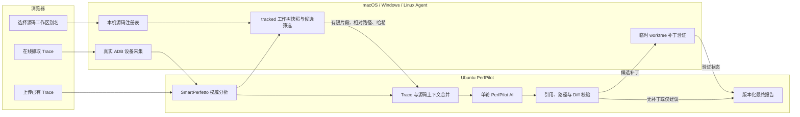

# PerfPilot 精简报告与 Agent 本机源码分析设计

- 日期：2026-08-07
- 状态：用户已确认
- 适用范围：PerfPilot 网页、Ubuntu 局域网服务、macOS/Windows/Linux PerfPilot Agent
- 扩展设计：`2026-08-06-perfpilot-single-pass-downloadable-report-design.md`
- 依赖设计：`2026-08-05-perfpilot-lan-deployment-device-agent-design.md`

## 1. 背景

现有 PerfPilot 已经可以把 Perfetto Trace 交给 SmartPerfetto，使用一次 PerfPilot AI 调用生成最终报告，并在网页中查看或保存 PDF。当前报告保留了大量指标、问题、证据和建议，适合技术审计，却不利于不了解 Android 性能的开发者快速判断“最痛的点是什么、先改哪里”。

现有上传表单还提供可选源码压缩包，但 `source_archive` 只被保存，没有进入 SmartPerfetto 或 PerfPilot AI 分析。用户更希望选择开发机器上的真实源码工作区，让 PerfPilot 基于当前 Git 工作树给出文件、函数和代码修改方案，同时满足以下约束：

- 源码路径留在开发者机器；
- 已跟踪但尚未提交的修改也参与分析；
- 未跟踪文件、构建产物和敏感文件不参与分析；
- 系统不得自动修改真实源码；
- 只有 Trace 与源码可靠关联时才生成 Diff；
- Diff 必须在隔离环境验证后才可下载；
- 没有源码或关联不足时继续给出建议，不伪造代码位置；
- 未来可以接入 Gerrit，但本次不实现 Gerrit。

## 2. 目标

本次改造实现以下结果：

1. 最终报告默认只显示一个直达结论、最多三个关键指标、最多三个核心痛点和三个按优先级排序的动作。
2. 报告采用“结论 / 源码修复 / 技术附录”三层结构，完整原始指标和证据仍可追溯。
3. 上传已有 Trace 时不要求选择或连接 Android 设备。
4. 只有在线抓取 Trace 时才选择 PerfPilot Agent 和真实 ADB 设备。
5. 用户可以给一次分析关联 Agent 本机的 Git 源码工作区；本机绝对路径不上传、不写入服务器数据库或日志。
6. Agent 基于当前工作树中 Git 已跟踪文件创建不可变快照，并在本机筛选与 Trace 问题相关的必要源码片段。
7. SmartPerfetto 结果和有界源码上下文进入同一个 PerfPilot AI 轮次；正常路径只有一次 Provider 请求。
8. 只有经过证据引用校验、Diff 安全校验和 Agent 临时 worktree 验证的补丁才可下载。
9. 源码链路的任何失败都只让源码部分降级，不阻断 SmartPerfetto 主报告。
10. 保持旧报告、无源码分析和现有单轮 AI 状态兼容。

## 3. 非目标

本次不实现以下内容：

- Gerrit 服务器连接、仓库凭据、项目映射、代码拉取或变更创建；
- 自动修改、提交或推送用户真实源码；
- 浏览器直接读取本机目录；
- 浏览器或服务器向 Agent 下发任意 Shell 命令；
- 上传完整源码仓库；
- 把 `source_archive` 作为本次源码级修复的数据源；
- 多模型投票或恢复三轮 AI；
- 自动证明性能已经改善；性能收益仍需重新采集 Trace 验证；
- 手机版界面；
- 生产数据库、队列或多租户部署的额外改造。

## 4. 已确认的产品决定

### 4.1 Trace 来源与设备选择分离

“新建分析”提供两个互斥入口：

| 入口 | Trace 输入 | Agent | Android 设备 | 源码工作区 |
| --- | --- | --- | --- | --- |
| 上传已有 Trace | 用户上传文件 | 仅在关联本机源码时选择源码 Agent | 不显示、不要求 | 可选 |
| 在线抓取 Trace | 由采集 Agent 生成 | 必填 | 必填，使用 Agent 实时上报的真实设备 | 可选，可来自同一或另一 Agent |

上传模式不得因为没有在线设备而禁用。在线抓取模式不得显示固定 Pixel 8 或其他演示设备；没有真实设备时显示“尚未连接设备”。

源码工作区与 Android 设备是两个独立概念。选择源码 Agent 不代表该 Agent 必须连接 Android 设备。

### 4.2 源码工作区选择

首版通过 PerfPilot Agent 本机命令登记工作区。网页中的“添加本机工作区”只展示适用于当前系统的登记说明和可复制命令，不尝试从浏览器打开文件选择器，也不要求 Agent 开放入站端口。

示意命令：

```text
perfpilot-agent source add --name Gallery --path <本机绝对路径>
```

Agent 在本机保存绝对路径，并向服务器同步以下非敏感元数据：

- 随机生成且稳定的 `workspace_id`；
- Agent ID；
- 用户设置的显示名称；
- Git 仓库类型和当前可用状态；
- 当前分支、HEAD 摘要和 tracked dirty 数量；
- 可选验证配置的 ID 与安全显示名称。

服务器和网页只使用 `agent_id + workspace_id` 绑定分析。原始绝对路径永远不进入请求正文、任务快照、数据库、对象存储、日志、报告或遥测。

### 4.3 当前工作树语义

源码快照使用“当前 Git 已跟踪工作树”策略：

- 包含 HEAD 中仍存在的已跟踪文件；
- 包含 staged 和 unstaged 的 tracked 修改，以当前工作树内容为准；
- 记录 tracked 删除文件；
- 排除全部 untracked 和 ignored 文件；
- 不遍历 `.git`；
- 不跟随符号链接；
- 不递归读取 Git submodule 工作树；
- 排除构建目录和敏感文件；
- 不把 Agent 工作目录当作应用源码目录。

Agent 记录 `git_head`、tracked 文件清单哈希、dirty overlay 哈希和统一的 `snapshot_hash`。同一分析后续的源码引用和补丁验证必须绑定该快照。

### 4.4 精简报告

新报告默认结构固定为：

1. 一句直接结论；
2. 最多三个关键指标；
3. 最多三个核心痛点；
4. 最多三个一一对应、按 P0/P1/P2 排序的动作；
5. 结论可信度和主要限制。

报告页提供三个页签：

- `结论`：面向普通开发者，只回答问题、影响和先后顺序；
- `源码修复`：显示经过验证的文件、函数、规则、Diff、验证结果和补丁下载；
- `技术附录`：折叠展示完整指标、SmartPerfetto 证据、源码引用清单、限制、模型和生成信息。

保存 PDF 时先输出结论和源码修复，再以明确的“技术附录”章节附上完整证据。附录不得把主体重新变成指标堆砌。

## 5. 总体架构



SmartPerfetto 继续拥有测量事实。Agent 负责本机路径、Git 快照、源码最小化和隔离验证。PerfPilot AI 负责一次性完成痛点排序、优化动作和符合条件的候选 Diff。服务器校验器决定 AI 输出能否进入报告。

## 6. Source Provider 边界

服务端定义与具体代码来源无关的 Source Provider 能力：

1. 列出用户可以访问的源码绑定；
2. 为分析创建不可变源码快照；
3. 根据 SmartPerfetto 问题提取有界源码上下文；
4. 验证候选补丁；
5. 删除或过期源码上下文与验证产物。

首版唯一实现为 `agent_workspace`。协议保留 `provider_kind` 字段，但只接受 `agent_workspace`；`gerrit` 不出现在网页选项中，服务器也不得静默接受。未来 Gerrit Provider 实现相同能力后，AI、报告和补丁状态无需改版。

一次分析的源码绑定使用以下逻辑形状：

```json
{
  "provider_kind": "agent_workspace",
  "agent_id": "uuid",
  "workspace_id": "uuid",
  "snapshot_policy": "tracked_worktree",
  "validation_profile_id": "uuid-or-null"
}
```

该对象不包含路径、Shell 字符串或任意环境变量。

## 7. Agent 本机源码注册表

### 7.1 注册与同步

Agent CLI 增加本机命令：

```text
perfpilot-agent source add
perfpilot-agent source list
perfpilot-agent source remove
perfpilot-agent source doctor
perfpilot-agent source validation add
perfpilot-agent source validation list
perfpilot-agent source validation remove
```

`source add` 必须验证：

- 路径是绝对路径且存在；
- 路径指向 Git 工作树；
- Git 目录和工作树关系可解析；
- 当前服务账户可读；
- 工作区没有位于 Agent 临时执行根目录内；
- 显示名称在同一 Agent 内唯一；
- 工作区 ID 不由路径派生。

注册表保存在 Agent 本机受限配置中。macOS/Linux 文件权限为 `0600`，Windows 使用仅服务账户和管理员可读的 ACL。服务器撤销 Agent 后，工作区元数据立即离线；本地路径不会随凭据撤销而上传或回传。

Agent 通过现有出站 HTTPS 控制通道同步工作区元数据。网页不能调用本机回环服务，Agent 不开放文件系统 API 或入站端口。

### 7.2 验证配置

Gradle 验证使用 Agent 本机登记的验证配置，而不是服务器提供的命令字符串。配置包含：

- 稳定 `validation_profile_id`；
- 显示名称；
- 固定 argv，例如 `./gradlew`、`:app:compileDebugKotlin`；
- 仓库内相对工作目录；
- 超时和允许的退出码；
- 精简环境变量允许列表。

命令必须以 argv 直接启动，禁止 `shell=true`、管道、重定向、命令替换和来自 AI 的参数。报告可以展示脱敏后的命令摘要，但服务器只能选择已登记的配置 ID。

验证配置完全在 Agent 本机创建。CLI 使用 `--` 之后的参数作为固定 argv，不把它重新拼接为 Shell 字符串。工作区未登记验证配置时仍可进行源码匹配，但候选 Diff 最终只能降级为源码针对性建议，不能显示或下载补丁。

## 8. 源码快照与本地筛选

### 8.1 快照生成

SmartPerfetto 完成规范化后，服务器向选定 Source Agent 发送签名的 `source_context` 任务。等待 Agent 和源码提取使用部署可调的有界时限，默认 120 秒；超时后流程进入 Trace-only 降级，不继续无限等待。任务只包含：

- analysis、agent 和 workspace 标识；
- SmartPerfetto 中最多三个候选 finding；
- 对应 evidence、时间区间、线程、进程、Slice、已解析 app 符号和规则提示；
- 明确的文件、片段、行数和字节上限；
- 任务到期时间。

Agent 枚举 Git 已跟踪文件，计算当前工作树快照。它以只读方式从 `git_head` 物化已提交内容，再覆盖当前 tracked staged/unstaged 内容、复现 tracked 删除并移除本地快照排除项，最后在 Agent 私有缓存中建立独立的快照 Git 仓库和快照提交。本地快照排除 `.git`、构建输出、敏感文件、符号链接和 submodule 内容，但可以保留编译所需且通过安全检查的 tracked 二进制输入，例如 Gradle Wrapper；这些二进制永远不会进入源码上下文或上传。该过程不得执行会写入注册仓库 `.git` 的 `git worktree add`、index 更新、暂存或锁定操作。完整仓库和私有快照仓库都不会上传。

如果分析期间真实工作树继续变化，已创建快照保持不可变；后续验证使用缓存快照，不读取新的工作树内容替代旧内容。缓存缺失或哈希不一致时返回 `source_changed` 或 `snapshot_unavailable`，不得在新内容上假装验证旧补丁。

### 8.2 允许与排除

首版上传候选上下文允许 Kotlin、Java、XML 和必要的 Gradle 构建脚本。Gradle 构建脚本只能用于解释和建议，AI 补丁只允许修改 Kotlin、Java 和 XML 文本文件，避免通过生成补丁改变构建逻辑。候选上下文必须排除：

- `.git`、`.gradle`、`build`、`out`、`dist`、`.idea` 和生成源码目录；
- `.env*`、`local.properties`、`gradle.properties`、keystore、证书、私钥和已知凭据文件；
- Git 对象、子模块内容、符号链接目标和二进制文件；
- 超过单文件上限的压缩、生成或混淆文件；
- 未跟踪文件，即使扩展名在允许列表中。

片段进入上传队列前执行本地敏感信息扫描和文本脱敏。匹配到令牌、密码、私钥块、高风险凭据模式或本机工作区绝对路径原文的片段直接丢弃，并只上报稳定排除原因，不上传命中内容。

### 8.3 候选筛选

候选筛选是确定性 Agent 逻辑，不调用第二个 AI。优先级依据：

1. Trace 中已解析的应用类、方法、业务 Trace section 或映射符号；
2. package、模块、线程和场景的一致性；
3. 与 Android 性能规则匹配的静态代码模式；
4. 与 finding/evidence 的独立关联信号数量；
5. 文件和符号的稳定相对位置。

默认上限为最多 20 个片段、每个片段最多 200 行、总 UTF-8 正文最多 96 KiB、单文件最多两个片段。服务端和 Agent 使用较小一方的限制。超限时按确定性得分截断，并在技术附录记录 `source_context_truncated`。

每个片段包含随机 `source_ref_id`、POSIX 风格相对路径、语言、符号、起止行、正文哈希、快照哈希、关联的 finding/evidence/rule ID 和本地计算的关联信号。绝对路径和 Git remote URL 不得进入片段。

## 9. Trace 与源码匹配等级

匹配等级由服务端依据确定性证据计算，AI 只能引用，不能提升：

| 等级 | 条件 | 报告能力 |
| --- | --- | --- |
| `strong` | 至少一个来自 Trace、mapping、Native symbol 或显式业务 Trace section 的直接应用标识，与同一快照中的源码符号稳定匹配；证据和源码哈希均有效 | 可以生成并验证具体文件、符号和 Diff |
| `weak` | 只能匹配 package、模块、场景、线程或静态规则，缺少直接代码标识 | 可以给针对性检查建议；不得把候选文件描述成根因，不生成 Diff |
| `none` | 无源码、无候选、证据不足或哈希失效 | 只给 Trace 证据支持的通用建议 |

仅凭“文件名看起来相关”、通用 Android API、模型猜测或代码中相似描述不能形成 `strong`。找不到可靠匹配时，报告宁可少写，也不得制造文件、函数、行号或代码修改。

## 10. 单轮 AI 契约

### 10.1 调用语义

源码筛选完成或在有界等待后降级，PerfPilot 才发起一次逻辑 AI 轮次。输入包括：

- 现有 SmartPerfetto 有界投影；
- 投影中的全部受限 metric 和 finding，模型只能从中选择最多三个进入主体；
- 服务端确定性排序的最多三个核心 finding，作为源码筛选与报告聚焦提示；
- 可选的有界 source context；
- 服务端计算的匹配等级；
- Android 性能规则 allowlist；
- 输出 Schema 和禁止推断规则。

正常路径只有一次 Provider 请求。继续保留现有“同一逻辑轮次最多自动重试一次”的网络或 Schema 失败语义；重试增加 `attempts`，不创建第二分析轮次。补丁在 Agent 验证失败后不得再次调用 AI 自动改写。

### 10.2 版本化输入与输出

`create-request 1.1` 在 trace upload 和 device capture 两种模式中增加可选 `source_binding`；`analysis-response 1.1` 增加可选 `source_analysis`；`analysis-report 1.2` 承载精简结论、源码修复和验证状态。Agent 源码提取与补丁验证使用独立、签名的 `source-task-snapshot 1.0`，不把源码任务伪装成需要 `device_digest` 的 ADB 采集任务。

新增 `analysis-projection 2.0`，在现有 Trace 投影上增加可选 `source_context`。新增 `synthesis-output 2.0`，核心字段为：

```json
{
  "schema_version": "2.0",
  "verdict": "一句直接结论",
  "executive_summary": "简短原因和先后顺序",
  "key_metric_ids": ["最多三个现有 metric_id"],
  "top_findings": ["最多三个、引用现有 finding/evidence"],
  "recommendations": ["最多三个、按 P0/P1/P2 排序"],
  "source_fixes": ["最多三个候选源码修复"],
  "retest_plan": ["最多三个复测动作"],
  "limitations": []
}
```

每个 `source_fix` 必须包含：

- 对应 finding、evidence 和 recommendation priority；
- 一个或两个属于同一文件的 `source_ref_ids`；
- Android 性能规则 ID；
- 匹配等级，且必须为 `strong`；
- 相对路径和符号，必须与引用片段完全一致；
- 简洁诊断；
- Unified Diff；
- 预期验证配置 ID；
- 复测目标，不得凭空承诺具体收益数值。

AI 把源码视为不可信数据。源码注释、字符串和文档中的指令不构成系统指令。AI 不得创建投影中不存在的 ID、数值、阈值、源码位置、设备状态或因果关系。

`recommendations` 的优先级只接受 `p0`、`p1`、`p2`，同一输出中不得重复。少于三项时按实际项数输出，不用空话补齐。

### 10.3 兼容性

旧 `create-request 1.0`、`analysis-response 1.0`、`analysis-projection 1.0`、`synthesis-output 1.0`、`analysis-report 1.0/1.1` 和历史报告继续由旧读取路径支持。新分析在不选择源码时仍可以使用 2.0 输出，以获得精简报告；`source_fixes` 为空。历史数据不迁移、不重写。

## 11. 服务端验证

AI 输出进入报告前依次执行：

1. JSON Schema 和长度限制；
2. metric、finding、evidence、limitation、rule 和 source ref allowlist；
3. `key_metric_ids` 最多三个且数值来自 SmartPerfetto；
4. finding 和 recommendation 最多三个，优先级顺序唯一且稳定；
5. source fix 只能引用 `strong` 匹配；
6. 相对路径规范化后仍位于仓库根目录内；
7. Diff 只能修改已提供且属于同一快照的 Kotlin、Java 或 XML 文本文件；
8. 每个 Diff hunk 必须落在已提供片段覆盖的行区间内，旧行必须与该片段内容一致；
9. 拒绝绝对路径、`..`、Git 元数据、符号链接、子模块、二进制补丁、文件重命名和权限位修改；
10. 每个 source fix 只能修改一个允许文件、最多引用两个片段；全部 source fix 合计最多三个文件，补丁正文总计最多 64 KiB；
11. 拒绝新增敏感文件、凭据、外部下载命令和未经登记的验证命令；
12. 所有叙述中的数值继续经过现有数值引用校验。

某个 source fix 无效时只丢弃该修复并记录限制。Trace 结论、其他有效建议和 SmartPerfetto 报告不受影响。如果整体 2.0 输出违反核心 Schema，则按现有单轮重试规则处理。

## 12. 补丁验证

### 12.1 临时 worktree

通过服务端静态校验的候选补丁进入签名的 `patch_verification` Agent 任务。Agent 必须：

1. 校验任务、Agent、workspace、analysis、snapshot 和 validation profile 标识；
2. 校验 Agent 私有快照仓库、快照提交和 `snapshot_hash`；
3. 在 Agent 私有临时目录中，从私有快照仓库创建 detached Git worktree；
4. 不复制 untracked、ignored、敏感或真实工作区私有文件；
5. 再次计算快照哈希；
6. 使用 `git apply --check` 等等价安全检查验证补丁；
7. 应用补丁；
8. 以固定 argv 和最小环境执行本机验证配置；
9. 上传有界、脱敏的退出状态和日志摘要；
10. 无论成功、失败、取消或超时都清理临时 worktree。

真实工作树及其 `.git` 元数据在整个流程中保持只读，不发生文件写入、worktree 登记、暂存、提交或分支切换。所有 Git 元数据写入都只发生在 Agent 私有快照仓库。

### 12.2 执行安全

Gradle 构建会执行项目内代码，因此验证只能在用户主动登记的工作区和验证配置上运行。Agent 不从 AI、网页自由文本或服务器响应拼接命令。验证进程使用独立进程组、最小凭据环境、磁盘上限和超时；默认超时 10 分钟，Agent 配置可以缩短但不得超过系统上限 20 分钟。取消或租约丢失时终止整个进程组。

网络隔离能力因 macOS、Windows 和 Linux 不同，首版不承诺统一的强制断网沙箱。文档和界面必须明确这是“在临时源码副本执行用户预先登记的 Gradle 任务”，不能把它描述成完全不可信代码沙箱。

### 12.3 验证状态

补丁状态为：

- `pending`：等待 Agent；
- `validating`：临时 worktree 中执行；
- `verified`：补丁应用和验证配置均成功；
- `apply_failed`：补丁无法应用；
- `validation_failed`：Gradle 或测试退出失败；
- `source_changed`：快照无法一致复原；
- `not_configured`：工作区没有选择有效验证配置；
- `timeout`：超过验证配置上限；
- `canceled`：分析或验证被用户取消；
- `unavailable`：Agent、快照缓存或验证配置不可用。

只有 `verified` 显示“下载 .patch”。其余状态只显示失败原因和优化建议，不提供被标记为可用的补丁。

## 13. 状态与异步流程

源码处理不改变 SmartPerfetto 的成功事实。分析响应新增独立的可选 `source_analysis` 状态，而不是把设备状态混入上传流程：

```json
{
  "requested": true,
  "provider_kind": "agent_workspace",
  "workspace_id": "uuid",
  "context_state": "waiting_for_agent | extracting | available | unavailable",
  "match_summary": "strong | weak | none",
  "verification_state": "not_requested | pending | validating | verified | apply_failed | validation_failed | source_changed | not_configured | timeout | canceled | unavailable",
  "failure_code": "stable-code-or-null"
}
```

推荐流水线：

```text
Trace 校验 → SmartPerfetto → 源码上下文（可选） → 单轮 AI → Diff 校验（可选）
→ Agent 临时验证（可选） → 最终报告
```

等待 Source Agent、提取源码和补丁验证全部在后台执行。新建分析弹窗在任务创建成功后立即关闭，主界面任务卡显示当前阶段、预计等待提示和取消按钮。

当 AI 已完成而补丁仍在验证时，报告可以打开并显示“源码补丁验证中”，但补丁下载和最终 PDF 下载保持禁用。验证进入终态后发布新的报告版本，分析才进入最终完成状态。

不关联源码时，`source_analysis.requested=false`，流程直接从 SmartPerfetto 进入单轮 AI，不创建 Agent 源码任务。

## 14. 报告数据与展示

### 14.1 结论页

结论页只显示：

- `verdict`；
- 不超过两段的 executive summary；
- 三个以内 `key_metric_ids`；
- 三个以内痛点与对应动作；
- 每项的优先级、影响、可信度和“已验证修复 / 仅建议”状态；
- 最重要的限制。

默认视图不显示完整指标表、完整证据 JSON、Provider 元数据或长篇通用 Android 教程。

### 14.2 源码修复页

每个已验证修复显示：

- 仓库相对路径和符号；
- Android 性能规则与简短机制说明；
- Trace finding/evidence 链接；
- Trace 与源码匹配等级；
- Unified Diff 预览；
- Agent、快照摘要、验证配置、耗时和终态；
- `.patch` 下载按钮；
- 复测步骤。

无源码、弱匹配或验证失败时，页面显示明确空态或失败原因，并保留建议。不得用占位 Diff、演示文件或虚构行号填充空间。

### 14.3 技术附录

技术附录按组折叠：

- SmartPerfetto 完整指标和时间线；
- finding、evidence、SQL 查询和区间；
- 源码片段引用、哈希和排除/截断原因；
- 限制、引擎版本、Prompt 版本、模型和生成信息；
- 补丁验证摘要和脱敏日志。

现有原始数据继续保留，不因为主体限额而删除。主体与附录必须引用同一 ID，避免生成两套相互矛盾的结论。

## 15. 失败与降级语义

| 条件 | 系统行为 | 用户可见结果 |
| --- | --- | --- |
| 上传 Trace 且无设备 | 正常创建 `trace_upload` | 不显示设备错误 |
| 在线抓取无 Agent 或设备 | 拒绝开始采集 | 指出 Agent 离线、ADB 未授权或未连接 |
| 未选择源码 | 跳过 Source Provider | Trace 报告正常，源码页显示未关联 |
| Source Agent 离线或超时 | 源码上下文标记 unavailable | AI 使用 Trace-only 投影，只给建议 |
| 工作区失效或不是 Git 仓库 | 拒绝源码任务，不影响 Trace | 显示工作区需要在 Agent 本机修复 |
| 没有候选或只有弱匹配 | `source_fixes=[]` | 不显示文件、函数、行号或 Diff |
| 源码片段被敏感扫描排除 | 记录稳定 limitation | 不上传命中内容，报告说明上下文受限 |
| AI 引用非法 source ref | 丢弃对应修复 | 其他结论保留，源码页说明校验失败 |
| Diff 路径或内容非法 | 拒绝对应修复 | 不进入 Agent 验证 |
| Agent 快照缓存丢失或变化 | `source_changed`/`unavailable` | 只保留建议，不声称已验证 |
| 未配置验证任务 | `not_configured` | 保留源码针对性建议，隐藏 Diff 与下载 |
| Diff 应用失败 | `apply_failed` | 显示原因，不可下载 |
| Gradle 失败或超时 | `validation_failed`/`timeout` | 显示脱敏摘要，不可下载 |
| SmartPerfetto 失败 | 分析失败 | 不调用 AI，不生成虚假源码结论 |
| AI 整体失败 | 保留 SmartPerfetto 核心报告 | 用户可以按现有方式重试单轮 AI |

源码链路失败不得把已成功的 SmartPerfetto 阶段改写成失败。用户重试 AI 时可以复用仍有效的服务端源码上下文；如果需要重新验证而 Agent 快照已过期，则明确要求重新提取源码快照。

## 16. 隐私、保留与删除

源码片段和补丁属于分析证据，使用团队私有对象前缀、租户授权和现有分析保留策略。服务器只保留实际进入 AI 或验证的有界片段、相对路径、哈希、候选补丁和验证摘要，不保留完整仓库。

Agent 本机快照缓存保存私有快照仓库、快照提交、排除清单和相关元数据。默认单快照上限 512 MiB、Agent 总上限 2 GiB，并在分析进入终态 24 小时后过期；部署可以调低这些限制，但不能取消容量和 TTL。任务取消、分析删除、Agent 撤销、容量回收或 TTL 到期后清理。缓存清理后不得把新的工作树冒充旧快照。

分析删除和显式 reset 必须同时删除服务端源码上下文、补丁和验证产物。日志系统对绝对路径执行结构化拒绝与测试；不得仅依赖显示层脱敏。

## 17. `source_archive` 兼容策略

新建分析主界面移除“源码压缩包”入口，改为可选的 Agent 源码工作区。后端继续识别历史 `source_archive` slot，避免破坏旧客户端、已上传任务和历史报告，但该附件不进入本次 Source Provider、AI 源码上下文或补丁验证。

API 对旧附件继续返回真实状态，并标记“已保存，未用于源码级修复”。不得把存在 ZIP 等同于完成源码分析。

## 18. 测试策略

### 18.1 Agent 单元与集成测试

- 添加、列出、删除和诊断源码工作区；
- 拒绝相对路径、非 Git 目录、Agent 临时目录和重复名称；
- `workspace_id` 不由绝对路径派生；
- 快照包含 tracked committed、staged 和 unstaged 当前内容；
- 快照记录 tracked 删除并排除 untracked/ignored 文件；
- 排除 `.git`、构建产物、敏感文件、二进制、symlink 和 submodule；
- Windows 路径、macOS/Linux 路径、CRLF/LF 和 Unicode 文件名行为一致；
- 候选筛选排序稳定并满足文件、行数和 96 KiB 总上限；
- 敏感扫描命中时内容不离开 Agent；
- 临时 worktree 正确复原 HEAD 和 tracked dirty overlay；
- 补丁永远不修改真实工作树或真实仓库 `.git` 元数据；
- 非登记命令、Shell 字符串和非法相对工作目录被拒绝；
- 成功、失败、取消、超时和进程组终止均清理临时 worktree；
- 快照哈希变化时返回 `source_changed`；
- macOS、Windows、Linux 使用同一套协议 fixture。

### 18.2 服务端契约与业务测试

- trace upload 请求可选 `source_binding`，但不得包含路径；
- device capture 和 source Agent 可以独立选择；
- 无源码时不创建 source task；
- SmartPerfetto 成功后才创建 source context task；
- Source Agent 离线或超时只降级源码，不失败主分析；
- Source Provider 首版只接受 `agent_workspace`，明确拒绝未实现的 `gerrit`；
- source context 限额、相对路径、哈希和引用闭合；
- `strong/weak/none` 由服务端确定，AI 不能提升；
- `synthesis-output 2.0` 严格限制三个指标、三个 finding、三个 recommendation 和三个 source fix；
- 正常路径只有一个 Provider 请求；自动重试仍记录一个 round；
- 虚构 metric/finding/evidence/source/rule ID 和数值被拒绝；
- 弱匹配、无匹配和非法 Diff 不能创建验证任务；
- 路径穿越、绝对路径、symlink、二进制、重命名和超限 Diff 被拒绝；
- 只有 `verified` 产物生成授权下载；
- 源码失败后仍发布 SmartPerfetto 核心报告；
- 旧 1.0 AI 输出、旧报告和旧 `source_archive` 继续可读；
- 分析删除/reset 清理源码与补丁产物；
- 数据库、对象键、审计日志和应用日志没有绝对源码路径。

### 18.3 前端测试

- 上传模式没有 Android 设备字段，也不依赖设备在线状态；
- 在线抓取模式要求真实 Agent 和设备；
- 固定 Pixel 8 演示值不会在空状态出现；
- 源码工作区选择独立于设备选择；
- Agent 离线、工作区失效和未配置验证任务有明确提示；
- 新建成功后弹窗关闭，主界面任务卡显示后台阶段和取消；
- 结论页最多显示三个指标、三个痛点和三个动作；
- 源码修复页正确展示无源码、验证中、已验证和失败状态；
- 只有 verified 状态显示 `.patch` 下载；
- 技术附录默认折叠且原始数据可展开；
- PDF 包含结论、源码修复和独立技术附录；
- 旧报告仍能打开；
- 页面刷新和任务恢复后状态不倒退。

### 18.4 浏览器与真实环境验收

至少完成以下端到端用例：

1. 上传 Trace、不选源码：无需设备，得到精简 Trace-only 报告。
2. 上传 Trace、选择强匹配源码：得到具体源码修复，临时 Gradle 验证成功，可下载 `.patch`，真实工作树字节级不变。
3. 上传 Trace、选择弱匹配源码：只有建议，没有文件级根因和 Diff。
4. 在线抓取 Trace：网页只显示 Agent 实时上报的真实设备，抓取后进入同一报告流程。
5. Source Agent 在 SmartPerfetto 完成后离线：主报告仍完成，源码页显示降级原因。
6. 候选 Diff 路径穿越或验证失败：不可下载，其他结论保留。
7. 最终报告保存 PDF，主结论精简，技术附录完整，浏览器控制台无错误。

## 19. 发布与回退

按兼容顺序发布：

1. 新增版本化 Source Provider、Agent task 和 AI/report 契约；
2. 发布支持工作区与验证任务的 Agent；
3. 发布服务端源码编排、AI 2.0 和报告数据；
4. 发布上传/抓取分离和三层报告界面；
5. 在 Ubuntu 局域网使用真实 Agent 灰度验证。

功能通过服务端能力标记启用。旧 Agent 不声明 source capability 时，网页不展示其工作区，Trace 上传和设备采集仍可用。回退前端或源码编排时，不删除新报告和补丁数据；旧读取路径继续展示 SmartPerfetto 主报告。不得通过恢复 `source_archive` 假装替代 Agent 源码分析。

## 20. 实施提交边界

实施阶段按以下独立边界提交，每次提交运行对应测试：

1. 契约与 Source Provider 领域模型；
2. Agent 本机工作区注册、快照和候选筛选；
3. 服务端源码任务、上下文存储和降级编排；
4. `analysis-projection 2.0`、`synthesis-output 2.0` 和单轮 AI 校验；
5. Diff 安全校验、Agent 临时 worktree 与 Gradle 验证；
6. 上传/在线抓取分离和源码工作区选择；
7. 精简结论、源码修复、技术附录和下载；
8. 跨平台、真实 Agent、Ubuntu 部署和完整回归。

Gerrit Provider 必须作为后续独立设计和实施，不得混入上述提交。

## 21. 验收标准

1. 上传已有 Trace 时不显示或要求 Android 设备。
2. 在线抓取 Trace 时只显示 Agent 实时上报的真实设备。
3. 用户可以选择 Agent 本机已登记的源码工作区，服务器任何持久层和日志都不含绝对路径。
4. 源码快照包含 tracked 未提交修改，排除 untracked、敏感文件、构建产物、symlink 和 submodule 内容。
5. Source Agent 只上传与最多三个核心 Trace 问题相关的有界片段。
6. 新报告正常路径只执行一次 PerfPilot AI Provider 请求，并生成一个逻辑 AI round。
7. 默认结论页最多显示三个关键指标、三个痛点和三个行动。
8. 只有 `strong` 匹配可以生成 Diff；弱匹配或无匹配只给建议。
9. 只有在临时 worktree 应用成功且登记的 Gradle 任务通过后，补丁才可下载。
10. 整个流程不修改真实源码工作区。
11. Agent、源码、AI 源码输出或补丁验证失败都不会丢失 SmartPerfetto 主报告。
12. 报告可以保存为一个包含结论、源码修复和独立技术附录的 PDF。
13. 旧报告、无源码分析和旧 `source_archive` API 保持可读兼容。
14. macOS、Windows、Linux Agent 契约测试与至少一个真实 Android/真实源码项目端到端用例通过。
15. 前端、API、Agent、契约、构建和浏览器回归全部通过。
